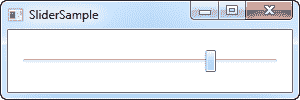
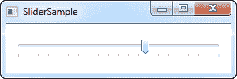
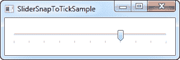
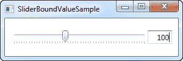
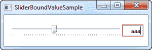
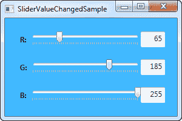

# 滑块（`Slider`）控件

> 原文：<https://wpf-tutorial.com/misc-controls/the-slider-control/>

滑块（`Slider`）控件允许您通过沿水平线或垂直线拖动滑块来选取数值。你可以在许多用户界面中看到它，但是仅仅从描述中还是很难识别，所以这里有一个非常基本的例子:

```
<Window x:Class="WpfTutorialSamples.Misc_controls.SliderSample"

        xmlns:x="http://schemas.microsoft.com/winfx/2006/xaml"
        Title="SliderSample" Height="100" Width="300">
    <StackPanel VerticalAlignment="Center" Margin="10">
        <Slider Maximum="100" />
    </StackPanel>
</Window>
```



这将允许最终用户通过沿线拖动按钮(称为拇指)来选择 0 到 100 之间的值。

## 滴答声

在这个例子中，我已经将拇指拖动到中间以外，但是显然很难看到确切的值。解决这个问题的一个方法是打开刻度，刻度是显示在线上的小标签，可以更好地指示拇指有多远。这里有一个例子:

<input type="hidden" name="IL_IN_ARTICLE">

```
<Window x:Class="WpfTutorialSamples.Misc_controls.SliderSample"

        xmlns:x="http://schemas.microsoft.com/winfx/2006/xaml"
        Title="SliderSample" Height="100" Width="300">
    <StackPanel VerticalAlignment="Center" Margin="10">
        <Slider Maximum="100" TickPlacement="BottomRight" TickFrequency="5" />
    </StackPanel>
</Window>
```



我通过给 **TickPlacement** 属性另一个值而不是缺省值 None 来打开刻度线。在我的例子中，我希望将 记号放在线的下方，但是您可以使用**顶部左侧**或者甚至**两个**作为可能的值来改变这一点。

还要注意我对 **TickFrequency** 属性的使用。缺省值为 1，但是在一个例子中，可能值的范围从 0 到 100，这将产生 100 个刻度标签，这些刻度标签必须适合有限的空间。在这种情况下，将 TickFrequency 提高到让它看起来不那么拥挤是有意义的。

## 捕捉到刻度

如果你看一下上面的截图，你会看到拇指在两个勾之间。这是有意义的，因为按照 TickFrequency 属性的规定，每个 tick 之间有五个值。此外，默认情况下，Slider 控件的值实际上是 double，这意味着该值可以(并且很可能)是非整数。我们可以通过使用 **IsSnapToTickEnabled** 属性对此进行更改，如下例所示:

```
<Window x:Class="WpfTutorialSamples.Misc_controls.SliderSnapToTickSample"

        xmlns:x="http://schemas.microsoft.com/winfx/2006/xaml"
        Title="SliderSnapToTickSample" Height="100" Width="300">
    <StackPanel VerticalAlignment="Center" Margin="10">
        <Slider Maximum="100" TickPlacement="BottomRight" TickFrequency="10" IsSnapToTickEnabled="True" />
    </StackPanel>
</Window>
```



请注意，我已经将 TickFrequency 更改为 10，然后启用了 IsSnapToTickEnabled 属性。这确保了缩略图只能直接放在一个刻度值上，因此对于本例，它只能是 0、10、20、30、40 等等。

## 滑块值

到目前为止，我们只是说明性地使用了 Slider，但是当然，实际的目的是读取它的当前值并使用它做一些事情。滑块有一个 Value 属性，您当然可以从代码隐藏中读取它，甚至可以绑定到它。

使用滑块的一个常见场景是将其与 TextBox 结合使用，这将允许用户查看当前选择的值，并通过输入数字而不是拖动滑块来更改它。通常，您必须订阅 Slider 和 TextBox 上的 change 事件，然后进行相应的更新，但是一个简单的绑定可以为我们完成所有这些工作:

```
<Window x:Class="WpfTutorialSamples.Misc_controls.SliderBoundValueSample"

        xmlns:x="http://schemas.microsoft.com/winfx/2006/xaml"
        Title="SliderBoundValueSample" Height="100" Width="300">
    <DockPanel VerticalAlignment="Center" Margin="10">
        <TextBox Text="{Binding ElementName=slValue, Path=Value, UpdateSourceTrigger=PropertyChanged}" DockPanel.Dock="Right" TextAlignment="Right" Width="40" />
        <Slider Maximum="255" TickPlacement="BottomRight" TickFrequency="5" IsSnapToTickEnabled="True" Name="slValue" />
    </DockPanel>
</Window>
```



现在，您可以通过使用滑块或在文本框中输入值来更改该值，它将立即反映在另一个控件中。作为一个额外的好处，我们还得到了简单的验证，而不需要任何额外的工作，例如，如果我们试图在文本框中输入一个非数值:



## 响应变化的价值观

当然，尽管绑定对于很多用途来说都很酷，但是您仍然可能希望通过代码隐藏来响应滑块值的变化。幸运的是，滑块附带了一个 ValueChanged 事件，这将有助于我们解决这个问题。为了说明这一点，我创建了一个更复杂的带有三个滑块的示例，我们在其中更改颜色的红、绿、蓝(RGB)值:

```
<Window x:Class="WpfTutorialSamples.Misc_controls.SliderValueChangedSample"

        xmlns:x="http://schemas.microsoft.com/winfx/2006/xaml"
        Title="SliderValueChangedSample" Height="200" Width="300">
    <StackPanel Margin="10" VerticalAlignment="Center">
        <DockPanel VerticalAlignment="Center" Margin="10">
            <Label DockPanel.Dock="Left" FontWeight="Bold">R:</Label>
            <TextBox Text="{Binding ElementName=slColorR, Path=Value, UpdateSourceTrigger=PropertyChanged}" DockPanel.Dock="Right" TextAlignment="Right" Width="40" />
            <Slider Maximum="255" TickPlacement="BottomRight" TickFrequency="5" IsSnapToTickEnabled="True" Name="slColorR" ValueChanged="ColorSlider_ValueChanged" />
        </DockPanel>

        <DockPanel VerticalAlignment="Center" Margin="10">
            <Label DockPanel.Dock="Left" FontWeight="Bold">G:</Label>
            <TextBox Text="{Binding ElementName=slColorG, Path=Value, UpdateSourceTrigger=PropertyChanged}" DockPanel.Dock="Right" TextAlignment="Right" Width="40" />
            <Slider Maximum="255" TickPlacement="BottomRight" TickFrequency="5" IsSnapToTickEnabled="True" Name="slColorG" ValueChanged="ColorSlider_ValueChanged" />
        </DockPanel>

        <DockPanel VerticalAlignment="Center" Margin="10">
            <Label DockPanel.Dock="Left" FontWeight="Bold">B:</Label>
            <TextBox Text="{Binding ElementName=slColorB, Path=Value, UpdateSourceTrigger=PropertyChanged}" DockPanel.Dock="Right" TextAlignment="Right" Width="40" />
            <Slider Maximum="255" TickPlacement="BottomRight" TickFrequency="5" IsSnapToTickEnabled="True" Name="slColorB" ValueChanged="ColorSlider_ValueChanged" />
        </DockPanel>
    </StackPanel>
</Window>
```

```
using System;
using System.Windows;
using System.Windows.Media;

namespace WpfTutorialSamples.Misc_controls
{
	public partial class SliderValueChangedSample : Window
	{
		public SliderValueChangedSample()
		{
			InitializeComponent();
		}

		private void ColorSlider_ValueChanged(object sender, RoutedPropertyChangedEventArgs<double> e)
		{
			Color color = Color.FromRgb((byte)slColorR.Value, (byte)slColorG.Value, (byte)slColorB.Value);
			this.Background = new SolidColorBrush(color);
		}
	}
}
```



在代码的 XAML 部分，我们有三个 DockPanels，每个都有一个标签、一个滑块和一个文本框（`TextBox`）控件。就像以前一样，TextBox 控件的 Text 属性被绑定到滑块的值。

每个滑块都订阅相同的 **ValueChanged** 事件，在该事件中，我们基于当前选择的值创建一个新的颜色实例，然后 使用该颜色为窗口的背景属性创建一个新的 SolidColorBrush。

总之，这是一个很好的例子，说明了滑块（`Slider`）控件的用途。

* * *