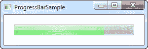
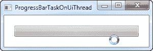
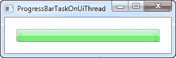
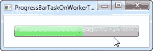
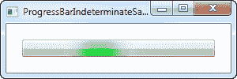
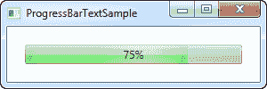

# ProgressBar 控件

> 原文：<https://wpf-tutorial.com/misc-controls/the-progressbar-control/>

WPF 有一个显示进度的便捷控件，叫做**进度条**。它的工作原理是设置一个最小值和最大值，然后 增加一个值，这将给出一个可视化的指示，表明你目前在这个过程中的进度。这里有一个非常基本的例子来演示它:

```
<Window x:Class="WpfTutorialSamples.Misc_controls.ProgressBarSample"

        xmlns:x="http://schemas.microsoft.com/winfx/2006/xaml"
        Title="ProgressBarSample" Height="100" Width="300">
    <Grid Margin="20">
        <ProgressBar Minimum="0" Maximum="100" Value="75" />
    </Grid>
</Window>
```



在这种情况下，我使用了一种非常标准的方法，将进度显示为一个百分比(在 0 到 100%之间)，初始值为 75。另一种方法是使用你正在执行的任务列表中的实际最小值和最大值。例如，如果在检查每个文件时遍历收集的文件列表，可以将 Minimum 属性设置为 0，将 Maximum 属性设置为列表中的文件数量，然后在遍历时递增。

ProgressBar 就像其他标准的 WPF 控件一样，呈现为与操作系统的视觉风格相匹配。在 Windows 7 上，它有一个很好的动画渐变，如截图所示。

## 执行冗长任务时显示进度

<input type="hidden" name="IL_IN_ARTICLE">

上面的例子说明了使用 ProgressBar 是多么简单，但是通常你当然希望显示一些实际工作的进度，而不仅仅是一个静态值。

在大多数情况下，你会使用 ProgressBar 来显示一些繁重/冗长任务的进度，这是大多数新程序员遇到的一个非常常见的问题:如果你在 UI 线程上做一件繁重的工作，同时试图同时更新例如 ProgressBar 控件，你很快就会意识到你不能在同一线程上同时做两件事。或者更清楚地说，你可以，但是在任务完成之前，ProgressBar 实际上不会显示每个进度更新，这几乎使它变得无用。

为了说明这一点，您可以尝试以下示例:

```
<Window x:Class="WpfTutorialSamples.Misc_controls.ProgressBarTaskOnUiThread"

        xmlns:x="http://schemas.microsoft.com/winfx/2006/xaml"
        Title="ProgressBarTaskOnUiThread" Height="100" Width="300"
        ContentRendered="Window_ContentRendered">
    <Grid Margin="20">
        <ProgressBar Minimum="0" Maximum="100" Name="pbStatus" />
    </Grid>
</Window>
```

```
using System;
using System.Threading;
using System.Windows;

namespace WpfTutorialSamples.Misc_controls
{
	public partial class ProgressBarTaskOnUiThread : Window
	{
		public ProgressBarTaskOnUiThread()
		{
			InitializeComponent();
		}

		private void Window_ContentRendered(object sender, EventArgs e)
		{
			for(int i = 0; i < 100; i++)
			{
				pbStatus.Value++;
				Thread.Sleep(100);
			}
		}
	}
}
```

一个非常基本的例子，窗口一准备好，我们就从 0 到 100 循环，并且在每次迭代中，我们增加 ProgressBar 的值。任何现代计算机的速度都比你眨眼的速度快，所以我在每次迭代中增加了 100 毫秒的延迟。不幸的是，正如我已经描述过的，什么都不会发生。这是它在过程中间的样子:



请注意，光标指示有事情正在发生，但是 ProgressBar 看起来仍然像开始时一样(空的)。一旦代表我们的冗长任务的循环完成，进度条将如下所示:



这真的没有帮助你的用户看到进展！相反，我们必须在工作线程上执行任务，然后将更新推送到 UI 线程，UI 线程将能够立即处理并直观地显示这些更新。处理这项工作的一个优秀工具是 BackgroundWorker 类，我们将在本教程的其他地方更多地讨论它。下面是与上面相同的示例，但这次使用了 BackgroundWorker:

```
<Window x:Class="WpfTutorialSamples.Misc_controls.ProgressBarTaskOnWorkerThread"

        xmlns:x="http://schemas.microsoft.com/winfx/2006/xaml"
        Title="ProgressBarTaskOnWorkerThread" Height="100" Width="300"
        ContentRendered="Window_ContentRendered">
    <Grid Margin="20">
        <ProgressBar Minimum="0" Maximum="100" Name="pbStatus" />
    </Grid>
</Window>
```

```
using System;
using System.ComponentModel;
using System.Threading;
using System.Windows;

namespace WpfTutorialSamples.Misc_controls
{
	public partial class ProgressBarTaskOnWorkerThread : Window
	{
		public ProgressBarTaskOnWorkerThread()
		{
			InitializeComponent();
		}

		private void Window_ContentRendered(object sender, EventArgs e)
		{
			BackgroundWorker worker = new BackgroundWorker();
			worker.WorkerReportsProgress = true;
			worker.DoWork += worker_DoWork;
			worker.ProgressChanged += worker_ProgressChanged;

			worker.RunWorkerAsync();
		}

		void worker_DoWork(object sender, DoWorkEventArgs e)
		{
			for(int i = 0; i < 100; i++)
			{
				(sender as BackgroundWorker).ReportProgress(i);
				Thread.Sleep(100);
			}
		}

		void worker_ProgressChanged(object sender, ProgressChangedEventArgs e)
		{
			pbStatus.Value = e.ProgressPercentage;
		}
	}
}
```



正如您在屏幕截图中看到的，进度现在在整个任务中一直更新，正如光标所指示的，UI 线程上没有执行任何艰苦的工作，这意味着您仍然可以与界面的其余部分进行交互。

请注意，虽然 BackgroundWorker 确实对多线程相关问题有很大帮助，但仍有一些事情您应该知道，所以在做任何比上述场景更高级的事情之前，请阅读本教程中的 BackgroundWorker 文章。

## 模糊的

对于一些任务，用百分比来表示进度是不可能的，或者你根本不知道要花多长时间。对于那些情况，不确定的进度条已经被发明出来，在那里一个动画让用户知道一些事情正在发生，同时指示运行时间不能被确定。

WPF 进度条通过使用 is incidential 属性支持这种模式，我们将在下一个示例中展示该属性:

```
<Window x:Class="WpfTutorialSamples.Misc_controls.ProgressBarIndeterminateSample"

        xmlns:x="http://schemas.microsoft.com/winfx/2006/xaml"
        Title="ProgressBarIndeterminateSample" Height="100" Width="300">
    <Grid Margin="20">
        <ProgressBar Minimum="0" Maximum="100" Name="pbStatus" IsIndeterminate="True" />
    </Grid>
</Window>
```



请注意，绿色进度指示器没有固定在任何一边，而是从头到尾自由浮动，然后又重新开始。

## 带文本的进度条

标准的 WPF 进度条让我非常怀念的一点是能够显示进度的文本表示以及进度条。幸运的是，WPF 的灵活性使我们很容易做到这一点。这里有一个例子:

```
<Window x:Class="WpfTutorialSamples.Misc_controls.ProgressBarTextSample"

        xmlns:x="http://schemas.microsoft.com/winfx/2006/xaml"
        Title="ProgressBarTextSample" Height="100" Width="300">
    <Grid Margin="20">
        <ProgressBar Minimum="0" Maximum="100" Value="75" Name="pbStatus" />
        <TextBlock Text="{Binding ElementName=pbStatus, Path=Value, StringFormat={}{0:0}%}" HorizontalAlignment="Center" VerticalAlignment="Center" />
    </Grid>
</Window>
```



我们通过将显示百分比的 ProgressBar 和 TextBlock 放在同一个网格中来完成上述操作，而没有指定任何行或列。这将在 ProgressBar 的顶部呈现 TextBlock，这正是我们在这里想要的，因为 TextBlock 默认有透明的背景。

我们使用绑定来确保 TextBlock 显示与 ProgressBar 相同的值。注意特殊的 **StringFormat** 语法， 允许我们用百分号后缀来显示值——这看起来可能有点奇怪，但是请参见本 教程的 **StringFormat** 文章以获得更多信息。

* * *