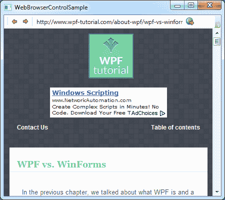

# WebBrowser 控件

> 原文：<https://wpf-tutorial.com/misc-controls/the-webbrowser-control/>

WPF 附带了一个现成的 WebBrowser 控件，它允许您在应用程序中托管一个完整的 web 浏览器。WebBrowser 控件实际上只是 Internet Explorer ActiveX 版本的一个外壳，但是由于它是 Windows 的一个集成部分，所以您的应用程序应该可以在所有 Windows 计算机上工作，而不需要安装其他组件。

在本文中，我做了一些不同的事情:我没有从一个非常有限的例子开始，然后添加到它，而是创建了一个更复杂的例子。它说明了让一个小的网络浏览器运行起来是多么容易。它的功能非常基本，但是如果你想的话，你可以很容易地扩展它。它看起来是这样的:



所以让我们来看看代码:

```
<Window x:Class="WpfTutorialSamples.Misc_controls.WebBrowserControlSample"

        xmlns:x="http://schemas.microsoft.com/winfx/2006/xaml"
        Title="WebBrowserControlSample" Height="300" Width="450">
    <Window.CommandBindings>
        <CommandBinding Command="NavigationCommands.BrowseBack" CanExecute="BrowseBack_CanExecute" Executed="BrowseBack_Executed" />
        <CommandBinding Command="NavigationCommands.BrowseForward" CanExecute="BrowseForward_CanExecute" Executed="BrowseForward_Executed" />
        <CommandBinding Command="NavigationCommands.GoToPage" CanExecute="GoToPage_CanExecute" Executed="GoToPage_Executed" />
    </Window.CommandBindings>
    <DockPanel>
        <ToolBar DockPanel.Dock="Top">
            <Button Command="NavigationCommands.BrowseBack">
                <Image Source="/WpfTutorialSamples;componeimg/arrow_left.png" Width="16" Height="16" />
            </Button>
            <Button Command="NavigationCommands.BrowseForward">
                <Image Source="/WpfTutorialSamples;componeimg/arrow_right.png" Width="16" Height="16" />
            </Button>
            <Separator />
            <TextBox Name="txtUrl" Width="300" KeyUp="txtUrl_KeyUp" />
            <Button Command="NavigationCommands.GoToPage">
                <Image Source="/WpfTutorialSamples;componeimg/world_go.png" Width="16" Height="16" />
            </Button>
        </ToolBar>
        <WebBrowser Name="wbSample" Navigating="wbSample_Navigating"></WebBrowser>
    </DockPanel>
</Window>
```

```
using System;
using System.Windows;
using System.Windows.Input;

namespace WpfTutorialSamples.Misc_controls
{
	public partial class WebBrowserControlSample : Window
	{
		public WebBrowserControlSample()
		{
			InitializeComponent();
			wbSample.Navigate("http://www.wpf-tutorial.com");
		}

		private void txtUrl_KeyUp(object sender, KeyEventArgs e)
		{
			if(e.Key == Key.Enter)
				wbSample.Navigate(txtUrl.Text);
		}

		private void wbSample_Navigating(object sender, System.Windows.Navigation.NavigatingCancelEventArgs e)
		{
			txtUrl.Text = e.Uri.OriginalString;
		}

		private void BrowseBack_CanExecute(object sender, CanExecuteRoutedEventArgs e)
		{
			e.CanExecute = ((wbSample != null) && (wbSample.CanGoBack));
		}

		private void BrowseBack_Executed(object sender, ExecutedRoutedEventArgs e)
		{
			wbSample.GoBack();
		}

		private void BrowseForward_CanExecute(object sender, CanExecuteRoutedEventArgs e)
		{
			e.CanExecute = ((wbSample != null) && (wbSample.CanGoForward));
		}

		private void BrowseForward_Executed(object sender, ExecutedRoutedEventArgs e)
		{
			wbSample.GoForward();
		}

		private void GoToPage_CanExecute(object sender, CanExecuteRoutedEventArgs e)
		{
			e.CanExecute = true;
		}

		private void GoToPage_Executed(object sender, ExecutedRoutedEventArgs e)
		{
			wbSample.Navigate(txtUrl.Text);
		}

	}
}
```

<input type="hidden" name="IL_IN_ARTICLE">

这些代码乍一看可能有点让人不知所措，但是如果你仔细看一下，你会发现其中有很多重复。

让我们从谈论 XAML 的部分开始。注意，我使用了本教程中其他地方讨论过的几个概念，包括 工具栏控件和 WPF 命令。该工具栏用于承载一对用于后退和前进的按钮。之后，我们有一个地址栏用于 输入和显示当前 URL，还有一个按钮用于导航到输入的 URL。

在工具栏下面，我们有实际的 WebBrowser 控件。如您所见，使用它只需要一行 XAML——在本例中，我们订阅了**导航**事件，该事件在 WebBrowser 开始导航到一个 URL 时发生。

在**代码隐藏**中，我们首先导航到一个已经在窗口构造器中的 URL，让一些东西立即显示 而不是一个空白控件。然后我们有了 **txtUrl_KeyUp** 事件，在这个事件中，我们检查用户是否在地址栏 中点击了 Enter——如果是，我们开始导航到输入的 Url。

事件确保地址栏在每次新的导航开始时被更新。这很重要，因为我们 希望它显示当前的 URL，无论用户是通过输入新的 URL 还是点击网页上的链接来启动导航。

代码隐藏的最后一部分是对我们的命令的简单处理:两个用于后退和前进按钮，其中我们使用 CanGoBack 和 CanGoForward 来决定它们是否可以执行，并使用 GoBack 和 GoForward 方法来完成实际工作。这在处理 WPF 命令时非常标准，如本教程的命令部分所述。

对于最后一个命令，我们允许它总是执行，当它执行时，我们再次使用 Navigate()方法。

## 摘要

如您所见，使用 webbrowser 控件，在应用程序中托管和使用完整的 WebBrowser 变得非常容易。然而，你应该知道 WPF 版本的浏览器与 WinForms 版本相比有一点局限性，但是对于基本的使用和导航来说，它工作得很好。

如果您希望使用 WinForms 版本，您可以使用 WindowsFormsHost，这将在本教程的其他地方解释。

* * *