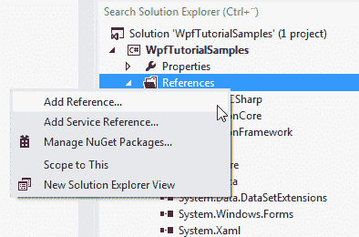
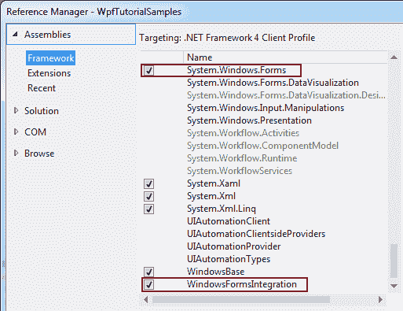
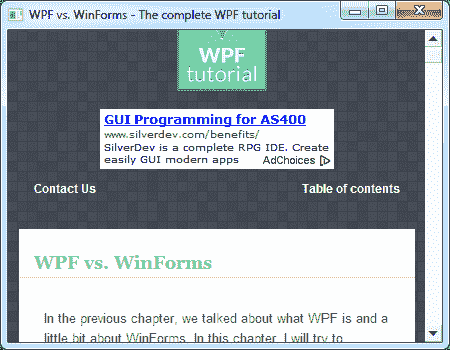

# WindowsFormsHost 控件

> 原文：<https://wpf-tutorial.com/misc-controls/the-windowsformshost-control/>

WPF 和 WinForms 是两个不同的 UI 框架，都是由微软创建的。WPF 是第一个 WinForms 的更现代的替代品。NET UI 框架。为了减轻两者之间的过渡，微软已经确保 WinForms 控件仍然可以在 WPF 应用程序内部使用。这是通过 WindowsFormsHost 完成的，我们将在本文中讨论它。

若要使用 WinForms 中的 WindowsFormsHost 和控件，需要在应用程序中添加对以下程序集的引用:

*   windows 窗体集成
*   系统。Windows .窗体

在 Visual Studio 中，这是通过右键单击项目中的“**引用**”节点并选择“**添加引用**”来完成的:



在弹出的对话框中，您应该选择“ **Assemblies** ”，然后勾选我们需要添加的两个组件:

<input type="hidden" name="IL_IN_ARTICLE"> 

## 使用 WinForms WebBrowser 控件

在上一篇文章中，我们使用 WPF WebBrowser 控件创建了一个小型 web 浏览器。然而，正如那篇文章中所述，与 WinForms 版本相比，WPF WebBrowser 控件有一点局限性。使用 WinForms 版本可以轻松完成许多事情，而使用 WPF 版本却很难或者根本不可能。

一个小例子是 **DocumentTitle** 属性和对应的 **DocumentTitleChanged** 事件，它很容易获取 并更新窗口的标题以匹配当前网页的标题。我们将以此为借口，在 我们的 WPF 应用程序中测试 WinForms 版本:

```
<Window x:Class="WpfTutorialSamples.Misc_controls.WindowsFormsHostSample"

        xmlns:x="http://schemas.microsoft.com/winfx/2006/xaml"
        xmlns:wf="clr-namespace:System.Windows.Forms;assembly=System.Windows.Forms"
        Title="WindowsFormsHostSample" Height="350" Width="450">
    <Grid>
        <WindowsFormsHost Name="wfhSample">
            <WindowsFormsHost.Child>
                <wf:WebBrowser DocumentTitleChanged="wbWinForms_DocumentTitleChanged" />
            </WindowsFormsHost.Child>
        </WindowsFormsHost>
    </Grid>
</Window>
```

```
using System;
using System.Windows;

namespace WpfTutorialSamples.Misc_controls
{
	public partial class WindowsFormsHostSample : Window
	{
		public WindowsFormsHostSample()
		{
			InitializeComponent();
			(wfhSample.Child as System.Windows.Forms.WebBrowser).Navigate("http://www.wpf-tutorial.com");
		}

		private void wbWinForms_DocumentTitleChanged(object sender, EventArgs e)
		{
			this.Title = (sender as System.Windows.Forms.WebBrowser).DocumentTitle;
		}
	}
}
```



请特别注意我们将 WinForms 命名空间添加到窗口的那一行，以便我们可以从中引用控件:

```
xmlns:wf="clr-namespace:System.Windows.Forms;assembly=System.Windows.Forms"
```

这将允许我们使用 wf:前缀引用 WinForms 控件。

如您所见，WindowsFormsHost 使用起来相当简单。它有一个子属性，可以在其中定义一个 WinForms 控件，就像 WPF 窗口只包含一个根控件一样。如果你需要更多来自 WinForms 的控件，你可以使用 WinForms 的**面板** 控件或者任何其他容器控件。

WinForms WebBrowser 控件通过引用系统来使用。Windows.Forms 程序集，使用 wf 前缀，如上所述。

在**代码隐藏**中，我们做了一个导航的初始调用，以便在启动时有一个可见的网页而不是空控件。然后我们处理 **DocumentTitleChanged** 事件，其中我们根据 WebBrowser 控件的当前 **DocumentTitle** 值更新窗口的 Title 属性。

恭喜您，现在您已经拥有了一个内置 WinForms WebBrowser 的 WPF 应用程序。

## 摘要

正如您所看到的，在您的 WPF 应用程序中使用 WinForms 控件非常容易，但是问题仍然存在:这是一个好主意吗？

一般来说，你可能要避免它。有许多问题可能会也可能不会影响您的应用程序(许多问题在这篇 MSDN 的文章中有所描述:[http://msdn . Microsoft . com/en-us/library/aa 970911% 28v = vs . 100% 29 . aspx](http://msdn.microsoft.com/en-us/library/aa970911%28v=VS.100%29.aspx))，但是 一个更严重的问题是，这种 UI 框架混合可能在的未来版本中不受支持。NET 框架。

不过，最终的决定还是取决于您——您真的需要 WinForms 控件吗？或者有没有一个 WPF 的替代品也能同样有效？

* * *