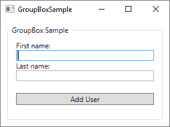
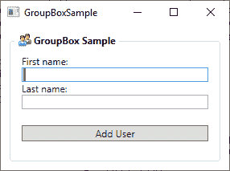

# 分组框控件

> 原文：<https://wpf-tutorial.com/misc-controls/the-groupbox-control/>

分组框控件将允许您可视化地将一组控件组合在一起。这显然也可以使用许多面板中的一个来完成，但是 GroupBox 添加了一种特殊类型的标题和边框，这在 Windows 操作系统中一直被大量使用。下面是使用**分组框**控件时的屏幕截图:



注意控件周围的边框，文本“GroupBox Sample”放在边框线内——这就是 GroupBox 的外观和行为。使用 GroupBox 就像在窗口中添加标签并在 **Header** 属性中写入相关内容一样简单:

```
<GroupBox Header="GroupBox Sample">

</GroupBox>
```

GroupBox 只能包含一个子元素，但这没有问题——只需将这个控件设置为面板，您就可以自由地向面板添加多个控件，例如创建一个如上所示的对话框。下面是我的示例对话框的完整 XAML 代码清单:

```
<Window x:Class="WpfTutorialSamples.Misc_controls.GroupBoxSample"

    xmlns:x="http://schemas.microsoft.com/winfx/2006/xaml"
    xmlns:d="http://schemas.microsoft.com/expression/blend/2008"
    xmlns:mc="http://schemas.openxmlformats.org/markup-compatibility/2006"
    xmlns:local="clr-namespace:WpfTutorialSamples.Misc_controls"
    mc:Ignorable="d"
    Title="GroupBoxSample" Height="220" Width="300">
    <Grid>
    <GroupBox Header="GroupBox Sample" Margin="10" Padding="10">
        <StackPanel>
        <TextBlock>First name:</TextBlock>
        <TextBox />
        <TextBlock>Last name:</TextBlock>
        <TextBox />
        <Button Margin="0,20">Add User</Button>
        </StackPanel>
    </GroupBox>
    </Grid>
</Window>
```

<input type="hidden" name="IL_IN_ARTICLE">

## 带有自定义标题的分组框

分组框的标题通常只是普通的、无格式的文本，但是也许你想让它看起来更花哨一点？没问题，因为就像 WPF 框架中几乎所有的东西一样，你可以用一个或几个其他控件来替换文本。所以你可以添加一个文本块控件，然后改变格式，例如文本的颜色。如果您愿意，您甚至可以添加图像，就像我在下一个示例中所做的那样:



现在标题有了图像和粗体文本，这很容易做到:

```
<Window x:Class="WpfTutorialSamples.Misc_controls.GroupBoxSample"

    xmlns:x="http://schemas.microsoft.com/winfx/2006/xaml"
    xmlns:d="http://schemas.microsoft.com/expression/blend/2008"
    xmlns:mc="http://schemas.openxmlformats.org/markup-compatibility/2006"
    xmlns:local="clr-namespace:WpfTutorialSamples.Misc_controls"
    mc:Ignorable="d"
    Title="GroupBoxSample" Height="220" Width="300">
    <Grid>
    <GroupBox Margin="10" Padding="10">
        <GroupBox.Header>
        <StackPanel Orientation="Horizontal">
            <Image Source="/WpfTutorialSamples;componeimg/group.png" Margin="3,0" />
            <TextBlock FontWeight="Bold">GroupBox Sample</TextBlock>
        </StackPanel>
        </GroupBox.Header>
        <StackPanel>
        <TextBlock>First name:</TextBlock>
        <TextBox />
        <TextBlock>Last name:</TextBlock>
        <TextBox />
        <Button Margin="0,20">Add User</Button>
        </StackPanel>
    </GroupBox>
    </Grid>
</Window>
```

注意我是如何简单地用一个 **GroupBox 替换了 Header 属性的。Header** 标签，然后它托管一个 StackPanel 来包含一个图像和一个 text block——有了这个标签，您就可以完全控制标题的外观了！

## 摘要

WPF 分组框控件将使你很容易把相关的控件组合在一起，这种方式在视觉上与微软视窗操作系统的外观相匹配。

* * *