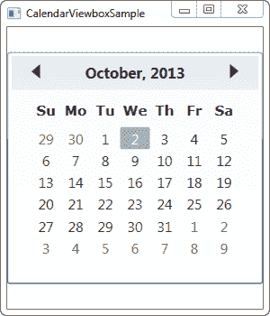
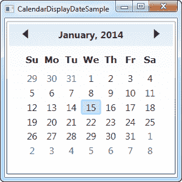

# 日历控件

> 原文：<https://wpf-tutorial.com/misc-controls/the-calendar-control/>

WPF 附带了一个控件，开箱即可显示完整的日历。它非常简单，您只需将它放入窗口中，就可以看到完整的日历视图，就像这样:

```
<Window x:Class="WpfTutorialSamples.Misc_controls.CalendarControlSample"

    xmlns:x="http://schemas.microsoft.com/winfx/2006/xaml"
    Title="CalendarControlSample" Height="250" Width="300">
    <Grid>
    <Calendar />
    </Grid>
</Window>
```


请注意，您现在如何获得所选月份内日期的完整列表，包括使用控件顶部的箭头跳转到上个月和下个月的可能性。除非您设置了特定日期，否则将显示当前月份，并且当前日期将被标签为选中。

## 日历大小

您可能会从我们的第一个示例中注意到，日历并没有占据所有的可用空间。事实上，即使你给它一个大的宽度和高度，实际的日历部分仍然只占你在屏幕截图上看到的空间，如果你把其中一个值设置得很低，日历将只能部分可见。

<input type="hidden" name="IL_IN_ARTICLE">

这种固定大小的行为并不是非常典型的 WPF，在这里，事情通常会扩展以填满可用空间，如果您有指定的可用空间用于您希望它填充的日历，这可能会有点烦人。对我们来说幸运的是，WPF 的一切都是可伸缩的，但是在日历控件的情况下，它需要一点帮助。为此，我们将使用 Viewbox 控件:

```
<Window x:Class="WpfTutorialSamples.Misc_controls.CalendarViewboxSample"

    xmlns:x="http://schemas.microsoft.com/winfx/2006/xaml"
    Title="CalendarViewboxSample" Height="350" Width="300">
    <Viewbox>
    <Calendar />
    </Viewbox>
</Window>
```



请注意 Calendar 控件现在是如何扩展到使用宽度中所有可用空间的。对控件的所有部分执行缩放，包括字体大小和边框宽度。

您可能还会注意到，日历控件没有用尽所有可用的高度空间。这是显而易见的，因为窗口的高度大于宽度，并且默认情况下，视图框会在保持原始纵横比的同时进行拉伸。你可以很容易地让它拉伸以填充两个方向的所有空间——只需将**拉伸**属性从默认的**统一**值更改为**填充**:

```
<Window x:Class="WpfTutorialSamples.Misc_controls.CalendarViewboxSample"

    xmlns:x="http://schemas.microsoft.com/winfx/2006/xaml"
    Title="CalendarViewboxSample" Height="350" Width="300">
    <Viewbox Stretch="Fill" StretchDirection="UpOnly">
    <Calendar />
    </Viewbox>
</Window>
```


现在它在两个方向上都占据了所有可用的空间。但这通常并不可取，因为大多数控件，尤其是这个控件，如果得到一组不正常的尺寸，例如 800 像素高和 300 像素宽，看起来会很奇怪。一个**拉伸**模式设置为**均匀**(或者被忽略，因为这是默认设置)通常是可行的。

我建议包含 **StretchDirection** 属性，如本例所示。它允许我们指定内容应该只被放大或缩小，这可能是有用的。例如，日历控件在某个尺寸以下变得毫无用处，你不再能看到它是什么，为了避免这种情况，你可以将**拉伸方向**设置为**向上仅**——日历控件将不再被缩放到默认尺寸以下。

## 使用显示日期设置初始视图

默认情况下，Calendar 控件将显示当前月份，但是您可以通过使用 **DisplayDate** 属性来更改这一点。只需将其设置为您希望开始的月份内的某个日期，它就会反映在控件中:

```
<Window x:Class="WpfTutorialSamples.Misc_controls.CalendarDisplayDateSample"

    xmlns:x="http://schemas.microsoft.com/winfx/2006/xaml"
    Title="CalendarDisplayDateSample" Height="300" Width="300">
    <Viewbox>
    <Calendar DisplayDate="01.01.2014" />
    </Viewbox>
</Window>
```



## 日历选择模式

**SelectionMode** 属性很有趣。通过改变它的默认值**单个日期**，您可以选择多个日期或日期范围。这里有一个例子:

```
<Window x:Class="WpfTutorialSamples.Misc_controls.CalendarSelectionModeSample"

    xmlns:x="http://schemas.microsoft.com/winfx/2006/xaml"
    Title="CalendarSelectionModeSample" Height="300" Width="300">
    <Viewbox>
    <Calendar SelectionMode="SingleRange" />
    </Viewbox>
</Window>
```


在**single range**selection mode 中，您可以选择整个日期范围，方法是按住鼠标左键并从一个日期拖动到另一个日期，或者按住 Ctrl 或 Shift 键同时单击几个日期，就像在 Windows 的所有部分中进行多重选择一样。在屏幕截图上，我选择了一整周，从周日到周一，但是您也可以轻松地选择一周中间的日期和扩展一周的范围。

SingleRange 模式只允许选择单一的日期范围，就像它的名字所暗示的那样。这意味着不能选择两个不相邻的日期，也不能选择多个范围。如果你想这样，你应该切换到**多范围**选择:

```
<Calendar SelectionMode="MultipleRange" />
```


有了这个属性，您可以选择的日期就没有限制了。在这种情况下，我选择了所有的星期六、所有的星期天以及中间的几个工作日。

当然，如果您不希望能够选择一个或几个日期，您可以将**选择模式**设置为**无**。

现在让我们讨论如何使用日历控件的选定日期。

## 使用选定的日期

如果您只允许单项选择，那么 **SelectedDate** 属性就是您所需要的全部(参见上面关于选择模式的解释)。它允许您通过代码隐藏和数据绑定来设置和获取当前选定的日期。

在下面的示例中，我们从代码隐藏中将选定的日期设置为明天，然后使用数据绑定将选定的日期读取到文本框控件中:

```
<Window x:Class="WpfTutorialSamples.Misc_controls.CalendarSelectionSample"

    xmlns:x="http://schemas.microsoft.com/winfx/2006/xaml"
    Title="CalendarSelectionSample" Height="280" Width="220">
    <StackPanel Margin="10">
    <Calendar Name="cldSample" SelectionMode="MultipleRange" SelectedDate="10.10.2013" />
    <Label>Selected date:</Label>
    <TextBox Text="{Binding ElementName=cldSample, Path=SelectedDate, StringFormat=d, UpdateSourceTrigger=PropertyChanged}" />
    </StackPanel>
</Window>
```

```
using System;
using System.Windows;

namespace WpfTutorialSamples.Misc_controls
{
    public partial class CalendarSelectionSample : Window
    {
    public CalendarSelectionSample()
    {
        InitializeComponent();
        cldSample.SelectedDate = DateTime.Now.AddDays(1);
    }
    }
}
```


在代码隐藏中，我们简单地将 **SelectedDate** 属性设置为当前日期加一天，即明天。然后，用户可以通过在 Calendar 控件中单击来更改此选择，通过在 TextBox 的 Text 属性中建立的数据绑定，此更改将自动反映在那里。

作为一个额外的好处，通过数据绑定的魔力，您还可以更改文本框中的值——只需输入一个有效的日期，更改将立即反映在日历控件中。如果您输入了错误的日期，自动绑定验证会通知您该问题:


## 使用多个选定的日期

如果您允许一次选择多个日期，您将不会发现 selected date 属性如此有用。相反，您应该使用 SelectedDates，它是 Calendar 控件中当前选定日期的集合。该属性可以从代码隐藏中访问，也可以与绑定一起使用，如下所示:

```
<Window x:Class="WpfTutorialSamples.Misc_controls.CalendarSelectedDatesSample"

    xmlns:x="http://schemas.microsoft.com/winfx/2006/xaml"
    Title="CalendarSelectedDatesSample" Height="420" Width="220">
    <StackPanel Margin="10">
    <Calendar Name="cldSample" SelectionMode="MultipleRange" />
    <Label>Selected dates:</Label>
    <ListBox ItemsSource="{Binding ElementName=cldSample, Path=SelectedDates}" MinHeight="150" />
    </StackPanel>
</Window>
```


通过这样一个简单的绑定，我们现在能够显示当前选定日期的列表。

如果您想对代码隐藏后的日期更改做出反应，可以订阅日历控件的 **SelectedDatesChanged** 事件。

## 封锁日期

根据使用 Calendar 控件的目的，您可能希望屏蔽某些日期。这可能是相关的，例如在预订应用中，您想要防止已经预订的日期被选择。日历控件通过使用 **BlackoutDates** 集合支持这种开箱即用的功能，当然，您可以从 XAML 和代码隐藏中使用该集合:

```
<Window x:Class="WpfTutorialSamples.Misc_controls.CalendarBlockedoutDatesSample"

    xmlns:x="http://schemas.microsoft.com/winfx/2006/xaml"
    Title="CalendarBlockedoutDatesSample" Height="300" Width="300">
    <Viewbox>
    <Calendar Name="cldSample" SelectionMode="MultipleRange">
        <Calendar.BlackoutDates>
        <CalendarDateRange Start="10.13.2013" End="10.19.2013" />
        <CalendarDateRange Start="10.27.2013" End="10.31.2013" />
        </Calendar.BlackoutDates>
    </Calendar>
    </Viewbox>
</Window>
```

```
using System;
using System.Windows;
using System.Windows.Controls;

namespace WpfTutorialSamples.Misc_controls
{
    public partial class CalendarBlockedoutDatesSample : Window
    {
    public CalendarBlockedoutDatesSample()
    {
        InitializeComponent();
        cldSample.BlackoutDates.AddDatesInPast();
        cldSample.BlackoutDates.Add(new CalendarDateRange(DateTime.Today, DateTime.Today.AddDays(1)));
    }
    }
}
```


在这个例子中，我演示了添加涂黑日期的两种方法——通过 XAML 和通过代码隐藏。这两种方式都是通过将 **CalendarDateRange** 的实例添加到 **BlackedoutDates** 集合中来实现的。

在 XAML，我对日期范围进行了硬编码(主要是为了向您展示也可以这样做)，同时我在代码隐藏方面做了一些更聪明的事情，首先通过对**adddatesinshipast()**方法的一次调用，将所有过去的日期添加到集合中，然后添加一个由今天和明天组成的范围。

## 显示模式-显示月份或年份

**DisplayMode** 属性可以将 Calendar 控件从可以选择日期的位置更改为可以选择月份甚至年份的位置。这是通过 DisplayMode 属性实现的，默认为 Month，我们在前面的例子中已经使用过了。如果我们改变它，它看起来是这样的:

```
<Window x:Class="WpfTutorialSamples.Misc_controls.CalendarDisplayModeSample"

    xmlns:x="http://schemas.microsoft.com/winfx/2006/xaml"
    Title="CalendarDisplayModeSample" Height="300" Width="300">
    <Viewbox>
    <Calendar DisplayMode="Year" />
    </Viewbox>
</Window>
```


通过将**显示模式**设置为**年**，我们现在可以选择给定年份的一个月。您可以使用箭头更改顶部的年份。

通过使用**显示模式**属性的**十进制**值，日历控件还允许选择一整年:

```
<Calendar DisplayMode="Decade" />
```


## 摘要

如您所见，Calendar 控件是一个非常通用的控件，有很多选项和功能，只需要很少的配置就可以使用。如果您正在构建一个具有任何日期相关功能的应用，您可能会以某种方式使用日历控件。

* * *