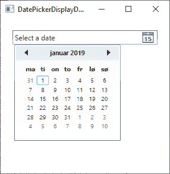
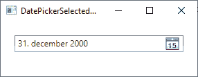

# 日期选择器控件

> 原文：<https://wpf-tutorial.com/misc-controls/the-datepicker-control/>

一般来说，处理日期可能很麻烦。写日期的方式有很多种，这取决于你的用户在世界的哪个地方，所以允许他们在文本框中自由输入日期几乎不是一个好主意。幸运的是，WPF 自带了几个处理日期的控件。

我们已经看到了其中的一个控件，日历控件，如果选择日期是你的对话框的主要任务的话，这个控件非常有用。然而，通常你需要在一个有多个输入控件的表单中收集一个日期和许多其他信息，比如文本框、组合框等等。对于这样的情况，你需要一个日期输入控件，它可以与其他控件融合在一起，并适合表单的布局——换句话说，你需要**日期选择器**控件！

日期选择器控件的显示非常像一个普通的文本框，但是有一个小按钮，单击它会显示一个日历视图，允许用户选择日期。下面是一个例子，说明它可能是什么样子:


然后，您可以手动书写日期，或者单击小按钮从日历控件中选择日期:

 <input type="hidden" name="IL_IN_ARTICLE">

## 添加 日期选择器控件

日期选择器控件开箱即可使用——只需将其添加到窗口中的任何位置，您就可以开始工作了:

```
<DatePicker></DatePicker>
```

下面是用于创建上述示例对话框的完整代码清单:

```
<Window x:Class="WpfTutorialSamples.Misc_controls.DatePickerSample"

    xmlns:x="http://schemas.microsoft.com/winfx/2006/xaml"
    xmlns:d="http://schemas.microsoft.com/expression/blend/2008"
    xmlns:mc="http://schemas.openxmlformats.org/markup-compatibility/2006"
    xmlns:local="clr-namespace:WpfTutorialSamples.Misc_controls"
    mc:Ignorable="d"
    Title="DatePickerSample" Height="300" Width="300">
    <StackPanel Margin="20">
    <Label>Name:</Label>
    <TextBox />
    <Label>Birthday:</Label>
    <DatePicker></DatePicker>
    <Label>Gender:</Label>
    <ComboBox>
        <ComboBoxItem>Female</ComboBoxItem>
        <ComboBoxItem>Male</ComboBoxItem>
    </ComboBox>
    <Button Margin="20">Signup</Button>
    </StackPanel>
</Window>
```

## 显示日期和选定日期

默认情况下，日期选择器控件不会选择日期，这留给用户决定。但是，如果您需要用日期预填充控件，只需使用 **SelectedDate** 属性，如下所示:

```
<DatePicker SelectedDate="2000-12-31"></DatePicker>
```

DatePicker 现在将有一个预先选择的日期，用户可以通过选择/输入另一个日期来覆盖它。 **SelectedDate** 也可以从代码隐藏中设置，也许更重要的是，它也可以从代码隐藏中读取，或者您可以将其值绑定到您的模型或另一个控件。

有时，您可能需要在特定日期启动日历，而实际上并没有为用户选择一个日期。为此，我们有了**显示日期**属性。默认值是当前日期，但是您可以很容易地更改它:

```
<DatePicker Name="dp1" DisplayDate="2019-01-01" />
```



请注意，当我们使用 DisplayDate 属性时，日历是如何从指定的日期开始的(并突出显示它)，但实际上并没有选择日期(如“选择日期”文本所示)。

## 选择日期格式

另一个有趣的属性是 **SelectedDateFormat** 。默认值是**短**，但是如果你把它改成**长**，它会以稍微冗长一点的方式格式化:

```
<DatePicker SelectedDate="2000-12-31" SelectedDateFormat="Long"></DatePicker>
```



无论使用短格式还是长格式，日期的实际格式都是由应用的区域性决定的。如果没有为应用专门定义区域性，则使用系统设置。您将从本文的截屏中注意到，在这台计算机上，日期格式是 DMY(日期-月份-年份)，但这可以通过设置特定的区域性来轻松更改。我们将在本教程的其他地方讨论这个问题。

## 封锁日期

根据您使用 日期选择器控件的目的，您可能希望隐藏某些日期。这将防止选择这些日期，这些日期将被直观地指示，并且可能是相关的，例如在预订应用中，您想要防止已经预订的日期被选择。日期选择器控件通过使用 BlackoutDates 集合支持这种开箱即用的功能，当然，您可以从 XAML 和代码隐藏中使用该集合。以下是 XAML 的做法:

```
<DatePicker Name="dp1">
    <DatePicker.BlackoutDates>
    <CalendarDateRange Start="2019-04-01" End="2019-04-07" />
    <CalendarDateRange Start="2019-04-22" End="2019-04-28" />
    </DatePicker.BlackoutDates>
</DatePicker>
```

结果将如下所示:


从代码隐藏中执行同样简单，并且它有两个额外的好处:首先，您可以动态地创建日期范围，例如基于当前日期。您还可以使用**adddatesinspast()**方法自动排除过去的所有日期。这里有一个例子:

```
dp1.BlackoutDates.AddDatesInPast();
dp1.BlackoutDates.Add(new CalendarDateRange(DateTime.Now, DateTime.Now.AddDays(7)));
```

这样一来，所有过去的日期以及下周都将无法选择。

## 摘要

**DatePicker** 控件允许用户指定一个有效的日期，既可以在文本框中输入，也可以从内置的日历小部件中选择。如果日期是手动输入的，它将立即生效，只有在有效的情况下才允许保留在文本框中。这将使您更容易创建包含日期的表单。

* * *