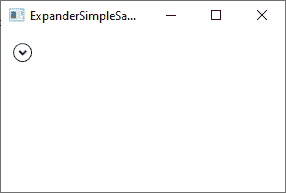
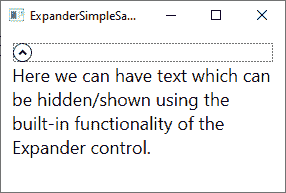
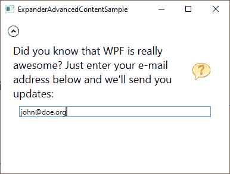
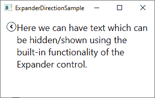
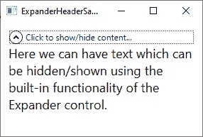
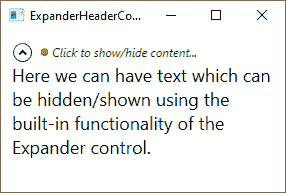

# 扩展器控件

> 原文：<https://wpf-tutorial.com/misc-controls/the-expander-control/>

**扩展器**控件将为您提供隐藏/显示一段内容的能力。这通常是一段文本，但由于 WPF 的灵活性，它可以用于任何类型的混合内容，如文本，图像，甚至其他 WPF 控件。为了明白我在说什么，这里有一个例子:



请注意箭头部分——只要单击它，扩展器控件就会展开并显示其内容:



它的代码当然非常简单:

```
<Expander>  
    <TextBlock TextWrapping="Wrap" FontSize="18">  
    Here we can have text which can be hidden/shown using the built-in functionality of the Expander control.  
    </TextBlock>  
</Expander>
```

<input type="hidden" name="IL_IN_ARTICLE">

默认情况下，扩展器是不展开的，因此看起来与第一个屏幕截图中的一样。用户可以通过单击它来展开它，或者您可以使用 **IsExpanded** 属性使它最初展开:

```
<Expander IsExpanded="True">
```

当然，如果您需要了解扩展器控件的当前状态，也可以在运行时读取该属性。

## 高级内容

Expander 的内容只能是一个控件，就像我们第一个例子中使用的 文本块控件一样，但是没有什么可以阻止你这样做，比如一个 Panel，它可以容纳你想要的任意多个子控件。这允许你在你的扩展器中托管丰富的内容，从文本和图像到列表视图或任何其他 WPF 控件。

下面是一个更高级内容的例子，我们使用了几个面板、文本和一个图像，甚至还有一个文本框控件:

```
<Expander Margin="10">
    <StackPanel Margin="10">
    <DockPanel>
        <Image Source="/WpfTutorialSamples;componeimg/question32.png" Width="32" Height="32" DockPanel.Dock="Right" Margin="10"></Image>
        <TextBlock TextWrapping="Wrap" FontSize="18">
            Did you know that WPF is really awesome? Just enter your e-mail address below and we'll send you updates:
        </TextBlock>
    </DockPanel>
    <TextBox Margin="10">john@doe.org</TextBox>
    </StackPanel>
</Expander>
```



## 膨胀反应

默认情况下，Expander 控件将占据其容器控件内的所有可用空间，然后根据默认设置为**向下**的 **ExpandDirection** 属性的值进行扩展。您可以在上面的截图中看到这一点，因为箭头位于控件的顶部，它根据控件是否展开而指向上或下。

如果您更改 **ExpandDirection** 属性的值，它将影响扩展器控件的行为和外观。例如，如果您将值更改为**右**，箭头将位于左侧并指向左/右而不是上/下。这里有一个例子:

```
<Expander Margin="10" ExpandDirection="Right">
    <TextBlock TextWrapping="Wrap" FontSize="18">
        Here we can have text which can be hidden/shown using the built-in functionality of the Expander control.
    </TextBlock>
</Expander>
```



当然，你也可以将这个属性设置为 **Up** 或**Left**——如果你这样做，按钮将被放置在底部或右边。

## 自定义标题

到目前为止，在所有的例子中，除了用于显示/隐藏内容的按钮之外，Expander 控件几乎没有外观——它被绘制成一个内部带有箭头的圆形按钮。不过，您可以使用 **Header** 属性轻松定制控件的标题区域。在下面的示例中，我们使用该属性在按钮旁边添加说明性文本:

```
<Expander Margin="10" Header="Click to show/hide content...">
    <TextBlock TextWrapping="Wrap" FontSize="18">
        Here we can have text which can be hidden/shown using the built-in functionality of the Expander control.
    </TextBlock>
</Expander>
```



但是您不必满足于一段简单的文本——**Header**属性将允许您向其添加控件，以创建更加定制的外观:

```
<Expander Margin="10">
    <Expander.Header>
    <DockPanel VerticalAlignment="Stretch">
        <Image Source="/WpfTutorialSamples;componeimg/bullet_green.png" Height="16" DockPanel.Dock="Left" />
        <TextBlock FontStyle="Italic" Foreground="Green">Click to show/hide content...</TextBlock>
    </DockPanel>
    </Expander.Header>
    <TextBlock TextWrapping="Wrap" FontSize="18">
        Here we can have text which can be hidden/shown using the built-in functionality of the Expander control.
    </TextBlock>
</Expander>
```

请注意，我只是添加了一个面板作为 **Header** 属性的内容，在其中，我可以做任何我想做的事情，比如添加一个图像和一个带有自定义格式的 文本块控件:



## 摘要

当您需要按需隐藏/显示内容时，Expander 控件是一个很好的小助手，而且就像 WPF 框架中的任何其他控件一样，它既易于使用又易于定制。

* * *