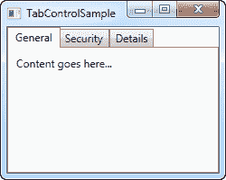
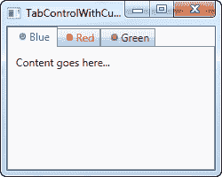
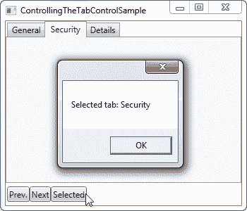

# 使用 WPF 选项卡控件

> 原文：<https://wpf-tutorial.com/tabcontrol/using-the-tabcontrol/>

WPF 选项卡控件允许你将界面分成不同的区域，每个区域都可以通过点击选项卡标题来访问，选项卡标题通常位于控件的顶部。选项卡控件通常用在 Windows 应用中，甚至用在 Windows 自己的界面中，如文件/文件夹的属性对话框等。

就像大多数其他 WPF 控件一样，TabControl 很容易上手。这里有一个非常基本的例子:

```
<Window x:Class="WpfTutorialSamples.Misc_controls.TabControlSample"

        xmlns:x="http://schemas.microsoft.com/winfx/2006/xaml"
        Title="TabControlSample" Height="200" Width="250">
    <Grid>
        <TabControl>
            <TabItem Header="General">
                <Label Content="Content goes here..." />
            </TabItem>
            <TabItem Header="Security" />
            <TabItem Header="Details" />
        </TabControl>
    </Grid>
</Window>
```



如您所见，每个选项卡都由一个 **TabItem** 元素表示，其中显示的文本由**标题** 属性控制。TabItem 元素来自 ContentControl 类，这意味着您可以在其中定义一个元素，如果 选项卡处于活动状态，这个元素就会显示出来(就像屏幕截图上那样)。我在这个例子中使用了一个标签，但是如果你想在标签中放置多个控件，只需使用其中一个带有子控件的 面板。

## 自定义标题

<input type="hidden" name="IL_IN_ARTICLE">

再一次，当你想要定制你的标签时，WPF 被证明是非常灵活的。显然，内容可以按照您喜欢的任何方式呈现，但是选项卡标题也可以！Header 属性可以填充您喜欢的任何内容，我们将在下一个示例中利用这一点:

```
<Window x:Class="WpfTutorialSamples.Misc_controls.TabControlWithCustomHeadersSample"

        xmlns:x="http://schemas.microsoft.com/winfx/2006/xaml"
        Title="TabControlWithCustomHeadersSample" Height="200" Width="250">
    <Grid>
        <Grid>
            <TabControl>
                <TabItem>
                    <TabItem.Header>
                        <StackPanel Orientation="Horizontal">
                            <Image Source="/WpfTutorialSamples;componeimg/bullet_blue.png" />
                            <TextBlock Text="Blue" Foreground="Blue" />
                        </StackPanel>
                    </TabItem.Header>
                    <Label Content="Content goes here..." />
                </TabItem>
                <TabItem>
                    <TabItem.Header>
                        <StackPanel Orientation="Horizontal">
                            <Image Source="/WpfTutorialSamples;componeimg/bullet_red.png" />
                            <TextBlock Text="Red" Foreground="Red" />
                        </StackPanel>
                    </TabItem.Header>
                </TabItem>
                <TabItem>
                    <TabItem.Header>
                        <StackPanel Orientation="Horizontal">
                            <Image Source="/WpfTutorialSamples;componeimg/bullet_green.png" />
                            <TextBlock Text="Green" Foreground="Green" />
                        </StackPanel>
                    </TabItem.Header>
                </TabItem>
            </TabControl>
        </Grid>
    </Grid>
</Window>
```



标签的数量可能有点多，但是一旦深入研究，您可能会发现，这非常简单。现在每个选项卡都有一个 TabControl。Header 元素，它包含一个 StackPanel，后者又包含一个 Image 和一个 文本块控件。这允许我们在每个选项卡上有一个图像，以及自定义文本的颜色(我们可以使它加粗，斜体或其他大小)。

## 控制选项卡控件

有时，您可能希望控制以编程方式选择哪个选项卡，或者获取有关所选选项卡的一些信息。WPF TabControl 有几个属性使这成为可能，包括 SelectedIndex 和 SelectedItem。在下一个示例中，我在第一个示例中添加了几个按钮，允许我们控制 TabControl:

```
<Window x:Class="WpfTutorialSamples.Misc_controls.ControllingTheTabControlSample"

        xmlns:x="http://schemas.microsoft.com/winfx/2006/xaml"
        Title="ControllingTheTabControlSample" Height="300" Width="350">
    <DockPanel>
        <StackPanel Orientation="Horizontal" DockPanel.Dock="Bottom" Margin="2,5">
            <Button Name="btnPreviousTab" Click="btnPreviousTab_Click">Prev.</Button>
            <Button Name="btnNextTab" Click="btnNextTab_Click">Next</Button>
            <Button Name="btnSelectedTab" Click="btnSelectedTab_Click">Selected</Button>
        </StackPanel>
        <TabControl Name="tcSample">
            <TabItem Header="General">
                <Label Content="Content goes here..." />
            </TabItem>
            <TabItem Header="Security" />
            <TabItem Header="Details" />
        </TabControl>

    </DockPanel>
</Window>
```

```
using System;
using System.Windows;
using System.Windows.Controls;

namespace WpfTutorialSamples.Misc_controls
{
	public partial class ControllingTheTabControlSample : Window
	{
		public ControllingTheTabControlSample()
		{
			InitializeComponent();
		}

		private void btnPreviousTab_Click(object sender, RoutedEventArgs e)
		{
			int newIndex = tcSample.SelectedIndex - 1;
			if(newIndex < 0)
				newIndex = tcSample.Items.Count - 1;
			tcSample.SelectedIndex = newIndex;
		}

		private void btnNextTab_Click(object sender, RoutedEventArgs e)
		{
			int newIndex = tcSample.SelectedIndex + 1;
			if(newIndex >= tcSample.Items.Count)
				newIndex = 0;
			tcSample.SelectedIndex = newIndex;
		}

		private void btnSelectedTab_Click(object sender, RoutedEventArgs e)
		{
			MessageBox.Show("Selected tab: " + (tcSample.SelectedItem as TabItem).Header);
		}
	}
}
```



如您所见，我只是在界面的下部添加了一组按钮。前两个允许选择控件上的上一个或下一个选项卡，而最后一个将显示关于当前所选选项卡的信息，如屏幕截图所示。

前两个按钮使用 **SelectedIndex** 属性来确定我们所处的位置，然后将该值减一或加一， 确保新的索引不会低于或高于可用项目的数量。第三个按钮使用 **SelectedItem** 属性 来获取对所选选项卡的引用。如您所见，我必须将其类型转换到 TabItem 类中以获得 header 属性，因为默认情况下, SelectedProperty 属于 object 类型。

## 摘要

当你需要在一个对话框中有一个清晰的分隔时，或者当没有足够的空间来放置你想要的所有控件时，TabControl 是非常有用的。在接下来的几章中，我们将探讨在不同的目的下使用 TabControl 的一些可能性。

* * *