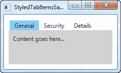
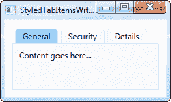

# WPF 选项卡控件:设计选项卡样式

> 原文：<https://wpf-tutorial.com/tabcontrol/styling-the-tabitems/>

在以前的一篇文章中，我们发现定制 WPF TabControl 的选项卡标题是多么容易，例如添加图像或给文本着色。但是，如果您希望超越这一点，直接影响选项卡的外观，包括形状和边框，您需要覆盖 TabItem 元素的控件模板，虽然这不像 WPF 的大多数其他领域那样直接，但仍然是可管理的。

因此，如果您想完全控制 TabControl 的选项卡的外观，请查看下一个示例:

```
<Window x:Class="WpfTutorialSamples.Misc_controls.StyledTabItemsSample"

        xmlns:x="http://schemas.microsoft.com/winfx/2006/xaml"
        Title="StyledTabItemsSample" Height="150" Width="250">
    <Grid>
        <TabControl Margin="10" BorderThickness="0" Background="LightGray">
            <TabControl.Resources>
                <Style TargetType="TabItem">
                    <Setter Property="Template">
                        <Setter.Value>
                            <ControlTemplate TargetType="TabItem">
                                <Grid Name="Panel">
                                    <ContentPresenter x:Name="ContentSite"
                                        VerticalAlignment="Center"
                                        HorizontalAlignment="Center"
                                        ContentSource="Header"
                                        Margin="10,2"/>
                                </Grid>
                                <ControlTemplate.Triggers>
                                    <Trigger Property="IsSelected" Value="True">
                                        <Setter TargetName="Panel" Property="Background" Value="LightSkyBlue" />
                                    </Trigger>
                                    <Trigger Property="IsSelected" Value="False">
                                        <Setter TargetName="Panel" Property="Background" Value="White" />
                                    </Trigger>
                                </ControlTemplate.Triggers>
                            </ControlTemplate>
                        </Setter.Value>
                    </Setter>
                </Style>
            </TabControl.Resources>
            <TabItem Header="General">
                <Label Content="Content goes here..." />
            </TabItem>
            <TabItem Header="Security" />
            <TabItem Header="Details" />
        </TabControl>
    </Grid>
</Window>
```



正如你所看到的，这使得 TabControl 看起来有点像 Windows 8，没有边框和不那么微妙的颜色来标记选中的选项卡，没有背景来标记未选中的选项卡。所有这些都是通过使用样式更改 ControlTemplate 来完成的。通过添加一个 **ContentPresenter** 控件，我们 指定 TabItem 的内容应该放在哪里。我们还有几个触发器，根据 **IsSelected** 属性控制标签的背景颜色。

如果你想要一个不那么微妙的外观，它就像改变模板一样容易。例如，你可能想要一个边框，但是要有圆角和渐变背景——没问题！看看下一个例子，我们就是这样完成的:

<input type="hidden" name="IL_IN_ARTICLE">

```
<Window x:Class="WpfTutorialSamples.Misc_controls.StyledTabItemsWithBorderSample"

        xmlns:x="http://schemas.microsoft.com/winfx/2006/xaml"
        Title="StyledTabItemsWithBorderSample" Height="150" Width="250">
    <Grid>
        <TabControl Margin="10" BorderBrush="Gainsboro">
            <TabControl.Resources>
                <Style TargetType="TabItem">
                    <Setter Property="Template">
                        <Setter.Value>
                            <ControlTemplate TargetType="TabItem">
                                <Border Name="Border" BorderThickness="1,1,1,0" BorderBrush="Gainsboro" CornerRadius="4,4,0,0" Margin="2,0">
                                    <ContentPresenter x:Name="ContentSite"
                                        VerticalAlignment="Center"
                                        HorizontalAlignment="Center"
                                        ContentSource="Header"
                                        Margin="10,2"/>
                                </Border>
                                <ControlTemplate.Triggers>
                                    <Trigger Property="IsSelected" Value="True">
                                        <Setter TargetName="Border" Property="Background" Value="LightSkyBlue" />
                                    </Trigger>
                                    <Trigger Property="IsSelected" Value="False">
                                        <Setter TargetName="Border" Property="Background" Value="GhostWhite" />
                                    </Trigger>
                                </ControlTemplate.Triggers>
                            </ControlTemplate>
                        </Setter.Value>
                    </Setter>
                </Style>
            </TabControl.Resources>
            <TabItem Header="General">
                <Label Content="Content goes here..." />
            </TabItem>
            <TabItem Header="Security" />
            <TabItem Header="Details" />
        </TabControl>
    </Grid>
</Window>
```



如您所见，我几乎只是在 ContentPresenter 周围添加了一个边框控件来实现这种改变的外观。希望这能证明获得定制风格的标签是多么容易，以及这种技术有多少可能性。

* * *