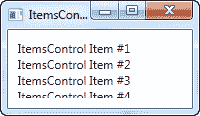
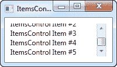

# 项目控件

> 原文：<https://wpf-tutorial.com/list-controls/itemscontrol/>

WPF 有各种显示数据列表的控件。它们有几种形状和形式，在复杂程度和为你做多少工作方面各不相同。最简单的变体是 ItemsControl，它几乎只是一个基于标记的循环——您需要应用所有的样式和模板，但在许多情况下，这正是您所需要的。

## 一个简单的 ItemsControl 示例

让我们从一个非常简单的例子开始，在这个例子中，我们用一组条目手工填充 ItemsControl。这应该向您展示 ItemsControl 有多简单:

```
<Window x:Class="WpfTutorialSamples.ItemsControl.ItemsControlSample"

        xmlns:x="http://schemas.microsoft.com/winfx/2006/xaml"
		xmlns:system="clr-namespace:System;assembly=mscorlib"
        Title="ItemsControlSample" Height="150" Width="200">
    <Grid Margin="10">
		<ItemsControl>
			<system:String>ItemsControl Item #1</system:String>
			<system:String>ItemsControl Item #2</system:String>
			<system:String>ItemsControl Item #3</system:String>
			<system:String>ItemsControl Item #4</system:String>
			<system:String>ItemsControl Item #5</system:String>
		</ItemsControl>
	</Grid>
</Window>
```


正如你所看到的，没有任何东西表明我们正在使用一个控件来重复这些项，而不是仅仅手动添加例如 5 个 TextBlock 控件——默认情况下，ItemsControl 是完全无外观的。如果你点击其中一个项目，什么都不会发生，因为没有选择项目或类似的概念。

<input type="hidden" name="IL_IN_ARTICLE">

## 具有数据绑定的 ItemsControl

当然，ItemsControl 并不像我们在第一个例子中那样，用于标记中定义的项目。与 WPF 中的几乎所有其他控件一样，ItemsControl 是为数据绑定而设计的，在数据绑定中，我们使用一个模板来定义我们的代码隐藏类应该如何呈现给用户。

为了演示这一点，我编写了一个示例，在这个示例中，我们向用户显示一个 TODO 列表，并且向您展示一旦您定义了自己的模板，一切变得多么灵活，我使用了一个 ProgressBar 控件向您显示当前的完成百分比。首先是一些代码，然后是截图，然后是所有的解释:

```
<Window x:Class="WpfTutorialSamples.ItemsControl.ItemsControlDataBindingSample"

        xmlns:x="http://schemas.microsoft.com/winfx/2006/xaml"
        Title="ItemsControlDataBindingSample" Height="150" Width="300">
    <Grid Margin="10">
		<ItemsControl Name="icTodoList">
			<ItemsControl.ItemTemplate>
				<DataTemplate>
					<Grid Margin="0,0,0,5">
						<Grid.ColumnDefinitions>
							<ColumnDefinition Width="*" />
							<ColumnDefinition Width="100" />
						</Grid.ColumnDefinitions>
						<TextBlock Text="{Binding Title}" />
						<ProgressBar Grid.Column="1" Minimum="0" Maximum="100" Value="{Binding Completion}" />
					</Grid>
				</DataTemplate>
			</ItemsControl.ItemTemplate>
		</ItemsControl>
	</Grid>
</Window>
```

```
using System;
using System.Windows;
using System.Collections.Generic;

namespace WpfTutorialSamples.ItemsControl
{
	public partial class ItemsControlDataBindingSample : Window
	{
		public ItemsControlDataBindingSample()
		{
			InitializeComponent();

			List<TodoItem> items = new List<TodoItem>();
			items.Add(new TodoItem() { Title = "Complete this WPF tutorial", Completion = 45 });
			items.Add(new TodoItem() { Title = "Learn C#", Completion = 80 });
			items.Add(new TodoItem() { Title = "Wash the car", Completion = 0 });

			icTodoList.ItemsSource = items;
		}
	}

	public class TodoItem
	{
		public string Title { get; set; }
		public int Completion { get; set; }
	}
}
```


此示例最重要的部分是我们在 ItemsControl.ItemTemplate 中使用 DataTemplate 标记在 ItemsControl 中指定的模板。我们添加了一个网格面板，以获得两列:在第一列中，我们有一个 TextBlock，它将显示 TODO 项的标题，在第二列中，我们有一个 ProgressBar 控件，它的值绑定到 Completion 属性。

该模板现在表示一个 TodoItem，我们在代码隐藏文件中声明了它，在该文件中，我们还实例化了许多 todo item，并将它们添加到一个列表中。最后，这个列表被分配给我们的 ItemsControl 的 **ItemsSource** 属性，然后它为我们完成剩下的工作。列表中的每一项都是使用我们的模板显示的，正如您在结果截图中看到的。

## ItemsPanelTemplate 属性

在上面的例子中，所有的项目都是从上到下呈现的，每个项目占据了一整行。发生这种情况是因为默认情况下，ItemsControl 将我们的所有项目都放入垂直对齐的 StackPanel 中。不过这很容易更改，因为 ItemsControl 允许您更改用于保存所有项目的面板类型。这里有一个例子:

```
<Window x:Class="WpfTutorialSamples.ItemsControl.ItemsControlPanelSample"

        xmlns:x="http://schemas.microsoft.com/winfx/2006/xaml"
		xmlns:system="clr-namespace:System;assembly=mscorlib"
        Title="ItemsControlPanelSample" Height="150" Width="250">
	<Grid Margin="10">
		<ItemsControl>
			<ItemsControl.ItemsPanel>
				<ItemsPanelTemplate>
					<WrapPanel />
				</ItemsPanelTemplate>
			</ItemsControl.ItemsPanel>
			<ItemsControl.ItemTemplate>
				<DataTemplate>
					<Button Content="{Binding}" Margin="0,0,5,5" />
				</DataTemplate>
			</ItemsControl.ItemTemplate>
			<system:String>Item #1</system:String>
			<system:String>Item #2</system:String>
			<system:String>Item #3</system:String>
			<system:String>Item #4</system:String>
			<system:String>Item #5</system:String>
		</ItemsControl>
	</Grid>
</Window>
```


我们通过在 **ItemsPanelTemplate** 属性中声明一个模板来指定 ItemsControl 应该使用 WrapPanel 作为它的模板，只是为了好玩，我们加入了一个 ItemTemplate，使字符串呈现为按钮。你可以使用任何 WPF 面板，但有些更有用。

另一个很好的例子是 UniformGrid 面板，在这里我们可以定义许多列，然后让我们的项目整齐地显示在等宽的列中:

```
<Window x:Class="WpfTutorialSamples.ItemsControl.ItemsControlPanelSample"

        xmlns:x="http://schemas.microsoft.com/winfx/2006/xaml"
		xmlns:system="clr-namespace:System;assembly=mscorlib"
        Title="ItemsControlPanelSample" Height="150" Width="250">
	<Grid Margin="10">
		<ItemsControl>
			<ItemsControl.ItemsPanel>
				<ItemsPanelTemplate>
					<UniformGrid Columns="2" />
				</ItemsPanelTemplate>
			</ItemsControl.ItemsPanel>
			<ItemsControl.ItemTemplate>
				<DataTemplate>
					<Button Content="{Binding}" Margin="0,0,5,5" />
				</DataTemplate>
			</ItemsControl.ItemTemplate>
			<system:String>Item #1</system:String>
			<system:String>Item #2</system:String>
			<system:String>Item #3</system:String>
			<system:String>Item #4</system:String>
			<system:String>Item #5</system:String>
		</ItemsControl>
	</Grid>
</Window>
```


## 带有滚动条的 ItemsControl

一旦您开始使用 ItemsControl，您可能会遇到一个非常常见的问题:默认情况下，ItemsControl 没有任何滚动条，这意味着如果内容不适合，它只是被裁剪。从本文的第一个例子和调整窗口大小可以看出这一点:



不过，WPF 让这个问题很容易解决。有许多可能的解决方案，例如，您可以更改 ItemsControl 使用的模板以包含一个 ScrollViewer 控件，但最简单的解决方案是简单地在 ItemsControl 周围放置一个 ScrollViewer。这里有一个例子:

```
<Window x:Class="WpfTutorialSamples.ItemsControl.ItemsControlSample"

        xmlns:x="http://schemas.microsoft.com/winfx/2006/xaml"
		xmlns:system="clr-namespace:System;assembly=mscorlib"
        Title="ItemsControlSample" Height="150" Width="200">
	<Grid Margin="10">
		<ScrollViewer VerticalScrollBarVisibility="Auto" HorizontalScrollBarVisibility="Auto">
			<ItemsControl>
				<system:String>ItemsControl Item #1</system:String>
				<system:String>ItemsControl Item #2</system:String>
				<system:String>ItemsControl Item #3</system:String>
				<system:String>ItemsControl Item #4</system:String>
				<system:String>ItemsControl Item #5</system:String>
			</ItemsControl>
		</ScrollViewer>
	</Grid>
</Window>
```



我将两个可见性选项设置为 Auto，使它们仅在需要时可见。正如您在截图中看到的，您现在可以滚动浏览项目列表。

## 摘要

当您希望完全控制数据的显示方式，并且不需要任何可选择的内容时，ItemsControl 非常有用。如果你想让用户能够从列表中选择项目，那么你最好使用其他控件，例如 ListBox 或 ListView。它们将在接下来的章节中描述。

* * *