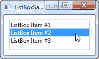
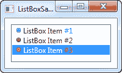
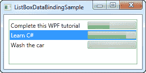
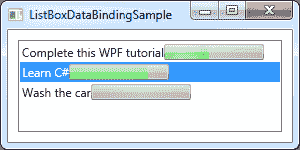
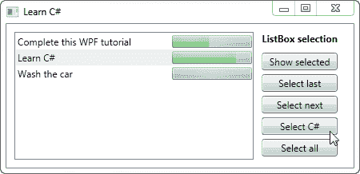

# 列表框（`ListBox`）控件

> 原文：<https://wpf-tutorial.com/list-controls/listbox-control/>

在上一篇文章中，我们看了一下 ItemsControl，它可能是 WPF 最简单的列表。ListBox 控件是下一个控件，它增加了一些功能。一个主要的区别是 ListBox 控件实际上处理选择，允许最终用户从列表中选择一个或几个项目，并自动为其提供视觉反馈。

下面是一个非常简单的列表框（`ListBox`）控件的例子:

```
<Window x:Class="WpfTutorialSamples.ListBox_control.ListBoxSample"

        xmlns:x="http://schemas.microsoft.com/winfx/2006/xaml"
        Title="ListBoxSample" Height="120" Width="200">
    <Grid Margin="10">
		<ListBox>
			<ListBoxItem>ListBox Item #1</ListBoxItem>
			<ListBoxItem>ListBox Item #2</ListBoxItem>
			<ListBoxItem>ListBox Item #3</ListBoxItem>
		</ListBox>
	</Grid>
</Window>
```



这非常简单:我们声明一个 ListBox 控件，在它的内部，我们声明三个 ListBoxItem，每个都有自己的文本。但是，由于 ListBoxItem 实际上是一个 ContentControl，我们可以为它定义自定义内容:

```
<Window x:Class="WpfTutorialSamples.ListBox_control.ListBoxSample"

        xmlns:x="http://schemas.microsoft.com/winfx/2006/xaml"
        Title="ListBoxSample" Height="120" Width="200">
	<Grid Margin="10">
		<ListBox>
			<ListBoxItem>
				<StackPanel Orientation="Horizontal">
					<Image Source="/WpfTutorialSamples;componeimg/bullet_blue.png" />
					<TextBlock>ListBox Item #1</TextBlock>
				</StackPanel>
			</ListBoxItem>
			<ListBoxItem>
				<StackPanel Orientation="Horizontal">
					<Image Source="/WpfTutorialSamples;componeimg/bullet_green.png" />
					<TextBlock>ListBox Item #2</TextBlock>
				</StackPanel>
			</ListBoxItem>
			<ListBoxItem>
				<StackPanel Orientation="Horizontal">
					<Image Source="/WpfTutorialSamples;componeimg/bullet_red.png" />
					<TextBlock>ListBox Item #3</TextBlock>
				</StackPanel>
			</ListBoxItem>
		</ListBox>
	</Grid>
</Window>
```

<input type="hidden" name="IL_IN_ARTICLE"> 

对于每个 ListBoxItem，我们现在添加一个 StackPanel，在其中添加一个图像和一个 TextBlock。这使我们能够完全控制内容和文本呈现，正如你在截图中看到的，每个数字使用了不同的颜色。

从屏幕截图中，您可能还会注意到 ItemsControl 和 ListBox 的另一个不同之处:默认情况下，控件周围会显示一个边框，使其看起来像一个实际的控件，而不仅仅是输出。

## 数据绑定列表框

手动为列表框定义项目是一个很好的例子，但是大多数情况下，列表框（`ListBox`）控件将使用数据绑定来填充来自数据源的项目。默认情况下，如果将项目列表绑定到 ListBox，将使用它们的`ToString()`方法来表示每个项目。这很少是您想要的，但幸运的是，我们可以轻松地声明一个用于呈现每个项目的模板。

我重用了 ItemsControl 文章中的基于 TODO 的示例，在该示例中，我们使用一个简单的代码隐藏类构建了一个很酷的 TODO 列表，在本例中，是一个用于可视化表示的 ListBox 控件。下面是一个例子:

```
<Window x:Class="WpfTutorialSamples.ListBox_control.ListBoxDataBindingSample"

        xmlns:x="http://schemas.microsoft.com/winfx/2006/xaml"
        Title="ListBoxDataBindingSample" Height="150" Width="300">
    <Grid Margin="10">
		<ListBox Name="lbTodoList" HorizontalContentAlignment="Stretch">
			<ListBox.ItemTemplate>
				<DataTemplate>
					<Grid Margin="0,2">
						<Grid.ColumnDefinitions>
							<ColumnDefinition Width="*" />
							<ColumnDefinition Width="100" />
						</Grid.ColumnDefinitions>
						<TextBlock Text="{Binding Title}" />
						<ProgressBar Grid.Column="1" Minimum="0" Maximum="100" Value="{Binding Completion}" />
					</Grid>
				</DataTemplate>
			</ListBox.ItemTemplate>
		</ListBox>
	</Grid>
</Window>
```

```
using System;
using System.Windows;
using System.Collections.Generic;

namespace WpfTutorialSamples.ListBox_control
{
	public partial class ListBoxDataBindingSample : Window
	{
		public ListBoxDataBindingSample()
		{
			InitializeComponent();
			List<TodoItem> items = new List<TodoItem>();
			items.Add(new TodoItem() { Title = "Complete this WPF tutorial", Completion = 45 });
			items.Add(new TodoItem() { Title = "Learn C#", Completion = 80 });
			items.Add(new TodoItem() { Title = "Wash the car", Completion = 0 });

			lbTodoList.ItemsSource = items;
		}
	}

	public class TodoItem
	{
		public string Title { get; set; }
		public int Completion { get; set; }
	}
}
```



所有神奇的事情都发生在我们为 ListBox 定义的 ItemTemplate 中。在这里，我们指定每个 ListBox 项应该由一个网格组成，分为两列，第一列中的 TextBlock 显示标题，第二列中的 ProgressBar 显示完成状态。为了得到这些值，我们使用了一些非常简单的数据绑定，这将在本教程的数据绑定部分进行解释。

在代码隐藏文件中，我们声明了一个非常简单的 TodoItem 类来保存我们的每个 TODO 项。在窗口的构造器中，我们初始化一个列表，向其中添加三个 TODO 项，然后将其分配给 ListBox 的 ItemsSource。我们在 XAML 部分指定的 ItemsSource 和 ItemTemplate 的组合，这就是 WPF 将所有项目呈现为 TODO 列表所需的全部内容。

请注意我在列表框上设置为**拉伸**的**HorizontalContentAlignment**属性。列表框项目的默认内容对齐方式 是**左**，这意味着每个项目只占用它需要的水平空间。结果呢？嗯，不完全是我们想要的:



通过使用拉伸对齐，每个项目都被拉伸以占据全部可用空间，正如您在前面的屏幕截图中看到的那样。

## 使用列表框选择

如上所述，ItemsControl 和 ListBox 之间的一个关键区别是 ListBox 为您处理和显示用户选择。因此，许多列表框问题都围绕着如何处理选择。为了帮助解决这些问题，我创建了一个更大的例子，向您展示一些与选择相关的技巧:

```
<Window x:Class="WpfTutorialSamples.ListBox_control.ListBoxSelectionSample"

        xmlns:x="http://schemas.microsoft.com/winfx/2006/xaml"
        Title="ListBoxSelectionSample" Height="250" Width="450">
	<DockPanel Margin="10">
		<StackPanel DockPanel.Dock="Right" Margin="10,0">
			<StackPanel.Resources>
				<Style TargetType="Button">
					<Setter Property="Margin" Value="0,0,0,5" />
				</Style>
			</StackPanel.Resources>
			<TextBlock FontWeight="Bold" Margin="0,0,0,10">ListBox selection</TextBlock>
			<Button Name="btnShowSelectedItem" Click="btnShowSelectedItem_Click">Show selected</Button>
			<Button Name="btnSelectLast" Click="btnSelectLast_Click">Select last</Button>
			<Button Name="btnSelectNext" Click="btnSelectNext_Click">Select next</Button>
			<Button Name="btnSelectCSharp" Click="btnSelectCSharp_Click">Select C#</Button>
			<Button Name="btnSelectAll" Click="btnSelectAll_Click">Select all</Button>
		</StackPanel>
		<ListBox Name="lbTodoList" HorizontalContentAlignment="Stretch" SelectionMode="Extended" SelectionChanged="lbTodoList_SelectionChanged">
			<ListBox.ItemTemplate>
				<DataTemplate>
					<Grid Margin="0,2">
						<Grid.ColumnDefinitions>
							<ColumnDefinition Width="*" />
							<ColumnDefinition Width="100" />
						</Grid.ColumnDefinitions>
						<TextBlock Text="{Binding Title}" />
						<ProgressBar Grid.Column="1" Minimum="0" Maximum="100" Value="{Binding Completion}" />
					</Grid>
				</DataTemplate>
			</ListBox.ItemTemplate>
		</ListBox>
	</DockPanel>
</Window>
```

```
using System;
using System.Windows;
using System.Collections.Generic;

namespace WpfTutorialSamples.ListBox_control
{
	public partial class ListBoxSelectionSample : Window
	{
		public ListBoxSelectionSample()
		{
			InitializeComponent();
			List<TodoItem> items = new List<TodoItem>();
			items.Add(new TodoItem() { Title = "Complete this WPF tutorial", Completion = 45 });
			items.Add(new TodoItem() { Title = "Learn C#", Completion = 80 });
			items.Add(new TodoItem() { Title = "Wash the car", Completion = 0 });

			lbTodoList.ItemsSource = items;
		}

		private void lbTodoList_SelectionChanged(object sender, System.Windows.Controls.SelectionChangedEventArgs e)
		{
			if(lbTodoList.SelectedItem != null)
				this.Title = (lbTodoList.SelectedItem as TodoItem).Title;
		}

		private void btnShowSelectedItem_Click(object sender, RoutedEventArgs e)
		{
			foreach(object o in lbTodoList.SelectedItems)
				MessageBox.Show((o as TodoItem).Title);
		}

		private void btnSelectLast_Click(object sender, RoutedEventArgs e)
		{
			lbTodoList.SelectedIndex = lbTodoList.Items.Count - 1;
		}

		private void btnSelectNext_Click(object sender, RoutedEventArgs e)
		{
			int nextIndex = 0;
			if((lbTodoList.SelectedIndex >= 0) && (lbTodoList.SelectedIndex < (lbTodoList.Items.Count - 1)))
				nextIndex = lbTodoList.SelectedIndex + 1;
			lbTodoList.SelectedIndex = nextIndex;
		}

		private void btnSelectCSharp_Click(object sender, RoutedEventArgs e)
		{
			foreach(object o in lbTodoList.Items)
			{
				if((o is TodoItem) && ((o as TodoItem).Title.Contains("C#")))
				{
					lbTodoList.SelectedItem = o;
					break;
				}
			}
		}

		private void btnSelectAll_Click(object sender, RoutedEventArgs e)
		{
			foreach(object o in lbTodoList.Items)
				lbTodoList.SelectedItems.Add(o);
		}

	}

	public class TodoItem
	{
		public string Title { get; set; }
		public int Completion { get; set; }
	}
}
```



如您所见，我在 ListBox 右侧定义了一系列按钮，以获取或操作选择。我还把**选择模式**改成了**扩展**，允许选择多个项目。这可以通过编程来完成，就像我在这个例子中的 所做的那样，也可以由最终用户通过在点击项目时按住**【Ctrl】**或**【Shift】**来完成。

对于每个按钮，我都在代码隐藏中定义了一个点击处理程序。每个操作都应该是不言自明的，所用的 C#代码也相当简单，但是如果您仍然有疑问，请尝试在您自己的机器上运行该示例，并测试该示例中的各种可能性。

## 摘要

ListBox 控件很像 ItemsControl，可以使用几种相同的技术。与 ItemsControl 相比，ListBox 确实提供了更多的功能，尤其是选择处理。对于更多的功能，比如列标题，您应该看看 列表视图（`ListView`）控件，在本教程的后面会有非常详细的描述，有几篇文章解释了所有的功能。

* * *