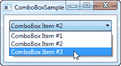
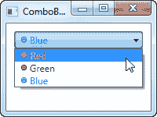
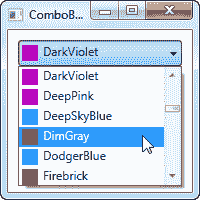
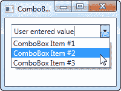
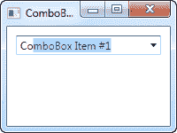
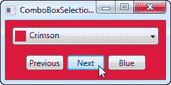

# 组合框控件

> 原文：<https://wpf-tutorial.com/list-controls/combobox-control/>

组合框控件在许多方面与 ListBox 控件相似，但占用的空间更少，因为项目列表在不需要时会被隐藏。组合框控件在 Windows 中的很多地方都有使用，但是为了确保每个人都知道它的外观和工作方式，我们将直接进入一个简单的示例:

```
<Window x:Class="WpfTutorialSamples.ComboBox_control.ComboBoxSample"

        xmlns:x="http://schemas.microsoft.com/winfx/2006/xaml"
        Title="ComboBoxSample" Height="150" Width="200">
    <StackPanel Margin="10">
        <ComboBox>
            <ComboBoxItem>ComboBox Item #1</ComboBoxItem>
            <ComboBoxItem IsSelected="True">ComboBox Item #2</ComboBoxItem>
            <ComboBoxItem>ComboBox Item #3</ComboBoxItem>
        </ComboBox>
    </StackPanel>
</Window>
```



在屏幕截图中，我已经通过单击激活了控件，从而显示了项目列表。从代码中可以看出，简单形式的 ComboBox 非常容易使用。我在这里所做的只是手动添加一些项目，通过在其中一个项目上设置 IsSelected 属性，使其成为默认的选定项目。

## 自定义内容

在第一个例子中，我们只显示了项目中的文本，这对于 组合框控件来说很常见，但是由于 ComboBoxItem 是一个 ContentControl，我们实际上可以使用几乎任何内容作为内容。让我们试着列出一个稍微复杂一点的项目列表:

<input type="hidden" name="IL_IN_ARTICLE">

```
<Window x:Class="WpfTutorialSamples.ComboBox_control.ComboBoxCustomContentSample"

        xmlns:x="http://schemas.microsoft.com/winfx/2006/xaml"
        Title="ComboBoxCustomContentSample" Height="150" Width="200">
    <StackPanel Margin="10">
        <ComboBox>
            <ComboBoxItem>
                <StackPanel Orientation="Horizontal">
                    <Image Source="/WpfTutorialSamples;componeimg/bullet_red.png" />
                    <TextBlock Foreground="Red">Red</TextBlock>
                </StackPanel>
            </ComboBoxItem>
            <ComboBoxItem>
                <StackPanel Orientation="Horizontal">
                    <Image Source="/WpfTutorialSamples;componeimg/bullet_green.png" />
                    <TextBlock Foreground="Green">Green</TextBlock>
                </StackPanel>
            </ComboBoxItem>
            <ComboBoxItem>
                <StackPanel Orientation="Horizontal">
                    <Image Source="/WpfTutorialSamples;componeimg/bullet_blue.png" />
                    <TextBlock Foreground="Blue">Blue</TextBlock>
                </StackPanel>
            </ComboBoxItem>
        </ComboBox>
    </StackPanel>
</Window>
```



对于每个 ComboBoxItem，我们现在添加一个 StackPanel，在其中添加一个图像和一个 TextBlock。这使我们能够完全控制内容和文本呈现，正如您在屏幕截图中看到的那样，文本颜色和图像都表示一个颜色值。

## 数据绑定组合框

从第一个例子中可以看出，使用 XAML 手动定义 组合框控件的项目很容易，但是您可能很快就会遇到这样的情况，您需要项目来自某种数据源，如数据库或内存列表。使用 WPF 数据绑定和自定义模板，我们可以轻松地呈现颜色列表，包括颜色预览:

```
<Window x:Class="WpfTutorialSamples.ComboBox_control.ComboBoxDataBindingSample"

        xmlns:x="http://schemas.microsoft.com/winfx/2006/xaml"
        Title="ComboBoxDataBindingSample" Height="200" Width="200">
    <StackPanel Margin="10">
        <ComboBox Name="cmbColors">
            <ComboBox.ItemTemplate>
                <DataTemplate>
                    <StackPanel Orientation="Horizontal">
                        <Rectangle Fill="{Binding Name}" Width="16" Height="16" Margin="0,2,5,2" />
                        <TextBlock Text="{Binding Name}" />
                    </StackPanel>
                </DataTemplate>
            </ComboBox.ItemTemplate>
        </ComboBox>
    </StackPanel>
</Window>
```

```
using System;
using System.Collections.Generic;
using System.Windows;
using System.Windows.Media;

namespace WpfTutorialSamples.ComboBox_control
{
	public partial class ComboBoxDataBindingSample : Window
	{
		public ComboBoxDataBindingSample()
		{
			InitializeComponent();
			cmbColors.ItemsSource = typeof(Colors).GetProperties();
		}
	}
}
```



这实际上很简单:在代码隐藏中，我使用基于反射的方法和 colors 类获得了所有颜色的列表。我将它赋给 ComboBox 的 **ItemsSource** 属性，然后使用我在 XAML 部件中定义的模板呈现每种颜色。

按照 ItemTemplate 的定义，每个项目都由一个 StackPanel 和一个矩形和一个 TextBlock 组成，每个矩形和 text block 都绑定到颜色值。这给了我们一个完整的颜色列表，用最少的努力-它看起来也很好，对不对？

## IsEditable

在第一个例子中，用户只能从我们的项目列表中选择，但是 ComboBox 的一个很酷的地方是它支持让用户从项目列表中选择或者输入他们自己的值。这在您希望通过给用户一组预定义的选项来帮助他们，同时仍然给他们手动输入所需值的选项的情况下非常有用。这都是由 **IsEditable** 属性控制的，该属性对组合框的行为和外观有很大的改变:

```
<Window x:Class="WpfTutorialSamples.ComboBox_control.ComboBoxEditableSample"

        xmlns:x="http://schemas.microsoft.com/winfx/2006/xaml"
        Title="ComboBoxEditableSample" Height="150" Width="200">
    <StackPanel Margin="10">
        <ComboBox IsEditable="True">
            <ComboBoxItem>ComboBox Item #1</ComboBoxItem>
            <ComboBoxItem>ComboBox Item #2</ComboBoxItem>
            <ComboBoxItem>ComboBox Item #3</ComboBoxItem>
        </ComboBox>
    </StackPanel>
</Window>
```



如您所见，我可以输入一个完全不同的值，或者从列表中选择一个值。如果从列表中选择，它只是覆盖组合框的文本。

作为一个可爱的小奖励，当用户开始输入时，ComboBox 将自动尝试帮助用户选择一个现有的值，正如您从下一个截图中看到的，我刚刚开始输入“Co”:



默认情况下，匹配不区分大小写，但是您可以通过将**istextsearchcasensitive**设置为 True 来区分大小写。如果您根本不想要 这种自动完成行为，您可以通过将**istextsearchabled**设置为 False 来禁用它。

## 使用组合框选择

使用 组合框控件的一个关键部分是能够读取用户选择，甚至用代码控制它。在下一个示例中，我重用了数据绑定 ComboBox 示例，但是添加了一些按钮来控制选择。我还使用了 **SelectionChanged** 事件来捕捉当被选择的项目被代码或用户更改时的 ,并对其进行操作。

以下是示例:

```
<Window x:Class="WpfTutorialSamples.ComboBox_control.ComboBoxSelectionSample"

        xmlns:x="http://schemas.microsoft.com/winfx/2006/xaml"
        Title="ComboBoxSelectionSample" Height="125" Width="250">
    <StackPanel Margin="10">
        <ComboBox Name="cmbColors" SelectionChanged="cmbColors_SelectionChanged">
            <ComboBox.ItemTemplate>
                <DataTemplate>
                    <StackPanel Orientation="Horizontal">
                        <Rectangle Fill="{Binding Name}" Width="16" Height="16" Margin="0,2,5,2" />
                        <TextBlock Text="{Binding Name}" />
                    </StackPanel>
                </DataTemplate>
            </ComboBox.ItemTemplate>
        </ComboBox>
        <WrapPanel Margin="15" HorizontalAlignment="Center">
            <Button Name="btnPrevious" Click="btnPrevious_Click" Width="55">Previous</Button>
            <Button Name="btnNext" Click="btnNext_Click" Margin="5,0" Width="55">Next</Button>
            <Button Name="btnBlue" Click="btnBlue_Click" Width="55">Blue</Button>
        </WrapPanel>
    </StackPanel>
</Window>
```

```
using System;
using System.Collections.Generic;
using System.Reflection;
using System.Windows;
using System.Windows.Media;

namespace WpfTutorialSamples.ComboBox_control
{
	public partial class ComboBoxSelectionSample : Window
	{
		public ComboBoxSelectionSample()
		{
			InitializeComponent();
			cmbColors.ItemsSource = typeof(Colors).GetProperties();
		}

		private void btnPrevious_Click(object sender, RoutedEventArgs e)
		{
			if(cmbColors.SelectedIndex > 0)
				cmbColors.SelectedIndex = cmbColors.SelectedIndex - 1;
		}

		private void btnNext_Click(object sender, RoutedEventArgs e)
		{
			if(cmbColors.SelectedIndex < cmbColors.Items.Count-1)
				cmbColors.SelectedIndex = cmbColors.SelectedIndex + 1;
		}

		private void btnBlue_Click(object sender, RoutedEventArgs e)
		{
			cmbColors.SelectedItem = typeof(Colors).GetProperty("Blue");
		}

		private void cmbColors_SelectionChanged(object sender, System.Windows.Controls.SelectionChangedEventArgs e)
		{
			Color selectedColor = (Color)(cmbColors.SelectedItem as PropertyInfo).GetValue(null, null);
			this.Background = new SolidColorBrush(selectedColor);
		}
	}
}
```



这个例子有趣的部分是我们三个按钮的三个事件处理程序，以及 **SelectionChanged** 事件处理程序。在前两个 中，我们通过读取 **SelectedIndex** 属性来选择上一个或下一个项目，然后对其进行减 1 或加 1。 非常简单，易于操作。

在第三个事件处理程序中，我们使用 SelectedItem 根据值选择特定的项。我在这里做了一些额外的工作(使用。NET reflection)，因为 ComboBox 绑定到一个属性列表，每个属性都是一种颜色，而不是一个简单的颜色列表，但基本上都是将其中一个项目包含的值赋予 **SelectedItem** 属性。

在第四个也是最后一个事件处理程序中，我响应被更改的选定项。当这种情况发生时，我读取选择的颜色(再次使用反射，如上所述)，然后使用选择的颜色为窗口创建一个新的背景笔刷。截图上可以看到效果。

如果你正在使用一个可编辑的组合框(IsEditable 属性设置为 true)，你可以读取**文本**属性来知道用户 已经输入或选择的值。

* * *