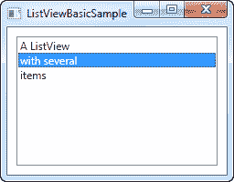
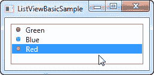

# 一个简单的列表视图例子

> 原文：<https://wpf-tutorial.com/listview-control/simple-listview/>

WPF 列表视图（`ListView`）控件在其最简单的形式下是非常简单的。事实上，它看起来很像 WPF 列表框，直到你开始向它添加专门的视图。这并不奇怪，因为 ListView 直接继承自 ListBox 控件。因此，默认的 ListView 实际上只是一个 ListBox，具有不同的选择模式(稍后将详细介绍)。

让我们尝试以最简单的形式创建一个 ListView:

```
<Window x:Class="WpfTutorialSamples.ListView_control.ListViewBasicSample"

        xmlns:x="http://schemas.microsoft.com/winfx/2006/xaml"
        Title="ListViewBasicSample" Height="200" Width="200">
    <Grid>
		<ListView Margin="10">
			<ListViewItem>A ListView</ListViewItem>
			<ListViewItem IsSelected="True">with several</ListViewItem>
			<ListViewItem>items</ListViewItem>
		</ListView>
	</Grid>
</Window>
```



这非常简单，使用手动指定的 ListViewItem 来填充列表，除了一个表示每个项目的文本标签之外什么也没有——这是一个最小的 WPF 列表视图（`ListView`）控件。

## 带有图像的 ListViewItem

<input type="hidden" name="IL_IN_ARTICLE">

由于 WPF 的无外观特性，为 ListViewItem 指定图像不仅仅是为属性分配图像 ID 或键。相反，您可以完全控制它，并指定在 ListViewItem 中呈现图像和文本所需的控件。这里有一个例子:

```
<Window x:Class="WpfTutorialSamples.ListView_control.ListViewBasicSample"

        xmlns:x="http://schemas.microsoft.com/winfx/2006/xaml"
        Title="ListViewBasicSample" Height="200" Width="200">
    <Grid>
		<ListView Margin="10">
			<ListViewItem>
				<StackPanel Orientation="Horizontal">
					<Image Source="/WpfTutorialSamples;componeimg/bullet_green.png" Margin="0,0,5,0" />
					<TextBlock>Green</TextBlock>
				</StackPanel>
			</ListViewItem>
			<ListViewItem>
				<StackPanel Orientation="Horizontal">
					<Image Source="/WpfTutorialSamples;componeimg/bullet_blue.png" Margin="0,0,5,0" />
					<TextBlock>Blue</TextBlock>
				</StackPanel>
			</ListViewItem>
			<ListViewItem IsSelected="True">
				<StackPanel Orientation="Horizontal">
					<Image Source="/WpfTutorialSamples;componeimg/bullet_red.png" Margin="0,0,5,0" />
					<TextBlock>Red</TextBlock>
				</StackPanel>
			</ListViewItem>
		</ListView>
	</Grid>
</Window>
```



我们在这里做的很简单。因为 ListViewItem 派生自 ContentControl 类，所以我们可以指定一个 WPF 控件作为其内容。在本例中，我们使用一个 StackPanel，它有一个 Image 和一个 TextBlock 作为它的子控件。

## 摘要

正如你所看到的，在 XAML 手动构建一个 ListView 非常简单，但是在大多数情况下，你的 ListView 数据将来自某种数据源，它应该在运行时呈现在 ListView 中。我们将在下一章中研究这一点。

* * *