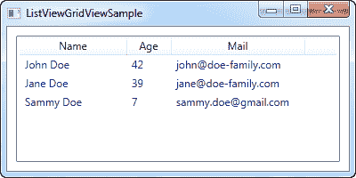
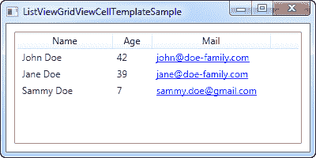

# 带有 GridView 的 ListView

> 原文：<https://wpf-tutorial.com/listview-control/listview-with-gridview/>

在以前的 ListView 文章中，我们使用了 WPF ListView 的最基本版本，它没有指定自定义视图。这产生了一个 ListView，其行为非常类似于 WPF 列表框，只是有一些细微的差别。真正的力量在于视图，WPF 内置了一个专门的视图:GridView。

通过使用 GridView，您可以在 ListView 中获得几列数据，就像您在 Windows 资源管理器中看到的一样。为了确保每个人都能看到它，我们从一个基本的例子开始:

```
<Window x:Class="WpfTutorialSamples.ListView_control.ListViewGridViewSample"

        xmlns:x="http://schemas.microsoft.com/winfx/2006/xaml"
        Title="ListViewGridViewSample" Height="200" Width="400">
    <Grid>
		<ListView Margin="10" Name="lvUsers">
			<ListView.View>
				<GridView>
					<GridViewColumn Header="Name" Width="120" DisplayMemberBinding="{Binding Name}" />
					<GridViewColumn Header="Age" Width="50" DisplayMemberBinding="{Binding Age}" />
					<GridViewColumn Header="Mail" Width="150" DisplayMemberBinding="{Binding Mail}" />
				</GridView>
			</ListView.View>
		</ListView>
	</Grid>
</Window>
```

```
using System;
using System.Collections.Generic;
using System.Windows;

namespace WpfTutorialSamples.ListView_control
{
	public partial class ListViewGridViewSample : Window
	{
		public ListViewGridViewSample()
		{
			InitializeComponent();
			List<User> items = new List<User>();
			items.Add(new User() { Name = "John Doe", Age = 42, Mail = "john@doe-family.com" });
			items.Add(new User() { Name = "Jane Doe", Age = 39, Mail = "jane@doe-family.com" });
			items.Add(new User() { Name = "Sammy Doe", Age = 7, Mail = "sammy.doe@gmail.com" });
			lvUsers.ItemsSource = items;
		}
	}

	public class User
	{
		public string Name { get; set; }

		public int Age { get; set; }

		public string Mail { get; set; }
	}
}
```



因此，对于测试数据，我们使用与前面相同的用户类，然后将它绑定到 ListView。这和我们在前面章节看到的都是一样的，但是你可以从截图中看到，布局非常不同。这就是数据绑定的威力——同样的数据，但以完全不同的方式呈现，只需改变标记。

<input type="hidden" name="IL_IN_ARTICLE">

在标记(XAML)中，我们使用 ListView 定义了 ListView 的视图。查看属性。我们将它设置为 GridView，这是 WPF 目前唯一包含的视图类型(尽管您可以轻松地创建自己的视图！).GridView 为我们提供了基于列的视图，您可以在屏幕截图中看到。

在 GridView 内部，我们定义了三列，每一列对应我们希望显示的一段数据。 **Header** 属性用于 指定我们希望为该列显示的文本，然后我们使用 **DisplayMemberBinding** 属性将该值绑定到用户类的 属性。

## 模板单元格内容

使用 **DisplayMemberBinding** 属性非常局限于输出简单的字符串，根本没有自定义格式，但是 WPF ListView 比这灵活得多。通过指定一个 **CellTemplate** ，我们可以完全控制内容在 特定列单元格中的呈现方式。

GridViewColumn 将使用 DisplayMemberBinding 作为其第一优先级，如果它存在的话。第二个选择是 CellTemplate 属性，我们将在本例中使用它:

```
<Window x:Class="WpfTutorialSamples.ListView_control.ListViewGridViewCellTemplateSample"

        xmlns:x="http://schemas.microsoft.com/winfx/2006/xaml"
        Title="ListViewGridViewCellTemplateSample" Height="200" Width="400">
    <Grid>
		<ListView Margin="10" Name="lvUsers">
			<ListView.View>
				<GridView>
					<GridViewColumn Header="Name" Width="120" DisplayMemberBinding="{Binding Name}" />
					<GridViewColumn Header="Age" Width="50" DisplayMemberBinding="{Binding Age}" />
					<GridViewColumn Header="Mail" Width="150">
						<GridViewColumn.CellTemplate>
							<DataTemplate>
								<TextBlock Text="{Binding Mail}" TextDecorations="Underline" Foreground="Blue" Cursor="Hand" />
							</DataTemplate>
						</GridViewColumn.CellTemplate>
					</GridViewColumn>
				</GridView>
			</ListView.View>
		</ListView>
	</Grid>
</Window>
```



请注意:这个例子中的代码隐藏代码与本文第一个例子中的代码隐藏代码相同。

我们为最后一列指定了一个定制的 **CellTemplate** ，我们希望在这里为电子邮件地址做一些特殊的格式化。对于 的其他列，我们只需要基本的文本输出，我们坚持使用 **DisplayMemberBinding** ，因为它需要的标记更少。

* * *