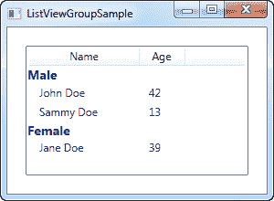
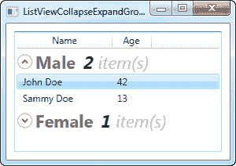

# 列表视图分组

> 原文：<https://wpf-tutorial.com/listview-control/listview-grouping/>

正如我们之前已经讨论过的，WPF 列表视图非常灵活。分组是它开箱即用支持的另一个东西，它既易于使用，又极具可定制性。让我们直接进入第一个例子，然后我会解释它，然后我们可以使用标准的 WPF 技巧来进一步定制外观。

对于本文，我借用了上一篇文章中的示例代码，然后对其进行了扩展以支持分组。看起来是这样的:

```
<Window x:Class="WpfTutorialSamples.ListView_control.ListViewGroupSample"

        xmlns:x="http://schemas.microsoft.com/winfx/2006/xaml"
        Title="ListViewGroupSample" Height="300" Width="300">
    <Grid Margin="10">
        <ListView Name="lvUsers">
            <ListView.View>
                <GridView>
                    <GridViewColumn Header="Name" Width="120" DisplayMemberBinding="{Binding Name}" />
                    <GridViewColumn Header="Age" Width="50" DisplayMemberBinding="{Binding Age}" />
                </GridView>
            </ListView.View>

            <ListView.GroupStyle>
                <GroupStyle>
                    <GroupStyle.HeaderTemplate>
                        <DataTemplate>
                            <TextBlock FontWeight="Bold" FontSize="14" Text="{Binding Name}"/>
                        </DataTemplate>
                    </GroupStyle.HeaderTemplate>
                </GroupStyle>
            </ListView.GroupStyle>
        </ListView>
    </Grid>
</Window>
```

```
using System;
using System.Collections.Generic;
using System.Windows;
using System.Windows.Data;

namespace WpfTutorialSamples.ListView_control
{
	public partial class ListViewGroupSample : Window
	{
		public ListViewGroupSample()
		{
			InitializeComponent();
			List<User> items = new List<User>();
			items.Add(new User() { Name = "John Doe", Age = 42, Sex = SexType.Male });
			items.Add(new User() { Name = "Jane Doe", Age = 39, Sex = SexType.Female });
			items.Add(new User() { Name = "Sammy Doe", Age = 13, Sex = SexType.Male });
			lvUsers.ItemsSource = items;

			CollectionView view = (CollectionView)CollectionViewSource.GetDefaultView(lvUsers.ItemsSource);
			PropertyGroupDescription groupDescription = new PropertyGroupDescription("Sex");
			view.GroupDescriptions.Add(groupDescription);
		}
	}

	public enum SexType { Male, Female };

	public class User
	{
		public string Name { get; set; }

		public int Age { get; set; }

		public string Mail { get; set; }

		public SexType Sex { get; set; }
	}
}
```



在 XAML，我在 ListView 中添加了一个 GroupStyle，为每个组的标题定义了一个模板。它由一个 文本块控件组成，在这里我使用了一个稍微大一点的粗体文本来显示它是一个组——正如我们稍后将看到的，这当然可以进行更多的定制。TextBlock 文本属性被绑定到一个名称属性**，但是请注意，这不是数据对象(在本例中是用户类)**上的名称属性。相反，它是由 WPF 根据我们用来将对象分组的属性指定的 组的名称。

<input type="hidden" name="IL_IN_ARTICLE">

在代码隐藏中，我们做的和以前一样:我们创建一个列表并向其中添加一些用户对象，然后我们将列表绑定到 ListView——除了我添加的新的性别属性之外，没有什么新的东西，它告诉我们用户是男是女。

在分配了 ItemsSource 之后，我们使用它来获取 ListView 为我们创建的 CollectionView。这个专门化的视图实例包含许多可能性，包括对项目进行分组的能力。我们通过向视图的 GroupDescription 添加一个所谓的 PropertyGroupDescription 来使用它。这基本上告诉 WPF 根据数据对象的特定属性进行分组，在本例中是性别属性。

## 自定义组标题

上面的例子很好地展示了 ListView 分组的基础，但是看起来有点无聊，所以让我们利用 WPF 让我们定义自己的模板并增加趣味的事实。一个常见的请求是能够折叠和扩展组，虽然 WPF 没有默认提供这种行为，但自己实现还是比较容易的。我们将通过完全重新模板化组容器来实现。

这可能看起来有点麻烦，但使用的原则有点简单，当您自定义 WPF 控件时，您会在其他情况下看到它们。代码如下:

```
<Window x:Class="WpfTutorialSamples.ListView_control.ListViewCollapseExpandGroupSample"

        xmlns:x="http://schemas.microsoft.com/winfx/2006/xaml"
        Title="ListViewCollapseExpandGroupSample" Height="300" Width="300">
    <Grid Margin="10">
        <ListView Name="lvUsers">
            <ListView.View>
                <GridView>
                    <GridViewColumn Header="Name" Width="120" DisplayMemberBinding="{Binding Name}" />
                    <GridViewColumn Header="Age" Width="50" DisplayMemberBinding="{Binding Age}" />
                </GridView>
            </ListView.View>

            <ListView.GroupStyle>
                <GroupStyle>
                    <GroupStyle.ContainerStyle>
                        <Style TargetType="{x:Type GroupItem}">
                            <Setter Property="Template">
                                <Setter.Value>
                                    <ControlTemplate>
                                        <Expander IsExpanded="True">
                                            <Expander.Header>
                                                <StackPanel Orientation="Horizontal">
                                                    <TextBlock Text="{Binding Name}" FontWeight="Bold" Foreground="Gray" FontSize="22" VerticalAlignment="Bottom" />
                                                    <TextBlock Text="{Binding ItemCount}" FontSize="22" Foreground="Green" FontWeight="Bold" FontStyle="Italic" Margin="10,0,0,0" VerticalAlignment="Bottom" />
                                                    <TextBlock Text=" item(s)" FontSize="22" Foreground="Silver" FontStyle="Italic" VerticalAlignment="Bottom" />
                                                </StackPanel>
                                            </Expander.Header>
                                            <ItemsPresenter />
                                        </Expander>
                                    </ControlTemplate>
                                </Setter.Value>
                            </Setter>
                        </Style>
                    </GroupStyle.ContainerStyle>
                </GroupStyle>
            </ListView.GroupStyle>
        </ListView>
    </Grid>
</Window>
```

***代码-behind 与第一个例子中使用的完全一样-随意向上滚动并抓取它。*T3】**



现在，我们的组看起来更令人兴奋，它们甚至包括一个扩展按钮，当您单击它时，它将切换组项目的可见性(这就是为什么单个女性用户在屏幕截图上不可见-我折叠了那个特定的组)。通过使用组公开的 ItemCount 属性，我们甚至可以显示每个组当前包含多少项。

正如你所看到的，它需要比我们习惯的多一点的标签，但是这个例子也超出了我们通常做的，所以这看起来是公平的。当您通读代码时，您会很快意识到许多行只是样式和模板等常见元素。

## 摘要

向 WPF 列表视图中添加分组非常简单——您所需要的只是一个带有 HeaderTemplate 的 GroupStyle，它告诉列表视图如何呈现一个组，以及几行代码——告诉 WPF 分组所依据的属性。从上一个例子可以看出，这个组甚至是非常可定制的，允许您创建一些非常酷的视图，而不需要太多的工作。

* * *