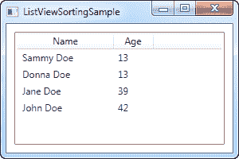
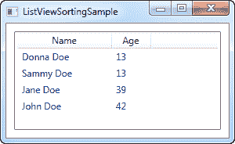

# 列表视图排序

> 原文：<https://wpf-tutorial.com/listview-control/listview-sorting/>

在上一章中，我们看到了如何通过访问 ListView 的视图实例，然后添加一个组描述来对 WPF ListView 中的项目进行分组。对 ListView 应用排序同样简单，并且大部分过程完全相同。让我们尝试一个简单的例子，我们按照年龄对用户对象进行排序:

```
<Window x:Class="WpfTutorialSamples.ListView_control.ListViewSortingSample"

        xmlns:x="http://schemas.microsoft.com/winfx/2006/xaml"
        Title="ListViewSortingSample" Height="200" Width="300">
    <Grid Margin="10">
        <ListView Name="lvUsers">
            <ListView.View>
                <GridView>
                    <GridViewColumn Header="Name" Width="120" DisplayMemberBinding="{Binding Name}" />
                    <GridViewColumn Header="Age" Width="50" DisplayMemberBinding="{Binding Age}" />
                </GridView>
            </ListView.View>
        </ListView>
    </Grid>
</Window>
```

```
using System;
using System.Collections.Generic;
using System.ComponentModel;
using System.Windows;
using System.Windows.Data;

namespace WpfTutorialSamples.ListView_control
{
	public partial class ListViewSortingSample : Window
	{
		public ListViewSortingSample()
		{
			InitializeComponent();
			List<User> items = new List<User>();
			items.Add(new User() { Name = "John Doe", Age = 42 });
			items.Add(new User() { Name = "Jane Doe", Age = 39 });
			items.Add(new User() { Name = "Sammy Doe", Age = 13 });
			items.Add(new User() { Name = "Donna Doe", Age = 13 });
			lvUsers.ItemsSource = items;

			CollectionView view = (CollectionView)CollectionViewSource.GetDefaultView(lvUsers.ItemsSource);
			view.SortDescriptions.Add(new SortDescription("Age", ListSortDirection.Ascending));
		}
	}

	public class User
	{
		public string Name { get; set; }

		public int Age { get; set; }
	}
}
```



XAML 看起来就像前面的例子，我们只是有几个显示用户信息的列——这里没有什么新东西。

在代码隐藏中，我们再次创建一个用户对象列表，然后将它指定为 ListView 的 ItemsSource。完成后，我们使用 ItemsSource 属性获取 ListView 自动为我们创建的 CollectionView 实例，我们可以用它来操纵 ListView 如何显示我们的对象。

<input type="hidden" name="IL_IN_ARTICLE">

有了视图对象，我们向它添加一个新的 SortDescription，指定我们希望我们的列表按照 Age 属性以升序排序。正如你在截图中看到的，这非常好——列表是按照年龄排序的，而不是按照项目添加的顺序。

## 多重排序标准

如第一个例子所示，排序非常容易，但是在截图上你会看到 Sammy 在 Donna 之前。他们有相同的年龄，所以在这种情况下，WPF 将只使用他们被添加的顺序。幸运的是，WPF 允许我们指定尽可能多的排序标准。在上面的例子中，尝试将与视图相关的代码更改为如下所示:

```
CollectionView view = (CollectionView)CollectionViewSource.GetDefaultView(lvUsers.ItemsSource);
view.SortDescriptions.Add(new SortDescription("Age", ListSortDirection.Ascending));
view.SortDescriptions.Add(new SortDescription("Name", ListSortDirection.Ascending));
```



现在，首先使用 age 对视图进行排序，当发现两个相同的值时，name 将用作第二个排序参数。

## 摘要

正如上面的例子所示，对 ListView 的内容进行排序非常容易，但是到目前为止，所有的排序都是由程序员而不是最终用户决定的。在下一篇文章中，我将向您展示如何让用户通过单击列来决定排序，就像在 Windows 中看到的那样。

* * *