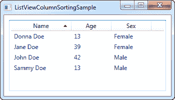

# 如何:带有列排序的列表视图

> 原文：<https://wpf-tutorial.com/listview-control/listview-how-to-column-sorting/>

在上一章中，我们看到了如何从代码隐藏中轻松地对 ListView 进行排序，虽然这在某些情况下已经足够了，但它不允许最终用户决定排序。除此之外，没有指示 ListView 是按照哪一列排序的。在 Windows 中，通常在许多用户界面中，通过在当前用于排序的列名旁边画一个三角形来说明列表中的排序方向是很常见的。

在这篇 how-to 文章中，我将为您提供一个实用的解决方案，为我们提供上述所有内容，但是请记住，这里的一些代码超出了我们到目前为止所学的内容——这就是为什么它有“how-to”标签的原因。

这篇文章建立在前一篇文章的基础上，但是我仍然会继续解释每一部分。这是我们的目标——一个带有列排序的 ListView，包括排序字段和方向的可视指示。用户只需单击一列进行排序，如果再次单击同一列，排序方向就会反转。它看起来是这样的:



## XAML

我们首先需要一些 XAML 来定义我们的用户界面。目前看起来是这样的:

<input type="hidden" name="IL_IN_ARTICLE">

```
<Window x:Class="WpfTutorialSamples.ListView_control.ListViewColumnSortingSample"

        xmlns:x="http://schemas.microsoft.com/winfx/2006/xaml"
        Title="ListViewColumnSortingSample" Height="200" Width="350">
    <Grid Margin="10">
        <ListView Name="lvUsers">
            <ListView.View>
                <GridView>
                    <GridViewColumn Width="120" DisplayMemberBinding="{Binding Name}">
                        <GridViewColumn.Header>
                            <GridViewColumnHeader Tag="Name" Click="lvUsersColumnHeader_Click">Name</GridViewColumnHeader>
                        </GridViewColumn.Header>
                    </GridViewColumn>
                    <GridViewColumn Width="80" DisplayMemberBinding="{Binding Age}">
                        <GridViewColumn.Header>
                            <GridViewColumnHeader Tag="Age" Click="lvUsersColumnHeader_Click">Age</GridViewColumnHeader>
                        </GridViewColumn.Header>
                    </GridViewColumn>
                    <GridViewColumn Width="80" DisplayMemberBinding="{Binding Sex}">
                        <GridViewColumn.Header>
                            <GridViewColumnHeader Tag="Sex" Click="lvUsersColumnHeader_Click">Sex</GridViewColumnHeader>
                        </GridViewColumn.Header>
                    </GridViewColumn>
                </GridView>
            </ListView.View>
        </ListView>
    </Grid>
</Window>
```

请注意，我是如何使用实际的 GridViewColumnHeader 元素为每一列指定标题的，而不仅仅是指定一个字符串。这样做是为了让我可以设置额外的属性，在本例中是**标签**属性以及**点击**事件。

**标签**属性用于保存字段名，如果单击该特定列，将使用该字段名进行排序。这是在每个列订阅的*lvUsersColumnHeader _ Click*事件中完成的。

这是 XAML 的关键概念。除此之外，我们绑定到代码隐藏属性 Name、Age 和 Sex，我们现在将讨论这些属性。

## 代码隐藏

在代码隐藏中，发生了很多事情。我总共使用了三个类，您通常会将它们分成单独的文件，但是为了方便起见，我将它们保存在同一个文件中，总共有大约 100 行。首先是代码，然后我会解释它是如何工作的:

```
using System;
using System.Collections.Generic;
using System.ComponentModel;
using System.Windows;
using System.Windows.Controls;
using System.Windows.Data;
using System.Windows.Documents;
using System.Windows.Media;

namespace WpfTutorialSamples.ListView_control
{
	public partial class ListViewColumnSortingSample : Window
	{
		private GridViewColumnHeader listViewSortCol = null;
		private SortAdorner listViewSortAdorner = null;

		public ListViewColumnSortingSample()
		{
			InitializeComponent();
			List<User> items = new List<User>();
			items.Add(new User() { Name = "John Doe", Age = 42, Sex = SexType.Male });
			items.Add(new User() { Name = "Jane Doe", Age = 39, Sex = SexType.Female });
			items.Add(new User() { Name = "Sammy Doe", Age = 13, Sex = SexType.Male });
			items.Add(new User() { Name = "Donna Doe", Age = 13, Sex = SexType.Female });
			lvUsers.ItemsSource = items;
		}

		private void lvUsersColumnHeader_Click(object sender, RoutedEventArgs e)
		{
			GridViewColumnHeader column = (sender as GridViewColumnHeader);
			string sortBy = column.Tag.ToString();
			if(listViewSortCol != null)
			{
				AdornerLayer.GetAdornerLayer(listViewSortCol).Remove(listViewSortAdorner);
				lvUsers.Items.SortDescriptions.Clear();
			}

			ListSortDirection newDir = ListSortDirection.Ascending;
			if(listViewSortCol == column && listViewSortAdorner.Direction == newDir)
				newDir = ListSortDirection.Descending;

			listViewSortCol = column;
			listViewSortAdorner = new SortAdorner(listViewSortCol, newDir);
			AdornerLayer.GetAdornerLayer(listViewSortCol).Add(listViewSortAdorner);
			lvUsers.Items.SortDescriptions.Add(new SortDescription(sortBy, newDir));
		}
	}

	public enum SexType { Male, Female };

	public class User
	{
		public string Name { get; set; }

		public int Age { get; set; }

		public string Mail { get; set; }

		public SexType Sex { get; set; }
	}

	public class SortAdorner : Adorner
	{
		private static Geometry ascGeometry =
			Geometry.Parse("M 0 4 L 3.5 0 L 7 4 Z");

		private static Geometry descGeometry =
			Geometry.Parse("M 0 0 L 3.5 4 L 7 0 Z");

		public ListSortDirection Direction { get; private set; }

		public SortAdorner(UIElement element, ListSortDirection dir)
			: base(element)
		{
			this.Direction = dir;
		}

		protected override void OnRender(DrawingContext drawingContext)
		{
			base.OnRender(drawingContext);

			if(AdornedElement.RenderSize.Width < 20)
				return;

			TranslateTransform transform = new TranslateTransform
				(
					AdornedElement.RenderSize.Width - 15,
					(AdornedElement.RenderSize.Height - 5) / 2
				);
			drawingContext.PushTransform(transform);

			Geometry geometry = ascGeometry;
			if(this.Direction == ListSortDirection.Descending)
				geometry = descGeometry;
			drawingContext.DrawGeometry(Brushes.Black, null, geometry);

			drawingContext.Pop();
		}
	}
}
```

请允许我从底层开始，然后一边解释发生了什么，一边一步步往上走。文件中的最后一个类是一个名为 **SortAdorner** 的装饰器类。这个小类所做的就是画一个三角形，或者向上或者向下，这取决于排序的方向。WPF 使用装饰器的 概念来允许你在其他控件上绘制东西，这正是我们在这里想要的:能够在我们的 ListView 列标题的顶部 绘制一个排序三角形。

**SortAdorner** 通过定义两个**几何**对象来工作，这两个对象基本上用于描述 2D 形状——在这种情况下，一个 三角形的尖端朝上，另一个尖端朝下。几何学。`Parse()`方法使用点列表来绘制三角形，这将在后面的文章中更详细地解释。

排序器知道排序方向，因为它需要画出正确的三角形，但是不知道我们对 排序的字段——这是在 UI 层处理的。

**User** 类只是一个基本的信息类，用来包含用户的信息。其中一些信息用于 UI 层，在这里我们绑定到姓名、年龄和性别属性。

在 Window 类中，我们有两个方法:构造器，我们在其中构建一个用户列表并将其分配给 ListView 的 ItemsSource，然后是更有趣的 click 事件处理程序，当用户单击一列时将会触发该处理程序。在类的顶部，我们定义了两个私有变量: *listViewSortCol* 和 *listViewSortAdorner* 。这将帮助我们跟踪当前排序的列，以及我们 放置来指示它的装饰器。

在 lvUsersColumnHeader_Click 事件处理程序中，我们首先获取对用户单击的列的引用。有了这个，我们可以简单地通过查看我们在 XAML 中定义的标签属性来决定用户类中的哪个属性作为排序依据。然后，我们检查是否已经按列进行了排序——如果是这样，我们移除装饰器并清除当前的排序描述。

之后，我们准备决定方向。默认值是升序，但是我们检查是否已经按照用户点击的列进行了排序——如果是这样，我们将方向改为降序。

最后，我们创建了一个新的 SortAdorner，传入它应该呈现的列以及方向。我们将它添加到列标题的 AdornerLayer 中，在最后，我们将 SortDescription 添加到 ListView 中，让它知道按哪个属性和哪个方向排序。

## 摘要

恭喜你，你现在有了一个完全可排序的 ListView，带有排序列和方向的可视化指示。如果您想更多地了解本文中使用的一些概念，如数据绑定、几何或一般的 ListViews，那么请查看其他一些文章，其中每个主题都有深入的讨论。

* * *