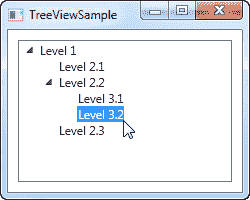
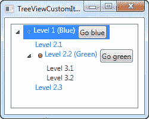

# 一个简单的树形视图示例

> 原文：<https://wpf-tutorial.com/treeview-control/simple-treeview/>

正如我们在上一篇文章中所讨论的，WPF 树视图可以以非常简单的方式使用，通过向它添加 TreeViewItem 对象，或者通过代码隐藏，或者直接在 XAML 中声明它们。这确实很容易开始，正如您从这里的示例中可以看到的:

```
<Window x:Class="WpfTutorialSamples.TreeView_control.TreeViewSample"

        xmlns:x="http://schemas.microsoft.com/winfx/2006/xaml"
        Title="TreeViewSample" Height="200" Width="250">
    <Grid Margin="10">
		<TreeView>
			<TreeViewItem Header="Level 1" IsExpanded="True">
				<TreeViewItem Header="Level 2.1" />
				<TreeViewItem Header="Level 2.2" IsExpanded="True">
					<TreeViewItem Header="Level 3.1" />
					<TreeViewItem Header="Level 3.2" />
				</TreeViewItem>
				<TreeViewItem Header="Level 2.3" />
			</TreeViewItem>
		</TreeView>
	</Grid>
</Window>
```



我们只需在 XAML 中直接声明 TreeViewItem 对象，与我们希望在其中显示它们的结构相同，其中第一个标记是 TreeView 控件的子标记，其子对象也是其父对象的子标记。为了指定我们希望为每个节点显示的文本，我们使用了 **Header** 属性。默认情况下，TreeViewItem 是不展开的，但是为了向您展示示例的结构，我使用了 **IsExpanded** 属性来展开两个父项。

## 带有图像和其他控件的 TreeViewItem

不过,**头**是一个有趣的属性。正如你所看到的，我可以指定一个文本字符串，然后让它直接呈现，而不需要 做任何其他事情，但这是 WPF 对我们很好——在内部，它将文本包装在 TextBlock 控件内，而不是强迫你这样做。这个 向我们展示了我们可以将几乎任何我们想要的东西填充到 Header 属性中，而不仅仅是一个字符串，然后让 TreeView 呈现它——这是一个很好的 例子，说明了为什么定制 WPF 控件的外观如此容易。

<input type="hidden" name="IL_IN_ARTICLE">

来自 WinForms 甚至其他 UI 库的人们的一个常见请求是能够在树形视图项目的文本标签旁边显示图像。使用 WinForms 很容易做到这一点，因为 TreeView 正是为此场景而构建的。WPF 的树形视图稍微复杂一点，但是你会得到比 WinForms 树形视图更多的灵活性。这里有一个例子:

```
<Window x:Class="WpfTutorialSamples.TreeView_control.TreeViewCustomItemsSample"

        xmlns:x="http://schemas.microsoft.com/winfx/2006/xaml"
        Title="TreeViewCustomItemsSample" Height="200" Width="250">
	<Grid Margin="10">
		<TreeView>
			<TreeViewItem IsExpanded="True">
				<TreeViewItem.Header>
					<StackPanel Orientation="Horizontal">
						<Image Source="/WpfTutorialSamples;componeimg/bullet_blue.png" />
						<TextBlock Text="Level 1 (Blue)" />
					</StackPanel>
				</TreeViewItem.Header>
				<TreeViewItem>
					<TreeViewItem.Header>
						<StackPanel Orientation="Horizontal">
							<TextBlock Text="Level 2.1" Foreground="Blue" />
						</StackPanel>
					</TreeViewItem.Header>
				</TreeViewItem>
				<TreeViewItem IsExpanded="True">
					<TreeViewItem.Header>
						<StackPanel Orientation="Horizontal">
							<Image Source="/WpfTutorialSamples;componeimg/bullet_green.png" />
							<TextBlock Text="Level 2.2 (Green)" Foreground="Blue" />
						</StackPanel>
					</TreeViewItem.Header>
					<TreeViewItem>
						<TreeViewItem.Header>
							<TextBlock Text="Level 3.1" Foreground="Green" />
						</TreeViewItem.Header>
					</TreeViewItem>
					<TreeViewItem>
						<TreeViewItem.Header>
							<TextBlock Text="Level 3.2" Foreground="Green" />
						</TreeViewItem.Header>
					</TreeViewItem>
				</TreeViewItem>
				<TreeViewItem>
					<TreeViewItem.Header>
						<TextBlock Text="Level 2.3" Foreground="Blue" />
					</TreeViewItem.Header>
				</TreeViewItem>
			</TreeViewItem>
		</TreeView>
	</Grid>
</Window>
```



我在这里做了一大堆事情，只是为了向您展示您所获得的灵活性:我给子项目着色，我给父项目添加图像甚至按钮。因为我们用简单的标记来定义整个事情，所以您几乎可以做任何事情，但是正如您从示例代码中看到的，这是有代价的:对于总共只有 6 个节点的树，需要大量的 XAML 代码！

## 摘要

正如我们在上面的例子中所做的那样，虽然完全可以使用标记来定义整个 TreeView，但在大多数情况下，这并不是最好的方法，尽管您可以从代码隐藏中完成，但这会导致更多的代码行。同样，解决方案是**数据绑定**，我们将在接下来的章节中探讨。

* * *