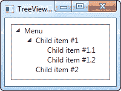
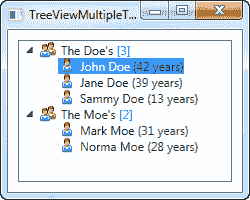

# TreeView、数据绑定和多个模板

> 原文：<https://wpf-tutorial.com/treeview-control/treeview-data-binding-multiple-templates/>

WPF 树视图支持数据绑定，就像几乎所有其他 WPF 控件一样，但是因为树视图本质上是分层的，一个普通的数据模板通常是不够的。相反，我们使用 HierarchicalDataTemplate，它允许我们对树节点本身进行模板化，同时控制将哪个属性用作节点子项的源。

## 一个基本的数据绑定树视图

在下面的示例中，我将向您展示开始使用 HierarchicalDataTemplate 是多么容易:

```
<Window x:Class="WpfTutorialSamples.TreeView_control.TreeViewDataBindingSample"

        xmlns:x="http://schemas.microsoft.com/winfx/2006/xaml"
		xmlns:self="clr-namespace:WpfTutorialSamples.TreeView_control"
        Title="TreeViewDataBindingSample" Height="150" Width="200">
    <Grid Margin="10">
		<TreeView Name="trvMenu">
			<TreeView.ItemTemplate>
				<HierarchicalDataTemplate DataType="{x:Type self:MenuItem}" ItemsSource="{Binding Items}">
					<TextBlock Text="{Binding Title}" />
				</HierarchicalDataTemplate>
			</TreeView.ItemTemplate>
		</TreeView>
	</Grid>
</Window>
```

```
using System;
using System.Collections.Generic;
using System.Windows;
using System.IO;
using System.Collections.ObjectModel;

namespace WpfTutorialSamples.TreeView_control
{
	public partial class TreeViewDataBindingSample : Window
	{
		public TreeViewDataBindingSample()
		{
			InitializeComponent();
			MenuItem root = new MenuItem() { Title = "Menu" };
			MenuItem childItem1 = new MenuItem() { Title = "Child item #1" };
			childItem1.Items.Add(new MenuItem() { Title = "Child item #1.1" });
			childItem1.Items.Add(new MenuItem() { Title = "Child item #1.2" });
			root.Items.Add(childItem1);
			root.Items.Add(new MenuItem() { Title = "Child item #2" });
			trvMenu.Items.Add(root);
		}
	}

	public class MenuItem
	{
		public MenuItem()
		{
			this.Items = new ObservableCollection<MenuItem>();
		}

		public string Title { get; set; }

		public ObservableCollection<MenuItem> Items { get; set; }
	}

}
```

 <input type="hidden" name="IL_IN_ARTICLE">

在 XAML 标记中，我为树形视图的 **ItemTemplate** 指定了一个 HierarchicalDataTemplate。我通过设置模板的 **ItemsSource** 属性，指示它使用 **Items** 属性来查找子项，并在其中定义了 实际的模板，该模板现在只包含一个绑定到 **Title** 属性的 TextBlock。

第一个例子非常简单，事实上非常简单，我们还不如手动添加 TreeView 项，而不是生成一组对象然后绑定到它们。然而，一旦事情变得稍微复杂一点，使用数据绑定的优势就会变得更加明显。

## 不同类型的多个模板

在下一个例子中，我举了一个稍微复杂一点的例子，我想展示一个家庭及其成员的树。一个家庭应该用一种方式来表现，而它的每个成员应该用另一种方式来表现。我通过创建两个不同的模板并将它们指定为树的资源(或者窗口或应用程序——这完全取决于您),然后允许 TreeView 根据底层数据类型选择正确的模板来实现这一点。

下面是代码——对它的解释将紧随其后:

```
<Window x:Class="WpfTutorialSamples.TreeView_control.TreeViewMultipleTemplatesSample"

        xmlns:x="http://schemas.microsoft.com/winfx/2006/xaml"
		xmlns:self="clr-namespace:WpfTutorialSamples.TreeView_control"
        Title="TreeViewMultipleTemplatesSample" Height="200" Width="250">
	<Grid Margin="10">
		<TreeView Name="trvFamilies">
			<TreeView.Resources>
				<HierarchicalDataTemplate DataType="{x:Type self:Family}" ItemsSource="{Binding Members}">
					<StackPanel Orientation="Horizontal">
						<Image Source="/WpfTutorialSamples;componeimg/group.png" Margin="0,0,5,0" />
						<TextBlock Text="{Binding Name}" />
						<TextBlock Text=" [" Foreground="Blue" />
						<TextBlock Text="{Binding Members.Count}" Foreground="Blue" />
						<TextBlock Text="]" Foreground="Blue" />
					</StackPanel>
				</HierarchicalDataTemplate>
				<DataTemplate DataType="{x:Type self:FamilyMember}">
					<StackPanel Orientation="Horizontal">
						<Image Source="/WpfTutorialSamples;componeimg/user.png" Margin="0,0,5,0" />
						<TextBlock Text="{Binding Name}" />
						<TextBlock Text=" (" Foreground="Green" />
						<TextBlock Text="{Binding Age}" Foreground="Green" />
						<TextBlock Text=" years)" Foreground="Green" />
					</StackPanel>
				</DataTemplate>
			</TreeView.Resources>
		</TreeView>
	</Grid>
</Window>
```

```
using System;
using System.Collections.Generic;
using System.Windows;
using System.Collections.ObjectModel;

namespace WpfTutorialSamples.TreeView_control
{
	public partial class TreeViewMultipleTemplatesSample : Window
	{
		public TreeViewMultipleTemplatesSample()
		{
			InitializeComponent();

			List<Family> families = new List<Family>();

			Family family1 = new Family() { Name = "The Doe's" };
			family1.Members.Add(new FamilyMember() { Name = "John Doe", Age = 42 });
			family1.Members.Add(new FamilyMember() { Name = "Jane Doe", Age = 39 });
			family1.Members.Add(new FamilyMember() { Name = "Sammy Doe", Age = 13 });
			families.Add(family1);

			Family family2 = new Family() { Name = "The Moe's" };
			family2.Members.Add(new FamilyMember() { Name = "Mark Moe", Age = 31 });
			family2.Members.Add(new FamilyMember() { Name = "Norma Moe", Age = 28 });
			families.Add(family2);

			trvFamilies.ItemsSource = families;
		}
	}

	public class Family
	{
		public Family()
		{
			this.Members = new ObservableCollection<FamilyMember>();
		}

		public string Name { get; set; }

		public ObservableCollection<FamilyMember> Members { get; set; }
	}

	public class FamilyMember
	{
		public string Name { get; set; }

		public int Age { get; set; }
	}
}
```



如前所述，这两个模板被声明为 TreeView 资源的一部分，允许 TreeView 根据将要显示的数据类型选择合适的模板。为**家族**类型定义的模板是一个分层模板，使用**成员** 属性来显示其家族成员。

为 **FamilyMember** 类型定义的模板是常规的 DataTemplate，因为该类型没有任何子成员。然而，如果我们 想要每个家庭成员保存一个他们孩子的集合，也许是他们孩子的孩子的集合，那么我们应该使用一个层次模板 来代替。

在这两个模板中，我们使用一个图像来表示一个家庭或一个家庭成员，然后我们还显示一些有趣的数据，比如家庭成员的数量或这个人的年龄。

在代码隐藏中，我们简单地创建两个 Family 实例，用一组成员填充它们，然后将每个 Family 添加到一个列表中，该列表然后用作 TreeView 的项目源。

## 摘要

使用数据绑定，TreeView 是非常可定制的，并且能够指定多个模板来呈现不同的数据类型，这种可能性几乎是无限的。

* * *