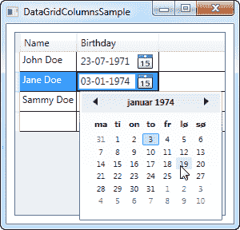

# 数据网格列

> 原文：<https://wpf-tutorial.com/datagrid-control/custom-columns/>

在前一章中，我们已经了解了建立并运行 WPF 数据网格是多么容易。它如此简单的原因之一是，DataGrid 会根据您使用的数据源自动为您生成适当的列。

但是，在某些情况下，您可能想要手动定义显示的列，因为您不想要数据源的所有属性/列，或者因为您想要控制使用哪些行内编辑器。

## 手动定义的列

让我们尝试一个例子，这个例子看起来很像上一章中的例子，但是为了最大限度的控制，我们手动定义了所有的列。您可以根据想要显示/编辑的数据选择列类型。在撰写本文时，可以使用以下列类型:

*   DataGridTextColumn
*   DataGridCheckBoxColumn
*   DataGridComboBoxColumn
*   DataGridHyperlinkColumn
*   DataGridTemplateColumn

尤其是最后一个，DataGridTemplateColumn，很有意思。它允许你定义任何类型的内容，这为使用自定义控件提供了机会，无论是来自 WPF 图书馆，甚至是你自己或第三方的控件。这里有一个例子:

<input type="hidden" name="IL_IN_ARTICLE">

```
<Window x:Class="WpfTutorialSamples.DataGrid_control.DataGridColumnsSample"

        xmlns:x="http://schemas.microsoft.com/winfx/2006/xaml"
        Title="DataGridColumnsSample" Height="200" Width="300">
    <Grid Margin="10">
		<DataGrid Name="dgUsers" AutoGenerateColumns="False">
			<DataGrid.Columns>

				<DataGridTextColumn Header="Name" Binding="{Binding Name}" />

				<DataGridTemplateColumn Header="Birthday">
					<DataGridTemplateColumn.CellTemplate>
						<DataTemplate>
							<DatePicker SelectedDate="{Binding Birthday}" BorderThickness="0" />
						</DataTemplate>
					</DataGridTemplateColumn.CellTemplate>
				</DataGridTemplateColumn>

			</DataGrid.Columns>
		</DataGrid>
	</Grid>
</Window>
```

```
using System;
using System.Collections.Generic;
using System.Windows;

namespace WpfTutorialSamples.DataGrid_control
{
	public partial class DataGridColumnsSample : Window
	{
		public DataGridColumnsSample()
		{
			InitializeComponent();

			List<User> users = new List<User>();
			users.Add(new User() { Id = 1, Name = "John Doe", Birthday = new DateTime(1971, 7, 23) });
			users.Add(new User() { Id = 2, Name = "Jane Doe", Birthday = new DateTime(1974, 1, 17) });
			users.Add(new User() { Id = 3, Name = "Sammy Doe", Birthday = new DateTime(1991, 9, 2) });

			dgUsers.ItemsSource = users;
		}
	}

	public class User
	{
		public int Id { get; set; }

		public string Name { get; set; }

		public DateTime Birthday { get; set; }
	}
}
```



在标签中，我在 DataGrid 上添加了 AutoGenerateColumns 属性，并将其设置为 false，以控制所使用的列。如您所见，我已经省略了 ID 列，因为我决定在本例中不考虑它。对于 Name 属性，我使用了一个简单的基于文本的列，因此本例中最有趣的部分来自生日列，其中我使用了一个 DataGridTemplateColumn，它内部有一个 日期选择器控件。这使得最终用户可以从日历中选择日期，而不必手动输入日期，如屏幕截图所示。

## 摘要

通过使用 AutoGenerateColumns 属性关闭自动生成的列，您可以完全控制显示哪些列以及如何查看和编辑它们的数据。正如本文的示例所示，这带来了一些非常有趣的可能性，您可以完全定制编辑器，从而增强最终用户体验。

* * *