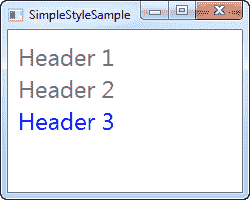

# WPF 样式简介

> 原文：<https://wpf-tutorial.com/styles/introduction/>

如果你来自 web 开发的世界，使用 [HTML](http://www.html5-tutorials.org/introduction-to-html/what-is-html/ "HTML") 和 [CSS](http://www.css3-tutorial.net/introduction/what-is-css/ "CSS3") ，你会很快意识到 XAML 很像 HTML:使用标签，你定义了应用的 结构布局。你甚至可以让你的元素看起来像某种特定的方式，使用内联属性，比如 Foreground，FontSize 等等， 就像你可以在本地设计你的 HTML 标签一样。

但是，当您希望在三个不同的 文本块控件上使用完全相同的字体大小和颜色时，会发生什么情况呢？您可以将所需的属性复制/粘贴到每个控件中，但是当三个控件变成 50 个控件，分布在几个窗口中时会发生什么情况呢？而当你意识到字体大小应该是 14 而不是 12 时会发生什么？

WPF 介绍了样式，这对于 XAML 来说就像 CSS 对于 HTML 一样。使用样式，您可以将一组属性分组，并将它们分配给特定类型的特定控件或所有控件，就像在 CSS 中一样，一个样式可以从另一个样式继承。

## 基本样式示例

我们将更多地讨论所有的细节，但对于这一介绍章节，我想向您展示一个关于如何使用样式的非常基本的例子:

```
<Window x:Class="WpfTutorialSamples.Styles.SimpleStyleSample"

        xmlns:x="http://schemas.microsoft.com/winfx/2006/xaml"
        Title="SimpleStyleSample" Height="200" Width="250">
    <StackPanel Margin="10">
        <StackPanel.Resources>
            <Style TargetType="TextBlock">
                <Setter Property="Foreground" Value="Gray" />
                <Setter Property="FontSize" Value="24" />
            </Style>
        </StackPanel.Resources>
        <TextBlock>Header 1</TextBlock>
        <TextBlock>Header 2</TextBlock>
        <TextBlock Foreground="Blue">Header 3</TextBlock>
    </StackPanel>
</Window>
```

<input type="hidden" name="IL_IN_ARTICLE"> 

对于我的 StackPanel 的资源，我定义了一个**样式**。我使用 TargetType 属性告诉 WPF，这个样式应该应用于范围(StackPanel)内的所有 文本块控件，然后我向该样式添加了两个 Setter 元素。Setter 元素用于为目标控件设置特定的 属性，在本例中是**前景**和**字体大小**属性。**属性** 属性告诉 WPF 我们想要定位哪个属性，而**值**属性定义了所需的值。

注意，最后一个文本块是蓝色的，而不是灰色的。我这样做是为了向您展示，虽然一个控件可以从指定的样式中获取样式，但是您完全可以在控件上本地重写它——在控件上直接定义的值总是优先于样式值。

## 摘要

WPF 样式使得创建一个特定的外观并用于几个控件变得非常容易，虽然第一个例子是非常局部的，我将在接下来的章节中向你展示如何创建全局样式。

* * *