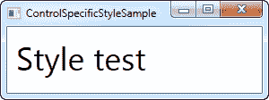
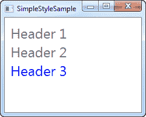
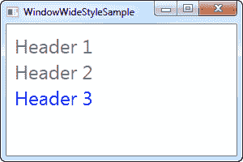
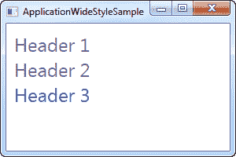
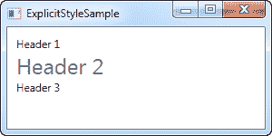

# 使用 WPF 风格

> 原文：<https://wpf-tutorial.com/styles/using-styles/>

在前一章中，我们介绍了样式的概念，我们使用了一个非常基本的本地定义样式的例子，它针对一个特定类型的控件 TextBlock。但是，样式可以在几个不同的范围内定义，这取决于您希望在哪里以及如何使用它们，您甚至可以将样式限制为仅在您明确希望使用它的控件上使用。在这一章中，我将向你展示定义一种风格的所有不同的方法。

## 本地控制特定样式

实际上，您可以直接在控件上定义样式，如下所示:

```
<Window x:Class="WpfTutorialSamples.Styles.ControlSpecificStyleSample"

        xmlns:x="http://schemas.microsoft.com/winfx/2006/xaml"
        Title="ControlSpecificStyleSample" Height="100" Width="300">
    <Grid Margin="10">
        <TextBlock Text="Style test">
            <TextBlock.Style>
                <Style>
                    <Setter Property="TextBlock.FontSize" Value="36" />
                </Style>
            </TextBlock.Style>
        </TextBlock>
    </Grid>
</Window>
```



在这个例子中，样式只影响这个特定的 TextBlock 控件，何必呢？好吧，在这种情况下，这是毫无意义的。我本可以用 TextBlock 控件上的一个 FontSize 属性来替换所有这些额外的标记，但是正如我们将在后面看到的那样，样式可以做的不仅仅是设置属性，例如，样式触发器可以使上面的例子在实际应用中有用。然而，您将定义的大多数样式可能会在更高的范围内。

<input type="hidden" name="IL_IN_ARTICLE">

## 本地子控件样式

使用控件的**资源**部分，你可以定位这个控件的子控件(以及那些子控件的子控件等等 )。这基本上是我们在上一章的介绍示例中所做的，看起来像这样:

```
<Window x:Class="WpfTutorialSamples.Styles.SimpleStyleSample"

        xmlns:x="http://schemas.microsoft.com/winfx/2006/xaml"
        Title="SimpleStyleSample" Height="200" Width="250">
    <StackPanel Margin="10">
        <StackPanel.Resources>
            <Style TargetType="TextBlock">
                <Setter Property="Foreground" Value="Gray" />
                <Setter Property="FontSize" Value="24" />
            </Style>
        </StackPanel.Resources>
        <TextBlock>Header 1</TextBlock>
        <TextBlock>Header 2</TextBlock>
        <TextBlock Foreground="Blue">Header 3</TextBlock>
    </StackPanel>
</Window>
```



这非常适合更多的本地造型需求。例如，在只需要一组外观相同的控件的对话框中这样做是很有意义的，而不是在每个控件上设置单独的属性。

## 全窗口样式

范围层次结构中的下一步是定义窗口资源中的样式。这与上面 StackPanel 的方法完全相同，但在您希望将特定样式应用于一个窗口中的所有控件(或一个 UserControl)而不仅仅是局部应用于特定控件的情况下，这是非常有用的。下面是一个修改后的例子:

```
<Window x:Class="WpfTutorialSamples.Styles.WindowWideStyleSample"

        xmlns:x="http://schemas.microsoft.com/winfx/2006/xaml"
        Title="WindowWideStyleSample" Height="200" Width="300">
    <Window.Resources>
        <Style TargetType="TextBlock">
            <Setter Property="Foreground" Value="Gray" />
            <Setter Property="FontSize" Value="24" />
        </Style>
    </Window.Resources>
    <StackPanel Margin="10">
        <TextBlock>Header 1</TextBlock>
        <TextBlock>Header 2</TextBlock>
        <TextBlock Foreground="Blue">Header 3</TextBlock>
    </StackPanel>
</Window>
```



正如您所看到的，结果是完全一样的，但这意味着您可以将控件放在窗口的任何地方，并且样式仍然适用。

## 应用程序范围的样式

如果您希望您的样式在整个应用程序中使用，跨越不同的窗口，您可以为整个应用程序定义它。这是在 Visual Studio 可能已经为您创建的 App.xaml 文件中完成的，就像在窗口范围的示例中一样:

**App.xaml**

```
<Application x:Class="WpfTutorialSamples.App"

             xmlns:x="http://schemas.microsoft.com/winfx/2006/xaml"
	 StartupUri="Styles/WindowWideStyleSample.xaml">
    <Application.Resources>
        <Style TargetType="TextBlock">
            <Setter Property="Foreground" Value="Gray" />
            <Setter Property="FontSize" Value="24" />
        </Style>
    </Application.Resources>
</Application>
```

**窗口**

```
<Window x:Class="WpfTutorialSamples.Styles.WindowWideStyleSample"

        xmlns:x="http://schemas.microsoft.com/winfx/2006/xaml"
        Title="ApplicationWideStyleSample" Height="200" Width="300">
    <StackPanel Margin="10">
        <TextBlock>Header 1</TextBlock>
        <TextBlock>Header 2</TextBlock>
        <TextBlock Foreground="Blue">Header 3</TextBlock>
    </StackPanel>
</Window>
```



## 显式使用样式

对于如何以及在何处对控件应用样式，您有很多控制，从本地样式到应用程序范围的样式，这可以帮助您在整个应用程序中获得一致的外观，但到目前为止，我们所有的样式都针对特定的控件类型，然后所有这些控件都使用它。然而这并不是必须的。

通过在一个样式上设置 **x:Key** 属性，你是在告诉 WPF，当你在一个 特定控件上显式引用这个样式时，你只想使用它。让我们尝试一个这样的例子:

```
<Window x:Class="WpfTutorialSamples.Styles.ExplicitStyleSample"

        xmlns:x="http://schemas.microsoft.com/winfx/2006/xaml"
        Title="ExplicitStyleSample" Height="150" Width="300">
    <Window.Resources>
        <Style x:Key="HeaderStyle" TargetType="TextBlock">
            <Setter Property="Foreground" Value="Gray" />
            <Setter Property="FontSize" Value="24" />
        </Style>
    </Window.Resources>
    <StackPanel Margin="10">
        <TextBlock>Header 1</TextBlock>
        <TextBlock Style="{StaticResource HeaderStyle}">Header 2</TextBlock>
        <TextBlock>Header 3</TextBlock>
    </StackPanel>
</Window>
```



请注意，即使 TargetType 被设置为 TextBlock，并且样式是为整个窗口定义的，但只有中间的 TextBlock(我在这里显式引用了 **HeaderStyle** 样式)使用该样式。这允许你定义针对特定控件类型的样式，但是只有 在你需要的地方使用它。

## 摘要

WPF 风格允许你在整个应用程序中轻松地重用你的控件的某种外观。使用 x:Key 属性，您可以决定样式是否应该显式引用才能生效，或者它是否应该针对所有控件。

* * *