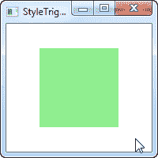
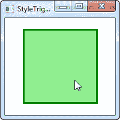

# 触发动画

> 原文：<https://wpf-tutorial.com/styles/trigger-animations-enteractions-exitactions/>

与以前的 WinForms 之类的框架相比，使用 WPF 变得容易多了，其中之一就是动画。触发器直接支持使用动画来响应被触发的触发器，而不仅仅是在两个静态值之间切换。

为此，我们使用了 **EnterActions** 和 **ExitActions** 属性，它们出现在所有已经讨论过的触发器类型中(除了 EventTrigger)，包括单个和多个。这里有一个例子:

```
<Window x:Class="WpfTutorialSamples.Styles.StyleTriggerEnterExitActions"

        xmlns:x="http://schemas.microsoft.com/winfx/2006/xaml"
        Title="StyleTriggerEnterExitActions" Height="200" Width="200" UseLayoutRounding="True">
    <Grid>
        <Border Background="LightGreen" Width="100" Height="100" BorderBrush="Green">
            <Border.Style>
                <Style TargetType="Border">
                    <Style.Triggers>
                        <Trigger Property="IsMouseOver" Value="True">
                            <Trigger.EnterActions>
                                <BeginStoryboard>
                                    <Storyboard>
                                        <ThicknessAnimation Duration="0:0:0.400" To="3" Storyboard.TargetProperty="BorderThickness" />
                                        <DoubleAnimation Duration="0:0:0.300" To="125" Storyboard.TargetProperty="Height" />
                                        <DoubleAnimation Duration="0:0:0.300" To="125" Storyboard.TargetProperty="Width" />
                                    </Storyboard>
                                </BeginStoryboard>
                            </Trigger.EnterActions>
                            <Trigger.ExitActions>
                                <BeginStoryboard>
                                    <Storyboard>
                                        <ThicknessAnimation Duration="0:0:0.250" To="0" Storyboard.TargetProperty="BorderThickness" />
                                        <DoubleAnimation Duration="0:0:0.150" To="100" Storyboard.TargetProperty="Height" />
                                        <DoubleAnimation Duration="0:0:0.150" To="100" Storyboard.TargetProperty="Width" />
                                    </Storyboard>
                                </BeginStoryboard>
                            </Trigger.ExitActions>
                        </Trigger>
                    </Style.Triggers>
                </Style>
            </Border.Style>
        </Border>
    </Grid>
</Window>
```



在这个例子中，我们有一个绿色的正方形。它有一个触发器，当鼠标在上面时触发，在这种情况下，它触发几个动画，所有这些都在触发器的 **EnterActions** 部分中定义。在那里，我们将边框的厚度从默认的 0 设置为 3，然后我们 将宽度和高度从 100 设置为 125。这一切都是同时发生的，因为它们是同一个**故事板**的一部分，甚至在 速度略有不同，因为我们完全控制每个动画应该播放多长时间。

我们使用 ExitActions 来撤销我们所做的更改，动画返回到默认值。我们运行反转动画稍微快一点，因为我们可以，因为它看起来很酷。

<input type="hidden" name="IL_IN_ARTICLE">

这两种状态在两个屏幕截图上都有表示，但是为了更好地理解效果，您应该使用上面的源代码在您自己的机器上运行这个示例。

## 摘要

使用带有样式触发器的动画是非常容易的，虽然我们还没有完全探索你可以用 WPF 动画做什么，上面使用的例子应该给你一个动画和样式是多么灵活的想法。

* * *