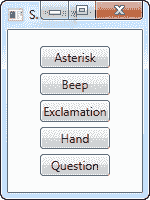
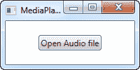
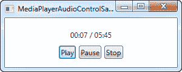

# 播放音频

> 原文：<https://wpf-tutorial.com/audio-video/playing-audio/>

WPF 具有出色的内置音频和视频支持，你将在本教程的下两章中看到。在这篇特定的文章中，我们将讨论播放来自实际音频文件(例如 MP3 格式)的音频的能力，但首先，让我们来看看两个更简单的方法。

## 系统声音和声音播放器

WPF 有一个名为 **SoundPlayer** 的类，它会为你播放基于 WAV 格式的音频内容。WAV 现在不是一种广泛使用的格式 ,主要是因为它是未压缩的，因此会占用很多空间。

因此，虽然 SoundPlayer 类易于使用，但它并不十分有用。相反，我们将把重点放在允许播放 MP3 文件的 **MediaPlayer** 和 **MediaElement** 类上，但是首先，让我们看看在您的 WPF 应用程序中播放声音的最简单的方法 SystemSounds 类。

SystemSounds 类提供了几种不同的声音，对应于用户在 Windows 中为该事件定义的声音，如感叹号和问题。您可以利用这些声音和设置，用一行代码来播放它们:

```
SystemSounds.Beep.Play();
```

<input type="hidden" name="IL_IN_ARTICLE">

这是一个完整的例子，我们使用了所有当前可用的声音:

```
<Window x:Class="WpfTutorialSamples.Audio_and_Video.SystemSoundsSample"

        xmlns:x="http://schemas.microsoft.com/winfx/2006/xaml"
        Title="SystemSoundsSample" Height="200" Width="150">
    <StackPanel Margin="10" HorizontalAlignment="Center" VerticalAlignment="Center">
        <Button Name="btnAsterisk" Click="btnAsterisk_Click">Asterisk</Button>
        <Button Name="btnBeep" Margin="0,5" Click="btnBeep_Click">Beep</Button>
        <Button Name="btnExclamation" Click="btnExclamation_Click">Exclamation</Button>
        <Button Name="btnHand" Margin="0,5" Click="btnHand_Click">Hand</Button>
        <Button Name="btnQuestion" Click="btnQuestion_Click">Question</Button>
    </StackPanel>
</Window>
```

```
using System;
using System.Media;
using System.Windows;

namespace WpfTutorialSamples.Audio_and_Video
{
	public partial class SystemSoundsSample : Window
	{
		public SystemSoundsSample()
		{
			InitializeComponent();
		}

		private void btnAsterisk_Click(object sender, RoutedEventArgs e)
		{
			SystemSounds.Asterisk.Play();
		}

		private void btnBeep_Click(object sender, RoutedEventArgs e)
		{
			SystemSounds.Beep.Play();
		}

		private void btnExclamation_Click(object sender, RoutedEventArgs e)
		{
			SystemSounds.Exclamation.Play();
		}

		private void btnHand_Click(object sender, RoutedEventArgs e)
		{
			SystemSounds.Hand.Play();
		}

		private void btnQuestion_Click(object sender, RoutedEventArgs e)
		{
			SystemSounds.Question.Play();
		}
	}
}
```



当然，使用这种方法有几个限制。首先，你只能访问这五种声音，其次，用户可能已经在 Windows 中禁用了它们，在这种情况下，预期的声音将被替换为静音。另一方面，如果你只是想像 Windows 一样使用这些声音，那就很容易产生警告、问题等声音。在这种情况下，你的应用程序尊重用户的沉默选择是一件好事。

## MediaPlayer 类

MediaPlayer 类使用 Windows Media Player 技术播放多种现代格式的音频和视频，例如 MP3 和 MPEG。在本文中，我们将使用它来播放音频，然后在下一篇文章中重点讨论视频。

使用 MediaPlayer 类播放 MP3 文件非常简单，我们将在下一个示例中看到:

```
<Window x:Class="WpfTutorialSamples.Audio_and_Video.MediaPlayerAudioSample"

        xmlns:x="http://schemas.microsoft.com/winfx/2006/xaml"
        Title="MediaPlayerAudioSample" Height="100" Width="200">
    <Grid VerticalAlignment="Center" HorizontalAlignment="Center">
        <Button Name="btnOpenAudioFile" Click="btnOpenAudioFile_Click">Open Audio file</Button>
    </Grid>
</Window>
```

```
using System;
using System.Windows;
using System.Windows.Media;
using Microsoft.Win32;

namespace WpfTutorialSamples.Audio_and_Video
{
	public partial class MediaPlayerAudioSample : Window
	{
		private MediaPlayer mediaPlayer = new MediaPlayer();

		public MediaPlayerAudioSample()
		{
			InitializeComponent();
		}

		private void btnOpenAudioFile_Click(object sender, RoutedEventArgs e)
		{
			OpenFileDialog openFileDialog = new OpenFileDialog();
			openFileDialog.Filter = "MP3 files (*.mp3)|*.mp3|All files (*.*)|*.*";
			if(openFileDialog.ShowDialog() == true)
			{
				mediaPlayer.Open(new Uri(openFileDialog.FileName));
				mediaPlayer.Play();
			}
		}
	}
}
```



在这个例子中，我们只有一个按钮，它将显示一个 OpenFileDialog 并让您选择一个 MP3 文件。一旦完成，它将使用已经创建的 MediaPlayer 实例来打开和播放这个文件。注意，MediaPlayer 对象是在事件处理程序之外创建的。这可以确保对象不会过早地被垃圾回收，因为一旦事件处理程序完成，它就会超出范围，从而导致播放停止。

还请注意，这个示例没有进行异常处理，这是为了保持示例尽可能简洁，但在这个示例中，也是因为 Open()和 Play()方法实际上没有抛出任何异常。相反，您可以使用 MediaOpened 和 MediaFailed 事件来判断事情是好是坏。

## 控制媒体播放器

在我们的第一个 MediaPlayer 示例中，我们只是打开并自动开始播放一个文件，没有给用户控制播放过程的机会，但显然，MediaPlayer 控件为您提供了对播放的完全控制。下面的例子向您展示了最重要的功能:

```
<Window x:Class="WpfTutorialSamples.Audio_and_Video.MediaPlayerAudioControlSample"

        xmlns:x="http://schemas.microsoft.com/winfx/2006/xaml"
        Title="MediaPlayerAudioControlSample" Height="120" Width="300">
    <StackPanel Margin="10">
        <Label Name="lblStatus" Content="Not playing..." HorizontalContentAlignment="Center" Margin="5" />
        <WrapPanel HorizontalAlignment="Center">
            <Button Name="btnPlay" Click="btnPlay_Click">Play</Button>
            <Button Name="btnPause" Margin="5,0" Click="btnPause_Click">Pause</Button>
            <Button Name="btnStop" Click="btnStop_Click">Stop</Button>
        </WrapPanel>
    </StackPanel>
</Window>
```

```
using System;
using System.Windows;
using System.Windows.Media;
using System.Windows.Threading;
using Microsoft.Win32;

namespace WpfTutorialSamples.Audio_and_Video
{
	public partial class MediaPlayerAudioControlSample : Window
	{
		private MediaPlayer mediaPlayer = new MediaPlayer();

		public MediaPlayerAudioControlSample()
		{
			InitializeComponent();

			OpenFileDialog openFileDialog = new OpenFileDialog();
			openFileDialog.Filter = "MP3 files (*.mp3)|*.mp3|All files (*.*)|*.*";
			if(openFileDialog.ShowDialog() == true)
				mediaPlayer.Open(new Uri(openFileDialog.FileName));

			DispatcherTimer timer = new DispatcherTimer();
			timer.Interval = TimeSpan.FromSeconds(1);
			timer.Tick += timer_Tick;
			timer.Start();
		}

		void timer_Tick(object sender, EventArgs e)
		{
			if(mediaPlayer.Source != null)
				lblStatus.Content = String.Format("{0} / {1}", mediaPlayer.Position.ToString(@"mm\:ss"), mediaPlayer.NaturalDuration.TimeSpan.ToString(@"mm\:ss"));
			else
				lblStatus.Content = "No file selected...";
		}

		private void btnPlay_Click(object sender, RoutedEventArgs e)
		{
			mediaPlayer.Play();
		}

		private void btnPause_Click(object sender, RoutedEventArgs e)
		{
			mediaPlayer.Pause();
		}

		private void btnStop_Click(object sender, RoutedEventArgs e)
		{
			mediaPlayer.Stop();
		}
	}
}
```



在本例中，我们对播放器进行了一些扩展，现在它包含了一个播放、暂停和停止按钮，以及一个显示当前播放状态的标签。要播放的 MP3 文件是以同样的方式加载的，但是为了保持示例简单，我们在应用程序启动时就加载了。

在 MP3 加载之后，我们启动一个计时器，它每秒钟滴答一次。我们使用这个事件来更新状态标签，它将显示当前进度以及加载文件的整个长度。

这三个按钮每个都简单地调用 MediaPlayer 对象上的相应方法——播放、暂停和停止。

## 摘要

还有几个选项可以让您的用户控制，但我想把这些留到我们讨论 MediaPlayer 类的视频方面时再说——到那时，我将做一个更完整的媒体播放器示例，它能够播放音频和视频文件，并有更多的选项。

* * *