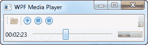
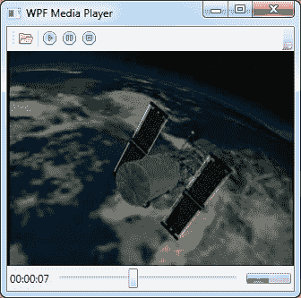

# 如何:创建完整的音频/视频播放器

> 原文：<https://wpf-tutorial.com/audio-video/how-to-creating-a-complete-audio-video-player/>

作为上一章关于播放音频和视频的结论，我决定创建一个更完整的示例，其中我们利用了 MediaPlayer/MediaElement 类可以处理音频和视频这一事实。

我将采用文章中使用的关于播放音频和视频的概念，并将它们与我们在本文前面已经讨论过的几个控件结合起来，将它们全部变成一个 WPF 媒体播放器。结果将如下所示:



但那只是它播放音频/MP3 文件的时候。加载视频后，界面会自动展开，在窗口中显示视频内容:



让我告诉你一点这东西是怎么造出来的。最后，您当然可以看到完整的源代码，供您使用。

<input type="hidden" name="IL_IN_ARTICLE">

## 界面

界面分为三个垂直区域:顶部，工具栏所在的位置，中间，显示视频(如果加载了视频文件)的位置，底部，我们可以找到一个状态栏，包括时间状态，一个用于查看和控制进度的**滑块**和一个用于显示音量的**进度条**。这里使用的所有控件已经在之前的教程中解释过了，所以我们不会太关注 这个。

注意 WPF 命令的使用，而不是按钮的点击事件。这允许我们在想要添加例如具有一些相同功能的主菜单或上下文菜单的情况下容易地重复使用该功能。这也使我们更容易根据播放器的当前状态来打开和关闭该功能。

还要注意，我们已经将 MediaElement **Stretch** 属性设置为 **None** ，将窗口 **SizeToContentMode** 设置为 **WidthAndHeight** 。这是保持窗口最小化的原因，如果正在播放的话，它需要显示界面和视频。

为了显示音量，我们在右下角使用了一个 ProgressBar 控件。这目前不允许用户控制音量，而只是通过经典的数据绑定反映 MediaElement 控件上的 **Volume** 属性。我们为 实现了一个小而巧妙的技巧，让用户控制音量——下面会详细介绍。

## 代码

在代码隐藏中，我们重用了在前面的示例中已经使用过的一些技术。例如，我们启动 DispatcherTimer，让它每秒滴答一次，在界面中显示当前的回放进度。在计时器的 Tick 事件中，我们通过根据正在播放的文件设置**最小值**、**最大值**和当前**值**来更新**滑块**控件，并通过挂钩滑块上的 **ValueChanged** 事件，我们使用它来更新以小时、分钟和秒显示当前播放进度的标签。

滑块控件还允许用户简单地通过拖动“拇指”到另一个位置来跳到文件的另一部分。我们通过实现 **DragStarted** 和 **DragCompleted** 的事件来处理这个问题——第一个事件设置一个变量(**useridragingslider**)，告诉计时器在我们拖动时不要更新滑块，第二个事件在 用户释放鼠标按钮时跳到指定的部分。

我们使用的四个命令都有 **CanExecute** 和 Executed 处理程序，尤其是暂停和停止命令非常有趣。由于我们不能从 MediaElement 控件中获得当前状态，我们必须自己跟踪当前状态。这是通过一个名为**mediaplayerisplay**的本地变量来完成的，我们定期检查这个变量来查看暂停和停止按钮是否应该被启用**。**

您应该注意的最后一个小细节是 **Grid_MouseWheel** 事件。主网格覆盖了整个窗口，所以通过订阅这个 事件，我们可以在用户滚动滚轮时得到通知。当这种情况发生时，作为一个小花招，我们根据方向 调高或调低音量(我们通过查看 Delta 属性来获得，向下滚动时为负，向上滚动时为正)。这立即反映在 用户界面中，其中一个 **ProgressBar** 控件被绑定到 MediaElement 的 Volume 属性。

## 完整的源代码

在描述了示例背后的所有理论之后，下面是完整的源代码:

```
<Window x:Class="WpfTutorialSamples.Audio_and_Video.AudioVideoPlayerCompleteSample"

        xmlns:x="http://schemas.microsoft.com/winfx/2006/xaml"
        Title="WPF Media Player" Height="300" Width="300"
        MinWidth="300" SizeToContent="WidthAndHeight">
    <Window.CommandBindings>
        <CommandBinding Command="ApplicationCommands.Open" CanExecute="Open_CanExecute" Executed="Open_Executed" />
        <CommandBinding Command="MediaCommands.Play" CanExecute="Play_CanExecute" Executed="Play_Executed" />
        <CommandBinding Command="MediaCommands.Pause" CanExecute="Pause_CanExecute" Executed="Pause_Executed" />
        <CommandBinding Command="MediaCommands.Stop" CanExecute="Stop_CanExecute" Executed="Stop_Executed" />
    </Window.CommandBindings>
    <Grid MouseWheel="Grid_MouseWheel">
        <Grid.RowDefinitions>
            <RowDefinition Height="Auto" />
            <RowDefinition Height="*" />
            <RowDefinition Height="Auto" />
        </Grid.RowDefinitions>
        <ToolBar>
            <Button Command="ApplicationCommands.Open">
                <Image Source="/WpfTutorialSamples;componeimg/folder.png" />
            </Button>
            <Separator />
            <Button Command="MediaCommands.Play">
                <Image Source="/WpfTutorialSamples;componeimg/control_play_blue.png" />
            </Button>
            <Button Command="MediaCommands.Pause">
                <Image Source="/WpfTutorialSamples;componeimg/control_pause_blue.png" />
            </Button>
            <Button Command="MediaCommands.Stop">
                <Image Source="/WpfTutorialSamples;componeimg/control_stop_blue.png" />
            </Button>
        </ToolBar>

        <MediaElement Name="mePlayer" Grid.Row="1" LoadedBehavior="Manual" Stretch="None" />

        <StatusBar Grid.Row="2">
            <StatusBar.ItemsPanel>
                <ItemsPanelTemplate>
                    <Grid>
                        <Grid.ColumnDefinitions>
                            <ColumnDefinition Width="Auto" />
                            <ColumnDefinition Width="*" />
                            <ColumnDefinition Width="Auto" />
                        </Grid.ColumnDefinitions>
                    </Grid>
                </ItemsPanelTemplate>
            </StatusBar.ItemsPanel>
            <StatusBarItem>
                <TextBlock Name="lblProgressStatus">00:00:00</TextBlock>
            </StatusBarItem>
            <StatusBarItem Grid.Column="1" HorizontalContentAlignment="Stretch">
                <Slider Name="sliProgress" Thumb.DragStarted="sliProgress_DragStarted"  Thumb.DragCompleted="sliProgress_DragCompleted" ValueChanged="sliProgress_ValueChanged" />
            </StatusBarItem>
            <StatusBarItem Grid.Column="2">
                <ProgressBar Name="pbVolume" Width="50" Height="12" Maximum="1" Value="{Binding ElementName=mePlayer, Path=Volume}" />
            </StatusBarItem>
        </StatusBar>
    </Grid>
</Window>
```

```
using System;
using System.Windows;
using System.Windows.Controls.Primitives;
using System.Windows.Input;
using System.Windows.Threading;
using Microsoft.Win32;

namespace WpfTutorialSamples.Audio_and_Video
{
	public partial class AudioVideoPlayerCompleteSample : Window
	{
		private bool mediaPlayerIsPlaying = false;
		private bool userIsDraggingSlider = false;

		public AudioVideoPlayerCompleteSample()
		{
			InitializeComponent();

			DispatcherTimer timer = new DispatcherTimer();
			timer.Interval = TimeSpan.FromSeconds(1);
			timer.Tick += timer_Tick;
			timer.Start();
		}

		private void timer_Tick(object sender, EventArgs e)
		{
			if((mePlayer.Source != null) && (mePlayer.NaturalDuration.HasTimeSpan) && (!userIsDraggingSlider))
			{
				sliProgress.Minimum = 0;
				sliProgress.Maximum = mePlayer.NaturalDuration.TimeSpan.TotalSeconds;
				sliProgress.Value = mePlayer.Position.TotalSeconds;
			}
		}

		private void Open_CanExecute(object sender, CanExecuteRoutedEventArgs e)
		{
			e.CanExecute = true;
		}

		private void Open_Executed(object sender, ExecutedRoutedEventArgs e)
		{
			OpenFileDialog openFileDialog = new OpenFileDialog();
			openFileDialog.Filter = "Media files (*.mp3;*.mpg;*.mpeg)|*.mp3;*.mpg;*.mpeg|All files (*.*)|*.*";
			if(openFileDialog.ShowDialog() == true)
				mePlayer.Source = new Uri(openFileDialog.FileName);
		}

		private void Play_CanExecute(object sender, CanExecuteRoutedEventArgs e)
		{
			e.CanExecute = (mePlayer != null) && (mePlayer.Source != null);
		}

		private void Play_Executed(object sender, ExecutedRoutedEventArgs e)
		{
			mePlayer.Play();
			mediaPlayerIsPlaying = true;
		}

		private void Pause_CanExecute(object sender, CanExecuteRoutedEventArgs e)
		{
			e.CanExecute = mediaPlayerIsPlaying;
		}

		private void Pause_Executed(object sender, ExecutedRoutedEventArgs e)
		{
			mePlayer.Pause();
		}

		private void Stop_CanExecute(object sender, CanExecuteRoutedEventArgs e)
		{
			e.CanExecute = mediaPlayerIsPlaying;
		}

		private void Stop_Executed(object sender, ExecutedRoutedEventArgs e)
		{
			mePlayer.Stop();
			mediaPlayerIsPlaying = false;
		}

		private void sliProgress_DragStarted(object sender, DragStartedEventArgs e)
		{
			userIsDraggingSlider = true;
		}

		private void sliProgress_DragCompleted(object sender, DragCompletedEventArgs e)
		{
			userIsDraggingSlider = false;
			mePlayer.Position = TimeSpan.FromSeconds(sliProgress.Value);
		}

		private void sliProgress_ValueChanged(object sender, RoutedPropertyChangedEventArgs<double> e)
		{
			lblProgressStatus.Text = TimeSpan.FromSeconds(sliProgress.Value).ToString(@"hh\:mm\:ss");
		}

		private void Grid_MouseWheel(object sender, MouseWheelEventArgs e)
		{
			mePlayer.Volume += (e.Delta > 0) ? 0.1 : -0.1;
		}

	}
}
```

## 摘要

代码清单可能看起来有点令人不知所措，但是正如您所看到的，其中有很多重复。如果你不考虑这些，你会很快意识到在 WPF 创造一个相当有能力的媒体播放器真的没有那么难！您可以在自己的项目中随意扩展这个例子——实现一个播放列表特性怎么样？

* * *