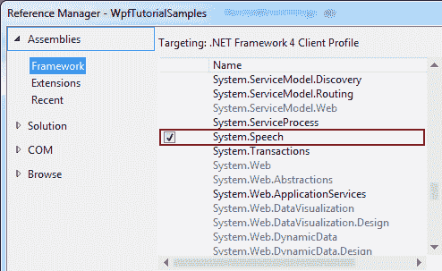

# 语音合成(让 WPF 说话)

> 原文：<https://wpf-tutorial.com/audio-video/speech-synthesis-making-wpf-talk/>

在系统中。语音汇编，微软增加了一些非常酷的东西:语音合成，将文本转换成口语的能力，以及语音识别，将口语翻译成文本的能力。在本文中，我们将重点讨论语音合成，然后在下一篇文章中讨论语音识别。

为了将文本转换成口语单词，我们将使用 **SpeechSynthesizer** 类。这个类驻留在系统中。语音汇编，我们需要添加这个 来在我们的应用程序中使用它。根据您使用的 Visual Studio 版本，该过程如下所示:



添加了适当的程序集后，我们现在可以从系统中使用 SpeechSynthesizer 类了。语音合成命名空间。有了这些，我们将开始另一个非常简单的“你好，世界！”灵感的例子，这一次是用口语:

```
<Window x:Class="WpfTutorialSamples.Audio_and_Video.SpeechSynthesisSample"

        xmlns:x="http://schemas.microsoft.com/winfx/2006/xaml"
        Title="SpeechSynthesisSample" Height="150" Width="150">
    <Grid>
        <Button Name="btnSayIt" Click="btnSayHello_Click" VerticalAlignment="Center" HorizontalAlignment="Center">Say hello!</Button>
    </Grid>
</Window>
```

<input type="hidden" name="IL_IN_ARTICLE">

```
using System;
using System.Speech.Synthesis;
using System.Windows;

namespace WpfTutorialSamples.Audio_and_Video
{
	public partial class SpeechSynthesisSample : Window
	{
		public SpeechSynthesisSample()
		{
			InitializeComponent();
		}

		private void btnSayHello_Click(object sender, RoutedEventArgs e)
		{
			SpeechSynthesizer speechSynthesizer = new SpeechSynthesizer();
			speechSynthesizer.Speak("Hello, world!");
		}
	}
}
```


这非常简单，因为截图在演示语音合成方面并没有太大帮助，我建议您尝试自己构建这个例子来体验一下。

## 控制发音

然而，语音合成器能做的不止这些。通过使用 PromptBuilder 类，我们可以更好地控制句子的发音。下一个示例是第一个示例的扩展，它将说明:

```
<Window x:Class="WpfTutorialSamples.Audio_and_Video.SpeechSynthesisPromptBuilderSample"

        xmlns:x="http://schemas.microsoft.com/winfx/2006/xaml"
        Title="SpeechSynthesisPromptBuilderSample" Height="150" Width="150">
    <Grid>
        <Button Name="btnSayIt" Click="btnSayHello_Click" VerticalAlignment="Center" HorizontalAlignment="Center">Say hello!</Button>
    </Grid>
</Window>
```

```
using System;
using System.Speech.Synthesis;
using System.Windows;

namespace WpfTutorialSamples.Audio_and_Video
{
	public partial class SpeechSynthesisPromptBuilderSample : Window
	{
		public SpeechSynthesisPromptBuilderSample()
		{
			InitializeComponent();
		}

		private void btnSayHello_Click(object sender, RoutedEventArgs e)
		{
			PromptBuilder promptBuilder = new PromptBuilder();
			promptBuilder.AppendText("Hello world");

			PromptStyle promptStyle = new PromptStyle();
			promptStyle.Volume = PromptVolume.Soft;
			promptStyle.Rate = PromptRate.Slow;
			promptBuilder.StartStyle(promptStyle);
			promptBuilder.AppendText("and hello to the universe too.");
			promptBuilder.EndStyle();

			promptBuilder.AppendText("On this day, ");
			promptBuilder.AppendTextWithHint(DateTime.Now.ToShortDateString(), SayAs.Date);

			promptBuilder.AppendText(", we're gathered here to learn");
			promptBuilder.AppendText("all", PromptEmphasis.Strong);
			promptBuilder.AppendText("about");
			promptBuilder.AppendTextWithHint("WPF", SayAs.SpellOut);

			SpeechSynthesizer speechSynthesizer = new SpeechSynthesizer();
			speechSynthesizer.Speak(promptBuilder);
		}
	}
}
```


这就是有趣的地方。试着运行这个例子，看看效果如何。通过向 SpeechSynthesizer 提供不仅仅是文本字符串的东西，我们可以很好地控制句子的各个部分是如何发音的。在这种情况下，应用程序将显示以下内容:

世界你好，宇宙你好。这一天，<今天的日期>，我们聚集在这里了解 WPF 的一切。

现在，试着把它直接发送给语音合成器，你可能会对这个结果傻笑一下。相反，我们所做的是将 Speak()方法引入句子的各个部分应该如何使用。首先，我们请 WPF 以较低的音量和较慢的语速说出“你好，也向宇宙问好”的部分，就像在低声说话一样。

下一个不仅仅使用默认发音的部分是日期。我们使用特殊的 SayAs 枚举来指定日期应该作为一个实际的日期读出，而不仅仅是一组数字、空格和特殊字符。

我们还要求单词“all”的发音要更重，以使句子更有活力，最后，我们要求单词“WPF”要拼写出来(W-P-F ),而不是作为一个实际的单词发音。

总的来说，这让我们能够让演讲合成器更容易理解！

## 摘要

让您的 WPF 应用程序说话是非常容易的，通过使用 PromptBuilder 类，您甚至可以很好地控制如何说话。这是一个非常强大的功能，但它可能与当今的许多应用程序无关。不过还是很酷！

* * *