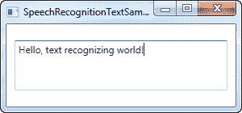

# 语音识别(让 WPF 倾听)

> 原文：<https://wpf-tutorial.com/audio-video/speech-recognition-making-wpf-listen/>

在上一篇文章中，我们讨论了如何使用 SpeechSynthesizer 类将文本转换成口语单词。在本文中，我们将反其道而行之，将口语文字转化为文本。为此，我们将使用驻留在系统中的 **SpeechRecognition** 类。演讲 大会。默认情况下，这个程序集不是您的解决方案的一部分，但是我们可以很容易地添加它。根据您使用的 Visual Studio 版本的不同， 进程看起来如下所示:


考虑到这一点，让我们从一个极其简单的语音识别示例开始:

```
<Window x:Class="WpfTutorialSamples.Audio_and_Video.SpeechRecognitionTextSample"

        xmlns:x="http://schemas.microsoft.com/winfx/2006/xaml"
        Title="SpeechRecognitionTextSample" Height="200" Width="300">
    <DockPanel Margin="10">
        <TextBox Margin="0,10" Name="txtSpeech" AcceptsReturn="True" />
    </DockPanel>
</Window>
```

```
using System;
using System.Speech.Recognition;
using System.Windows;

namespace WpfTutorialSamples.Audio_and_Video
{
	public partial class SpeechRecognitionTextSample : Window
	{
		public SpeechRecognitionTextSample()
		{
			InitializeComponent();
			SpeechRecognizer speechRecognizer = new SpeechRecognizer();
		}
	}
}
```

<input type="hidden" name="IL_IN_ARTICLE"> 

这实际上就是您所需要的——上面截图中的文本是通过我的耳机口述的，然后通过使用语音识别作为文本插入到 TextBox 控件中。

一旦你初始化了一个 **SpeechRecognizer** 对象，Windows 就启动它的语音识别应用程序，它将完成所有的艰苦工作 ，然后将结果发送给活动的应用程序，在本例中是我们的应用程序。看起来是这样的:


*如果你以前没有在你的电脑上使用过语音识别，那么 Windows 将带你通过一个指南，这将帮助你开始并作出一些必要的调整 。 T1】*

第一个例子将允许您向应用程序口述文本，这很好，但是命令呢？Windows 和 WPF 将在这里一起工作，把你的按钮变成命令，通过语音就可以到达，不需要任何额外的工作。这里有一个例子:

```
<Window x:Class="WpfTutorialSamples.Audio_and_Video.SpeechRecognitionTextCommandsSample"

        xmlns:x="http://schemas.microsoft.com/winfx/2006/xaml"
        Title="SpeechRecognitionTextCommandsSample" Height="200" Width="300">
    <DockPanel Margin="10">
        <WrapPanel DockPanel.Dock="Top">
            <Button Name="btnNew" Click="btnNew_Click">New</Button>
            <Button Name="btnOpen" Click="btnOpen_Click">Open</Button>
            <Button Name="btnSave" Click="btnSave_Click">Save</Button>
        </WrapPanel>
        <TextBox Margin="0,10" Name="txtSpeech" AcceptsReturn="True" TextWrapping="Wrap" />
    </DockPanel>
</Window>
```

```
using System;
using System.Speech.Recognition;
using System.Windows;

namespace WpfTutorialSamples.Audio_and_Video
{
	public partial class SpeechRecognitionTextCommandsSample : Window
	{
		public SpeechRecognitionTextCommandsSample()
		{
			InitializeComponent();
			SpeechRecognizer recognizer = new SpeechRecognizer();
		}

		private void btnNew_Click(object sender, RoutedEventArgs e)
		{
			txtSpeech.Text = "";
		}

		private void btnOpen_Click(object sender, RoutedEventArgs e)
		{
			MessageBox.Show("Command invoked: Open");
		}

		private void btnSave_Click(object sender, RoutedEventArgs e)
		{
			MessageBox.Show("Command invoked: Save");
		}
	}
}
```


您可以尝试运行该示例，然后说出其中一个命令，例如“New”或“Open”。这实际上允许您向文本框口述文本，同时从用户界面调用命令——确实很酷！

## 特定命令

在上面的例子中，当焦点放在文本框上时，Windows 将自动进入听写模式。Windows 将尝试区分听写和命令，但在某些情况下这当然很困难。

因此，虽然上面的例子关注的是听写和与 UI 元素的交互，但是下一个例子将只关注监听和解释特定命令的能力。这也意味着听写将被完全忽略，即使文本输入字段有焦点。

为此，我们将使用**speecher recognition engine**类，而不是**speecher recognizer**类。两者之间的一个巨大差异是 **SpeechRecognitionEngine** 类不需要运行 Windows 语音识别，也不会带你通过语音识别指南 。取而代之的是，它将使用基本的语音识别，只听你在课堂上输入的语法。

在下一个例子中，我们将向识别引擎输入一组命令。其思想是它应该监听两个词:一个命令/属性和一个值，在这种情况下，它将用于更改标签控件中文本的颜色、大小和粗细，完全基于您的语音命令。在向您展示整个代码示例之前，我想重点介绍一下我们向引擎添加命令的方式。代码如下:

```
GrammarBuilder grammarBuilder = new GrammarBuilder();
Choices commandChoices = new Choices("weight", "color", "size");
grammarBuilder.Append(commandChoices);

Choices valueChoices = new Choices();
valueChoices.Add("normal", "bold");
valueChoices.Add("red", "green", "blue");
valueChoices.Add("small", "medium", "large");
grammarBuilder.Append(valueChoices);

speechRecognizer.LoadGrammar(new Grammar(grammarBuilder));
```

我们使用一个 **GrammarBuilder** 来构建一组语法规则，我们可以将这些规则加载到 SpeechRecognitionEngine 中。它有几个追加方法， ，其中最简单的是 append()。这个方法接受一个选择列表。我们用 指令的第一部分——我们想要访问的命令/属性——创建一个**选择**实例。这些选项通过 Append()方法添加到构建器中。

现在，每次在 GrammarBuilder 上调用 append 方法时，都要指示它监听一个单词。在我们的例子中，我们希望它监听两个单词，所以我们创建了第二组选择，它将保存指定命令/属性的值。我们为每个可能的命令添加一个值范围——一组值用于权重命令，一组值用于颜色命令，一组值用于大小命令。它们都被添加到同一个**选择**实例中，然后追加到构建器中。

最后，我们通过调用 **LoadGrammer()** 方法将其加载到 SpeechRecognitionEngine 实例中，该方法将一个语法实例作为 参数——在本例中基于我们的 GrammarBuilder 实例。

解释完之后，让我们看一下整个例子:

```
<Window x:Class="WpfTutorialSamples.Audio_and_Video.SpeechRecognitionCommandsSample"

        xmlns:x="http://schemas.microsoft.com/winfx/2006/xaml"
        Title="SpeechRecognitionCommandsSample" Height="200" Width="325"
        Closing="Window_Closing">
    <DockPanel>
        <WrapPanel DockPanel.Dock="Bottom" HorizontalAlignment="Center" Margin="0,10">
            <ToggleButton Name="btnToggleListening" Click="btnToggleListening_Click">Listen</ToggleButton>
        </WrapPanel>
        <Label Name="lblDemo" HorizontalAlignment="Center" VerticalAlignment="Center" FontSize="48">Hello, world!</Label>
    </DockPanel>
</Window>
```

```
using System;
using System.Globalization;
using System.Speech.Recognition;
using System.Windows;
using System.Windows.Media;

namespace WpfTutorialSamples.Audio_and_Video
{
	public partial class SpeechRecognitionCommandsSample : Window
	{
		private SpeechRecognitionEngine speechRecognizer = new SpeechRecognitionEngine();

		public SpeechRecognitionCommandsSample()
		{
			InitializeComponent();
			speechRecognizer.SpeechRecognized += speechRecognizer_SpeechRecognized;

			GrammarBuilder grammarBuilder = new GrammarBuilder();
			Choices commandChoices = new Choices("weight", "color", "size");
			grammarBuilder.Append(commandChoices);

			Choices valueChoices = new Choices();
			valueChoices.Add("normal", "bold");
			valueChoices.Add("red", "green", "blue");
			valueChoices.Add("small", "medium", "large");
			grammarBuilder.Append(valueChoices);

			speechRecognizer.LoadGrammar(new Grammar(grammarBuilder));
			speechRecognizer.SetInputToDefaultAudioDevice();
		}

		private void btnToggleListening_Click(object sender, RoutedEventArgs e)
		{
			if(btnToggleListening.IsChecked == true)
				speechRecognizer.RecognizeAsync(RecognizeMode.Multiple);
			else
				speechRecognizer.RecognizeAsyncStop();
		}

		private void speechRecognizer_SpeechRecognized(object sender, SpeechRecognizedEventArgs e)
		{
			lblDemo.Content = e.Result.Text;
			if(e.Result.Words.Count == 2)
			{
				string command = e.Result.Words[0].Text.ToLower();
				string value = e.Result.Words[1].Text.ToLower();
				switch(command)
				{
					case "weight":
						FontWeightConverter weightConverter = new FontWeightConverter();
						lblDemo.FontWeight = (FontWeight)weightConverter.ConvertFromString(value);
						break;
					case "color":
						lblDemo.Foreground = new SolidColorBrush((Color)ColorConverter.ConvertFromString(value));
						break;
					case "size":
						switch(value)
						{
							case "small":
								lblDemo.FontSize = 12;
								break;
							case "medium":
								lblDemo.FontSize = 24;
								break;
							case "large":
								lblDemo.FontSize = 48;
								break;
						}
						break;
				}
			}
		}

		private void Window_Closing(object sender, System.ComponentModel.CancelEventArgs e)
		{
			speechRecognizer.Dispose();
		}
	}
}
```


在截图上，你可以看到在我使用了语音命令“加粗”和“蓝色”之后的应用程序——很酷，对吧？

这个例子的语法方面已经解释过了，而且接口非常简单，所以让我们把注意力集中在代码隐藏的其余部分。

我们使用一个 **ToggleButton** 来启用或禁用监听，使用 RecognizeAsync()和 RecognizeAsyncStop()方法。RecognizeAsync() 接受一个参数，该参数通知识别引擎应该进行单次识别还是多次识别。对于我们的例子，我们想要给 几个命令，所以使用了 Multiple。因此，要启用监听，只需单击该按钮，要禁用它，只需再次单击它。状态用按钮来直观的 表示，启用时为“向下”，禁用时为正常。

现在，除了构建语法，最有趣的部分是我们解释命令的地方。这是在**speecher recognized** 事件中完成的，我们在构造函数中挂接了该事件。我们使用完全识别的文本来更新演示标签，以显示最新的命令，然后我们使用 Words 属性来深入挖掘实际的命令。

首先，我们检查它是否只有两个词——一个命令/属性和一个值。如果是这种情况，我们首先检查命令部分，对于每个可能的命令，我们相应地处理值。

对于 weight 和 color 命令，我们可以使用转换器将值转换成标签可以自动理解的东西，但是对于 sizes，我们手动解释给定的值，因为我为这个示例选择的值不能自动转换。请注意，您应该在所有情况下处理异常，因为像“weight blue”这样的命令会尝试将值 blue 赋给 FontWeight，这自然会导致异常。

## 摘要

正如你所看到的，WPF 的语音识别既简单又非常强大——特别是最后一个例子会让你很好地了解它有多强大！有了使用听写和/或特定语音命令的能力，您就可以在应用程序中真正提供出色的替代输入方式。

* * *