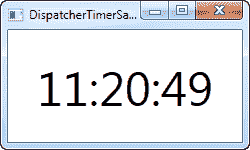
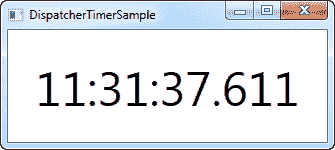

# 调度员

> 原文：<https://wpf-tutorial.com/misc/dispatchertimer/>

在 WinForms 中，有一个称为计时器的控件，它可以在给定的时间间隔内重复执行一个操作。WPF 也有这种可能性，但是我们有了 **DispatcherTimer** 控件，而不是一个看不见的控件。它做了几乎相同的事情，但不是把它放到你的 表单上，而是从你的代码隐藏代码中专门创建和使用它。

DispatcherTimer 类的工作方式是指定一个时间间隔，然后订阅每次达到这个时间间隔 时将发生的 **Tick** 事件。在调用 **Start()** 方法或将 **IsEnabled** 属性设置为 true 之前，DispatcherTimer 不会启动。

让我们尝试一个简单的例子，我们使用 DispatcherTimer 创建一个数字时钟:

```
<Window x:Class="WpfTutorialSamples.Misc.DispatcherTimerSample"

        xmlns:x="http://schemas.microsoft.com/winfx/2006/xaml"
        Title="DispatcherTimerSample" Height="150" Width="250">
    <Grid>
        <Label Name="lblTime" FontSize="48" HorizontalAlignment="Center" VerticalAlignment="Center" />
    </Grid>
</Window>
```

```
using System;
using System.Windows;
using System.Windows.Threading;

namespace WpfTutorialSamples.Misc
{
	public partial class DispatcherTimerSample : Window
	{
		public DispatcherTimerSample()
		{
			InitializeComponent();
			DispatcherTimer timer = new DispatcherTimer();
			timer.Interval = TimeSpan.FromSeconds(1);
			timer.Tick += timer_Tick;
			timer.Start();
		}

		void timer_Tick(object sender, EventArgs e)
		{
			lblTime.Content = DateTime.Now.ToLongTimeString();
		}
	}
}
```

 <input type="hidden" name="IL_IN_ARTICLE">

XAML 部分非常简单——它只是一个居中的大字体标签，用于显示当前时间。

代码隐藏是这个例子中神奇的地方。在窗口的构造器中，我们创建了一个 DispatcherTimer 实例。我们将 **Interval** 属性设置为一秒，订阅 Tick 事件，然后启动计时器。在 Tick 事件中，我们只需将标签更新为 显示当前时间。

当然，DispatcherTimer 可以在更短或更长的时间间隔内工作。例如，您可能只希望每 30 秒或 5 分钟发生一件事——只需使用 TimeSpan。From*方法，比如 FromSeconds 或 FromMinutes，或者创建一个完全符合您需要的新 TimeSpan 实例。

为了展示 DispatcherTimer 的能力，让我们尝试更频繁地更新...频繁得多！

```
using System;
using System.Windows;
using System.Windows.Threading;

namespace WpfTutorialSamples.Misc
{
	public partial class DispatcherTimerSample : Window
	{
		public DispatcherTimerSample()
		{
			InitializeComponent();
			DispatcherTimer timer = new DispatcherTimer();
			timer.Interval = TimeSpan.FromMilliseconds(1);
			timer.Tick += timer_Tick;
			timer.Start();
		}

		void timer_Tick(object sender, EventArgs e)
		{
			lblTime.Content = DateTime.Now.ToString("HH:mm:ss.fff");
		}
	}
}
```



如您所见，我们现在要求 DispatcherTimer 每毫秒触发一次！在 Tick 事件中，我们使用自定义的时间格式字符串在标签中显示毫秒。现在你有了一个可以轻松用作秒表的东西——只需在窗口上添加几个按钮，然后让它们调用计时器上的 **Stop()** 、 **Start()** 和 **Restart()** 方法。

## 摘要

在许多情况下，您需要在应用程序中以给定的时间间隔发生一些事情，使用 DispatcherTimer，这很容易实现。请注意，如果您在 Tick 事件中做了一些复杂的事情，它不应该运行得太频繁，就像在最后一个例子中，计时器每毫秒滴答一次——这将给运行您的应用程序的计算机带来很大压力。

还要注意，DispatcherTimer 并不是在所有情况下都 100%精确。tick 操作被放在 Dispatcher 队列中，所以如果计算机压力很大，您的操作可能会被延迟。的。NET framework 承诺 Tick 事件永远不会过早发生，但不能保证不会稍有延迟。然而，对于大多数用例，DispatcherTimer 已经足够精确了。

如果您需要您的计时器在队列中具有更高的优先级，您可以通过发送 DispatcherTimer 优先级的值之一来设置 DispatcherPriority。关于它的更多信息可以在这篇 [MSDN 文章](http://msdn.microsoft.com/en-us/library/system.windows.threading.dispatcherpriority.aspx)中找到。

* * *