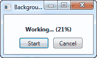
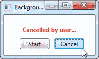

# 取消`BackgroundWorker`

> 原文：<https://wpf-tutorial.com/misc/cancelling-the-backgroundworker/>

正如我们在上一篇文章中看到的，多线程具有额外的优势，能够显示进度，并且在执行耗时的操作时不会让应用挂起。

如果您在 UI 线程上执行所有工作，您将面临的另一个问题是用户没有办法取消正在运行的任务——这是为什么呢？因为如果 UI 线程忙于执行冗长的任务，将不会处理任何输入，这意味着无论用户多么努力地点击取消按钮或 Esc 键，都不会发生任何事情。

对我们来说幸运的是，BackgroundWorker 是为了让您更容易地支持进度和取消而构建的，虽然我们在前一章中查看了整个进度部分，但这一章将全部讲述如何使用取消支持。让我们直接看一个例子:

```
<Window x:Class="WpfTutorialSamples.Misc.BackgroundWorkerCancellationSample"

        xmlns:x="http://schemas.microsoft.com/winfx/2006/xaml"
        Title="BackgroundWorkerCancellationSample" Height="120" Width="200">
    <StackPanel VerticalAlignment="Center" HorizontalAlignment="Center">
        <TextBlock Name="lblStatus" HorizontalAlignment="Center" Margin="0,10" FontWeight="Bold">Not running...</TextBlock>
        <WrapPanel>
            <Button Name="btnStart" Width="60" Margin="10,0" Click="btnStart_Click">Start</Button>
            <Button Name="btnCancel" Width="60" Click="btnCancel_Click">Cancel</Button>
        </WrapPanel>
    </StackPanel>
</Window>
```

```
using System;
using System.ComponentModel;
using System.Windows;
using System.Windows.Media;

namespace WpfTutorialSamples.Misc
{
	public partial class BackgroundWorkerCancellationSample : Window
	{
		private BackgroundWorker worker = null;

		public BackgroundWorkerCancellationSample()
		{
			InitializeComponent();
			worker = new BackgroundWorker();
			worker.WorkerSupportsCancellation = true;
			worker.WorkerReportsProgress = true;
			worker.DoWork += worker_DoWork;
			worker.ProgressChanged += worker_ProgressChanged;
			worker.RunWorkerCompleted += worker_RunWorkerCompleted;
		}

		private void btnStart_Click(object sender, RoutedEventArgs e)
		{
			worker.RunWorkerAsync();
		}

		private void btnCancel_Click(object sender, RoutedEventArgs e)
		{
			worker.CancelAsync();
		}

		void worker_DoWork(object sender, DoWorkEventArgs e)
		{
			for(int i = 0; i <= 100; i++)
			{
				if(worker.CancellationPending == true)
				{
					e.Cancel = true;
					return;
				}
				worker.ReportProgress(i);
				System.Threading.Thread.Sleep(250);
			}
			e.Result = 42;
		}

		void worker_ProgressChanged(object sender, ProgressChangedEventArgs e)
		{
			lblStatus.Text = "Working... (" + e.ProgressPercentage + "%)";
		}

		void worker_RunWorkerCompleted(object sender, RunWorkerCompletedEventArgs e)
		{
			if(e.Cancelled)
			{
				lblStatus.Foreground = Brushes.Red;
				lblStatus.Text = "Cancelled by user...";
			}
			else
			{
				lblStatus.Foreground = Brushes.Green;
				lblStatus.Text = "Done... Calc result: " + e.Result;
			}
		}
	}
}
```

 <input type="hidden" name="IL_IN_ARTICLE">

因此，XAML 是非常基本的——只是一个显示当前状态的标签，然后是几个启动和取消工作进程的按钮。

在代码隐藏中，我们首先创建 BackgroundWorker 实例。请特别注意我们设置为 true 的**workers supports cancellation**和 **WorkerReportsProgress** 属性——否则，如果我们试图使用这些特性，将会引发异常。

取消按钮简单地调用 **CancelAsync()** 方法——这将向工作器发出信号，表明用户希望通过将**cancelation pending**属性设置为 true 来取消正在运行的 进程，但这是您从 UI 线程中所能做的全部工作——剩下的工作将必须从 **DoWork** 事件内部完成 。

在 **DoWork** 事件中，我们数到 100，每次迭代有 250 毫秒的延迟。这给了我们一个漂亮而冗长的任务，我们 可以报告进度，并且仍然有时间点击取消按钮。

注意我是如何在每次迭代中检查 **CancellationPending** 属性的——如果工人被取消，该属性将为真，我将 有机会跳出循环。我在事件参数上设置了**取消**属性，以表示该流程已被取消- 该值在 **RunWorkerCompleted** 事件中使用，以查看工作进程是实际完成了还是被取消了。

在 **RunWorkerCompleted** 、**、**事件中，我只是简单地检查工人是否被取消，然后相应地更新状态标签 。



## 摘要

总之，向您的 BackgroundWorker 添加取消支持很容易——只要确保您将**workers supports cancellation** 属性设置为 true，并在执行工作时检查 **CancellationPending** 属性。然后，当您想要取消任务时，您只需 调用 worker 上的 **CancelAsync()** 方法，就大功告成了。

* * *