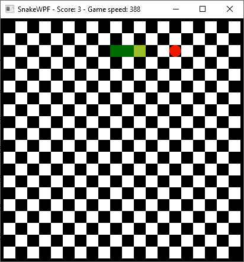

# 介绍

> 原文：<https://wpf-tutorial.com/creating-game-snakewpf/introduction/>

*这篇介绍性文章的一个快速总结:我们将在 WPF 实现经典的贪吃蛇游戏，最终的结果看起来像这样:*

创建游戏通常是很多人，尤其是年轻人，被吸引去学习编程的原因。但问题通常是:我如何开始，我需要什么？嗯，你需要一种编程语言，比如 C#、C++或任何其他流行的语言，如果你精通你喜欢的语言，你真的不需要其他任何东西:只需要从底部开始，向屏幕添加像素，在某个时候，你可能会有一个工作的游戏。

然而，大多数人更喜欢在低层次的东西上得到一点帮助。如果有一个库或框架可以为你做，为什么要手动添加像素到屏幕上，这样你就可以专注于构建一个有趣的游戏了？有许多框架可以帮助你做到这一点，实际上，**其中之一是 WPF 框架**。

现在承认，当你想创建游戏时，WPF 不是最明显的选择——它绝对是一个主要关注为面向商业的应用程序创建用户界面的框架。但是，在 WPF 框架中仍然有许多元素可以用来创建一个游戏，也许同样重要的是:你得到了在 Windows 中绘制和控制窗口的所有机制。

所以，如果你想创造一个简单的游戏，WPF 可能是个不错的选择。至少它会对所有最基本的方面有很大的帮助，比如创建一个窗口，为游戏画一个简单的区域等等。如果你想添加高级 3D 图形和快速移动的对象，可能需要其他库/框架的更多帮助，但对于一个简单的游戏来说它会做得很好——例如，一个经典的[贪吃蛇游戏](https://en.wikipedia.org/wiki/Snake_(video_game_genre))！

<input type="hidden" name="IL_IN_ARTICLE">

## 蛇 WPF

作为概念的证明，我决定创建一个基于 WPF 的非常经典的贪吃蛇游戏版本。它将使用一个常规的 WPF 窗口作为游戏区域，以及常规的 WPF 控件/形状来创建实际的游戏。我之所以选择 Snake，是因为它相当容易实现(没有那么多的逻辑代码)，而且它可以使用简单的几何图形来实现，比如正方形和圆形，这在 WPF 框架中非常容易使用。还因为它仍然是一个非常有趣的游戏，尽管它很简单！

如果你不知道贪吃蛇游戏，我只能假设你在 20 世纪 90 年代末和 21 世纪初从未拥有过诺基亚手机。贪吃蛇的第一个版本是在很多年前编写和演示的，但当诺基亚决定在他们所有的手机上包含他们自己的版本时，它成为了一个主要的热门。

游戏简单有趣:在寻找食物(有时是一个苹果)的过程中，你向一个方向(左、右、上或下)移动一条虚拟的蛇。当你的蛇碰到苹果时，它被吃掉了，你的蛇长大了，一个新的苹果出现在屏幕上。如果你撞到墙壁或你自己的蛇尾巴，游戏结束，你必须重新开始。你吃的苹果越多，你得到的分数越高，但是不撞到自己的尾巴就越难。

游戏有许多变化——例如，每次你吃苹果时，你的蛇移动的速度通常会增加，使它越来越难，但不是所有的蛇实现都会这样做。另一个变化是墙-一些实现将允许你穿过墙，从对面出去，而另一些实现将在你撞到墙时结束游戏。

在我们的 SnakeWPF 中，墙壁是坚硬的(如果蛇撞到墙壁，蛇就会死)，并且速度会随着你吃的每一个苹果而成倍增加，直到某一点。

## 摘要

在接下来的几篇文章中，我们将使用 WPF 框架实现经典贪吃蛇游戏的完美版本。我们将在下一篇文章中从背景开始，最后，我们将有我们的第一个功能齐全的基于 WPF 的游戏。

请注意，虽然这是一个 WPF 教程，我们将需要比正常多一点的 C#代码，以实现游戏逻辑等。随着我们的进展，我会试着解释大部分内容，但是如果你需要更多关于 C#的知识，不要忘记我们的网络中有一个很好的、[完整的 C#教程](https://csharp.net-tutorials.com/)！

* * *