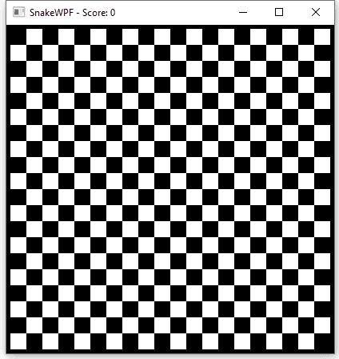

# 使用 DispatcherTimer 连续移动

> 原文：<https://wpf-tutorial.com/creating-game-snakewpf/continuous-movement-with-dispatchertimer/>

***Chapter introduction:*** *在本系列文章中，我们将从头开始构建一个完整的贪吃蛇游戏。从[介绍](https://www.wpf-tutorial.com/creating-game-snakewpf/introduction/)开始，然后一篇接一篇地阅读文章，以获得全面的理解是有意义的。

如果你想**立刻获得游戏**的完整源代码，现在就开始修改和学习，考虑[下载我们所有的样本](https://www.wpf-tutorial.com/download-wpf-tutorial-pdf-with-sample-code/)！*  *在之前的文章中，我们为我们的蛇创建了一个漂亮的游戏区域，然后我们添加了代码来执行蛇的实际创建和移动。然而，正如已经提到的，移动的代码不应该只被调用一次——相反，它应该被一次又一次地调用，以使蛇在游戏运行时保持移动。换句话说，我们需要一个计时器。

一般来说，在编程中，计时器通常是一种机制，它允许一个任务基于一个时间间隔一次又一次地重复。换句话说，每当计时器“滴答”时，就执行一段代码，计时器根据定义的时间间隔滴答。这正是我们保持我们的蛇移动所需要的，所以我们将添加一个 **DispatcherTimer** 到我们的窗口:

```
public partial class SnakeWPFSample : Window        
{        
    private System.Windows.Threading.DispatcherTimer gameTickTimer = new System.Windows.Threading.DispatcherTimer();  
    ....
```

准备好之后，我们现在需要订阅它的唯一事件: **Tick** 事件。我们将在窗口的构造函数中完成:

```
public SnakeWPFSample()  
{  
    InitializeComponent();  
    gameTickTimer.Tick += GameTickTimer_Tick;          
}
```

下面是该事件的实现:

<input type="hidden" name="IL_IN_ARTICLE">

```
private void GameTickTimer_Tick(object sender, EventArgs e)  
{  
    MoveSnake();  
}
```

因此，每当计时器滴答时，Tick 事件被调用，这反过来调用我们之前实现的 MoveSnake()方法。为了最终看到我们所有辛勤劳动的结果，并有一个可视的，移动的蛇，我们基本上只需要创建初始的蛇部分，然后启动计时器。我们将创建一个名为 **StartNewGame()** 的方法，当玩家死亡时，我们将使用它来启动第一个游戏以及任何数量的其他新游戏。我们将从一个非常基础的版本开始，然后随着我们的进展，我会用更多的功能扩展它——现在，让我们让这条蛇动起来吧！

第一步是添加另一组常量，我们将使用它们来启动新游戏:

```
public partial class SnakeWPFSample : Window  
{  
    const int SnakeSquareSize = 20;  
    const int SnakeStartLength = 3;  
    const int SnakeStartSpeed = 400;  
    const int SnakeSpeedThreshold = 100;  
    ......
```

此时只使用前三个常量来控制蛇的大小、长度和起始速度。我们稍后将使用 SnakeSpeedThreshold，但是现在，让我们像承诺的那样添加 StartNewGame()方法的一个简单实现:

```
private void StartNewGame()  
{  
    snakeLength = SnakeStartLength;  
    snakeDirection = SnakeDirection.Right;  
    snakeParts.Add(new SnakePart() { Position = new Point(SnakeSquareSize * 5, SnakeSquareSize * 5) });  
    gameTickTimer.Interval = TimeSpan.FromMilliseconds(SnakeStartSpeed);  

    // Draw the snake  
    DrawSnake();  

    // Go!          
    gameTickTimer.IsEnabled = true;  
}
```

我们首先基于初始值设置**蛇行长度**和**蛇行方向**。然后我们向 **snakeParts** 列表中添加一个单独的部分(稍后会详细介绍)，给它一个向右移动的好的开始位置——我们将再次使用 **SnakeSquareSize** 常量来帮助计算正确的位置。准备好之后，我们可以通过调用 DrawSnake()方法来绘制蛇，然后启用计时器，这将基本上启动蛇的移动。

我们现在终于可以坐下来享受这个看起来像游戏的东西的第一个版本了——事实上，我们现在要做的就是调用 **StartNewGame()** 方法。当然，这应该在用户准备好的时候完成，但是现在，为了检查一切是否正常，我们只要在其他一切都初始化好之后就去做——我们将再次依赖于**窗口**的**内容渲染**事件，这是我们在第一篇文章中添加的。只需向我们的 *StartNewGame()* 方法添加一个调用，我们就可以编译并运行了:

```
private void Window_ContentRendered(object sender, EventArgs e)  
{  
    DrawGameArea();  
    StartNewGame();  
}
```

如果你做了所有描述的事情，你现在应该可以开始游戏，看到蛇被创造出来，并立即开始移动:



注意这条蛇是如何从无到有，从一个正方形开始，然后增长到三个正方形的长度。发生这种情况是因为我们只向 **snakeParts** 列表添加了一个部分，但是每次计时器调用 **MoveSnake()** 方法时，都会添加一个新的部分(以使其增长)，同时如果当前长度即将超过蛇的期望长度(从 3 开始，由 **SnakeStartLength** 常量决定)，则只删除尾部部分。

## 摘要

我们现在有了一条会动的蛇，真是太棒了！但是从上面的动画图像中可以看出，还是有事情要做的——没有食物给蛇吃，当蛇撞到墙上时，什么也没有发生。我们将在下一篇文章中讨论这些方面。

* * **