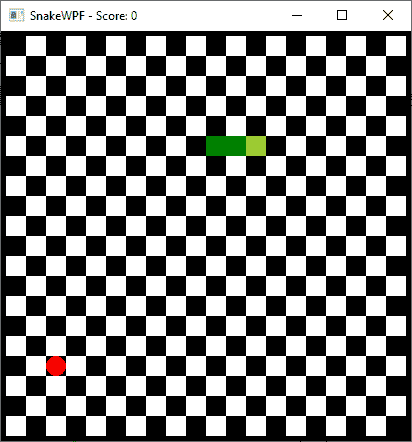

# 给蛇添加食物

> 原文：<https://wpf-tutorial.com/creating-game-snakewpf/adding-food-for-the-snake/>

***Chapter introduction:*** *在本系列文章中，我们将从头开始构建一个完整的贪吃蛇游戏。从[介绍](https://www.wpf-tutorial.com/creating-game-snakewpf/introduction/)开始，然后一篇接一篇地阅读文章，以获得全面的理解是有意义的。

如果你想**立刻获得游戏**的完整源代码，现在就开始修改和学习，考虑[下载我们所有的样本](https://www.wpf-tutorial.com/download-wpf-tutorial-pdf-with-sample-code/)！*  *在 SnakeWPF 文章系列的这个阶段，我们现在有一个棋盘背景作为游戏区域，还有一条可爱的绿色蛇在它周围移动。然而，正如在介绍中提到的，游戏的目的是让蛇吃一些食物-在我们的版本中它将是红苹果！

所以现在是时候开始给游戏区增加一些食物了。我们将在 GameArea 画布的边界内随机添加一个红色圆圈，但我们需要确保我们没有将它放在已经被不断生长的蛇占据的方格中。换句话说，将苹果放在游戏区域最重要的一个方面是决定下一个位置的代码。下面是我们将用于实现这一目的的代码:

```
private Point GetNextFoodPosition()
{
    int maxX = (int)(GameArea.ActualWidth / SnakeSquareSize);
    int maxY = (int)(GameArea.ActualHeight / SnakeSquareSize);
    int foodX = rnd.Next(0, maxX) * SnakeSquareSize;
    int foodY = rnd.Next(0, maxY) * SnakeSquareSize;

    foreach(SnakePart snakePart in snakeParts)
    {
    if((snakePart.Position.X == foodX) && (snakePart.Position.Y == foodY))
        return GetNextFoodPosition();
    }

    return new Point(foodX, foodY);
}
```

请务必在窗口类声明的顶部添加这一行，以及其余的字段/常数:

```
public partial class SnakeWPFSample : Window
{
    private Random rnd = new Random();
    ......
```

所以，快速解释一下代码:我们再次使用 **SnakeSquareSize** 常量来帮助我们计算食物的下一个位置，结合 Random 类，这将给出一个随机的 X 和 Y 位置。一旦我们有了它，我们运行所有当前的蛇部分，并检查它们的位置是否与我们刚刚创建的 X 和 Y 坐标相匹配——如果它们匹配，这意味着我们已经到达了当前被蛇占据的区域，然后我们通过简单地再次调用该方法(使这成为一个递归方法)来请求一个新的位置。

<input type="hidden" name="IL_IN_ARTICLE">

这也意味着这个方法可以无限次数地调用自己，并且在理论上导致一个无限循环。我们可以为此做一些检查，但这应该是没有必要的，因为这需要蛇足够长，以至于没有留下任何空白——我敢打赌，在这种情况发生之前，游戏已经结束了。

准备就绪后，我们准备添加代码，将食物添加到新计算的位置——我们将通过一个名为**drawswangefood()**的方法来完成。感谢 *GetNextFoodPosition()* 已经处理的所有工作，这非常简单，但是首先，确保声明用于保存对食物的引用的字段，以及用于绘制苹果的 SolidColorBrush，以及其他字段/常量声明:

```
public partial class SnakeWPFSample : Window  
{  
    private UIElement snakeFood = null;  
    private SolidColorBrush foodBrush = Brushes.Red;
    ......
```

下面是该方法的实现:

```
private void DrawSnakeFood()
{
    Point foodPosition = GetNextFoodPosition();
    snakeFood = new Ellipse()
    {
    Width = SnakeSquareSize,
    Height = SnakeSquareSize,
    Fill = foodBrush
    };
    GameArea.Children.Add(snakeFood);
    Canvas.SetTop(snakeFood, foodPosition.Y);
    Canvas.SetLeft(snakeFood, foodPosition.X);
}
```

正如承诺的那样，这非常简单——一旦我们有了位置，我们就简单地创建一个新的椭圆实例，并再次使用 **SnakeSquareSize** 常量来确保它与背景瓷砖以及每个蛇形部分具有相同的大小。我们在 **snakeFood** 字段中保存了一个对椭圆实例的引用，因为我们以后需要它。

准备就绪后，我们只需要调用 DrawSnakeFood()方法来查看我们的工作结果。这将在两种情况下完成:在游戏开始时和当蛇“吃”食物时(后面会详细介绍)。现在，让我们在我们的 **StartNewGame()** 方法中添加对它的调用:

```
private void StartNewGame()
{
    snakeLength = SnakeStartLength;
    snakeDirection = SnakeDirection.Right;
    snakeParts.Add(new SnakePart() { Position = new Point(SnakeSquareSize * 5, SnakeSquareSize * 5) });
    gameTickTimer.Interval = TimeSpan.FromMilliseconds(SnakeStartSpeed);

    // Draw the snake and the snake food
    DrawSnake();
    DrawSnakeFood();

    // Go!        
    gameTickTimer.IsEnabled = true;
}
```

就是这样！如果你现在运行这个游戏，你应该会看到这条蛇终于有了可以追逐的食物:



在屏幕上放一个红点需要做很多工作，对吗？

## 摘要

在本文中，我们终于为蛇添加了一些食物，但仍有工作要做:我们需要能够控制蛇，并且我们需要知道它何时撞到了什么东西(墙、自己的尾巴或食物)。在下一篇文章中会有更多的介绍。

* * **