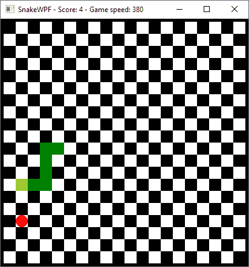
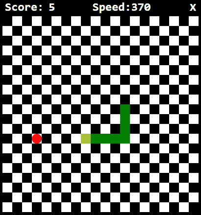

# 改进 SnakeWPF:让它看起来更像游戏

> 原文：<https://wpf-tutorial.com/creating-game-snakewpf/improving-snakewpf-making-it-look-more-like-a-game/>

***Chapter introduction:*** *在本系列文章中，我们将从头开始构建一个完整的贪吃蛇游戏。从[介绍](https://www.wpf-tutorial.com/creating-game-snakewpf/introduction/)开始，然后一篇接一篇地阅读文章，以获得全面的理解是有意义的。

如果你想**立刻获得游戏**的完整源代码，现在就开始修改和学习，考虑[下载我们所有的样本](https://www.wpf-tutorial.com/download-wpf-tutorial-pdf-with-sample-code/)！*  *在前几篇文章中，我们已经在 WPF 制作了一个很酷的贪吃蛇游戏。我们已经实现了所有的游戏机制，结果是一个功能齐全的游戏。然而，肯定有很多可以改进的地方，因为当前的实现非常简单。因此，在接下来的文章中，我将对我们的 SnakeWPF 游戏做一些改进——在这篇文章中，我将专注于使我们的游戏看起来更像一个真实的游戏！

现在看起来，使用默认的 Windows 样式的边框/标题栏，我们的实现看起来不太像一个游戏。然而，我们以前需要标题栏来显示分数/速度信息，作为一个不错的奖励，我们自动获得了默认的窗口按钮来最小化/最大化/关闭窗口:



在这一点上，我想完全删除默认的 Windows 标题栏，而是实现我们自己的顶部状态栏，它应该显示当前的分数和速度，以及一个自定义的关闭按钮。所有这些都应该与游戏的当前外观相匹配。幸运的是，对于 WPF 来说，这很容易实现。

## 添加自定义标题栏

第一步是向窗口声明添加几个属性和一个新事件。它现在应该是这样的:

<input type="hidden" name="IL_IN_ARTICLE">

```
<Window x:Class="WpfTutorialSamples.Games.SnakeWPFSample"

    xmlns:x="http://schemas.microsoft.com/winfx/2006/xaml"
    xmlns:d="http://schemas.microsoft.com/expression/blend/2008"
    xmlns:mc="http://schemas.openxmlformats.org/markup-compatibility/2006"
    xmlns:local="clr-namespace:WpfTutorialSamples.Games"
    mc:Ignorable="d"
    Title="SnakeWPF - Score: 0" SizeToContent="WidthAndHeight" ContentRendered="Window_ContentRendered" KeyUp="Window_KeyUp"
    ResizeMode="NoResize" WindowStyle="None" Background="Black" MouseDown="Window_MouseDown">
```

变化都在最后一行。我们将 **ResizeMode** 设置为 **NoResize** ，将 **WindowStyle** 设置为 **None** 。这将完全删除标题栏以及窗口周围的任何默认边框——但这对我们来说没问题，因为我们游戏的主要区域已经有一个 5 px 的黑色边框。

您还会注意到我已经订阅了一个新事件——鼠标按下事件。原因是因为我们失去了默认的标题栏，用户不再有任何方法将游戏从屏幕的一点拖到另一点。幸运的是，我们很容易重新创建这种行为，例如在我们自己的自定义标题栏上。然而，由于它看起来不像常规的标题栏，用户可能会对拖动到哪里感到困惑，所以我决定简单地使整个窗口表面可拖动。因此，在代码隐藏中，像这样定义**窗口 _ 鼠标按下**事件处理程序:

```
private void Window_MouseDown(object sender, MouseButtonEventArgs e)
{
    this.DragMove();
}
```

有了它，无论你在哪里使用鼠标，你的窗口都可以被拖动。下一步是添加我们的自定义标题栏，它应该显示分数和速度，以及一个关闭按钮。窗口 XAML 的内部现在应该是这样的:

```
<DockPanel Background="Black">  
    <Grid DockPanel.Dock="Top" Name="pnlTitleBar">  
    <Grid.ColumnDefinitions>  
        <ColumnDefinition Width="*" />  
        <ColumnDefinition Width="*" />  
        <ColumnDefinition Width="Auto" />  
    </Grid.ColumnDefinitions>  

    <Grid.Resources>  
        <Style TargetType="TextBlock">  
        <Setter Property="FontFamily" Value="Consolas" />  
        <Setter Property="Foreground" Value="White" />  
        <Setter Property="FontSize" Value="24" />  
        <Setter Property="FontWeight" Value="Bold" />  
        </Style>  
    </Grid.Resources>  

    <WrapPanel Margin="10,0,0,0">  
        <TextBlock>Score:</TextBlock>  
        <TextBlock Name="tbStatusScore">0</TextBlock>  
    </WrapPanel>  
    <WrapPanel Grid.Column="1">  
        <TextBlock>Speed:</TextBlock>  
        <TextBlock Name="tbStatusSpeed">0</TextBlock>  
    </WrapPanel>  
    <Button Grid.Column="2" DockPanel.Dock="Right" Background="Transparent" Foreground="White" FontWeight="Bold" FontSize="20" BorderThickness="0" Name="btnClose" Click="BtnClose_Click" Padding="10,0">X</Button>  
    </Grid>  
    <Border BorderBrush="Black" BorderThickness="5">  
    <Canvas Name="GameArea" ClipToBounds="True" Width="400" Height="400">  

    </Canvas>  
    </Border>  
</DockPanel>
```

不要忘记定义 **BtnClose_Click** 事件处理程序:

```
private void BtnClose_Click(object sender, RoutedEventArgs e)
{
    this.Close();
}
```

我们之前实现了一个名为 **UpdateGameStatus()** 的方法，它更新了窗口的 Title 属性——这个方法应该更改为使用新的 TextBlock 的:

```
private void UpdateGameStatus()
{        
    this.tbStatusScore.Text = currentScore.ToString();
    this.tbStatusSpeed.Text = gameTickTimer.Interval.TotalMilliseconds.ToString();
}
```

我会告诉你我们刚刚做了什么，但首先，让我们看看游戏现在是什么样子的:



看起来很酷，对吧？但是让我们来讨论一下我们刚刚做的事情:正如你所看到的，最初的 **Border** 控件和 *GameArea* **Canvas** 现在已经被 **DockPanel** 包围了。这使得我们可以很容易地将新的标题栏以**网格**面板的形式附加到窗口的顶部。

网格使用了几个很酷的 WPF 技术，在本教程的其他地方已经讨论过了:我们使用 **ColumnDefinition** 将该区域分成两个大小相等的区域(用于分数和速度)，外加一个自动调整大小的第三列用于关闭按钮。你还会注意到，我们使用 WPF **样式**对所有 文本块（`TextBlock`）控件应用相同的视觉效果——由于网格中定义的样式，相同的自定义字体、字体大小、颜色和粗细被应用于所有这些控件，目标是 **TextBlock** 控件。

还要注意定制用于关闭窗口的**按钮**控件是多么容易，完全匹配游戏的其余外观和感觉，只需使用标准属性——WPF 是如此灵活！

## 摘要

在本文中，我们通过移除标准的 Windows 外观并应用我们自己的自定义标题栏，使 SnakeWPF 实现看起来更像一个游戏。在接下来的文章中，我们会做更多的改进！

* * **