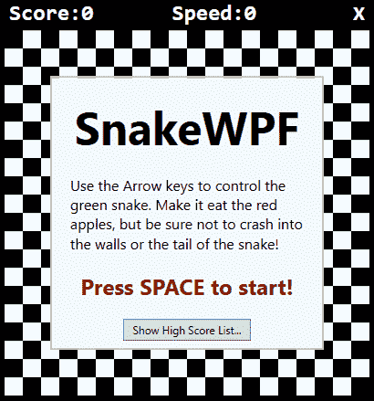
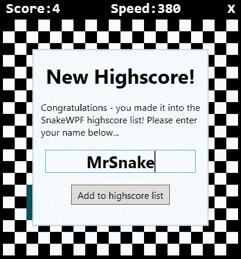
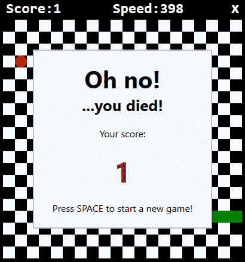

# 改进 SnakeWPF:添加高分列表

> 原文：<https://wpf-tutorial.com/creating-game-snakewpf/improving-snakewpf-adding-a-high-score-list/>

***Chapter introduction:*** *在本系列文章中，我们将从头开始构建一个完整的贪吃蛇游戏。从[介绍](https://www.wpf-tutorial.com/creating-game-snakewpf/introduction/)开始，然后一篇接一篇地阅读文章，以获得全面的理解是有意义的。

如果你想**立刻获得游戏**的完整源代码，现在就开始修改和学习，考虑[下载我们所有的样本](https://www.wpf-tutorial.com/download-wpf-tutorial-pdf-with-sample-code/)！*  *在上一篇文章中，我们对 SnakeWPF 实现做了很多视觉上的改进。在这篇文章里，我要补充一个很酷的功能:**高分榜！最重要的是，我想通过增加一个欢迎界面来使游戏更加人性化。我还将把非常不游戏化的“你死了”的消息框换成游戏内的屏幕。**

为此我们需要相当多的额外代码和标签，但是让我们从简单的部分开始——XAML！

## XAML

我想做的第一件事，是给蛇窗口添加一束 XAML。这将主要包括 4 个新的容器(在本例中为边界控件)，它们将托管一系列子控件以支持各种情况:

*   一个容器，用于在游戏开始时显示欢迎消息，通知将要使用的控件等。
*   一个用于显示高分列表的容器
*   当用户获得高分时显示的一个容器，包括一个用于输入姓名的文本框
*   一个容器，当用户死亡时显示，但没有进入高分列表(取代我们以前使用的无聊的消息框)

我们将把这些容器添加到 **GameArea** 画布中，然后在我们不需要它们的时候简单地隐藏它们。如前所述，每个容器都有不同的用途，并包含相当多的标签，但我们只使用 WPF 控件，这在本教程中已经讨论过了。

<input type="hidden" name="IL_IN_ARTICLE">

### 欢迎信息

在 GameArea Canvas 控件中添加这段 XAML:

```
<Border BorderBrush="Silver" BorderThickness="2" Width="300" Height="300" Canvas.Left="50" Canvas.Top="50" Name="bdrWelcomeMessage" Panel.ZIndex="1">
    <StackPanel Orientation="Vertical" Background="AliceBlue">
    <TextBlock FontWeight="Bold" FontSize="50" HorizontalAlignment="Center" Margin="0,20,0,0">SnakeWPF</TextBlock>
    <TextBlock TextWrapping="Wrap" Margin="20" FontSize="16">Use the Arrow keys to control the green snake. Make it eat the red apples, but be sure not to crash into the walls or the tail of the snake!</TextBlock>
    <TextBlock FontWeight="Bold" HorizontalAlignment="Center" FontSize="24" Foreground="Maroon">Press SPACE to start!</TextBlock>
    <Button Margin="20" Name="btnShowHighscoreList" Click="BtnShowHighscoreList_Click" HorizontalAlignment="Center" Padding="10,3">Show High Score List...</Button>
    </StackPanel>
</Border>
```



它简要地告诉用户游戏是关于什么的，如何控制蛇以及如何开始游戏。包含所有内容的边框最初是可见的，因此这将是游戏开始时用户首先遇到的东西。在屏幕的底部，我添加了一个显示高分列表的按钮(我们将在一分钟内添加)。单击事件处理程序将在后面的代码中实现。

### 高分榜

现在事情变得有点复杂，因为我想以 WPF 的方式来做这件事，并使用数据绑定来显示高分列表，而不是手动构建和更新列表。但是不要担心，我会解释这一切。首先，在 GameArea 画布中添加 XAML，就像我们之前做的一样——画布将容纳我们所有的边界控件，每个控件都为我们的游戏提供自己的功能:

```
<Border BorderBrush="Silver" BorderThickness="2" Width="300" Height="300" Canvas.Left="50" Canvas.Top="50" Name="bdrHighscoreList" Panel.ZIndex="1" Visibility="Collapsed">
    <StackPanel Orientation="Vertical" Background="AliceBlue">
    <Border BorderThickness="0,0,0,2" BorderBrush="Silver" Margin="0,10">
        <TextBlock HorizontalAlignment="Center" FontSize="34" FontWeight="Bold">High Score List</TextBlock>
    </Border>
    <ItemsControl ItemsSource="{Binding Source={StaticResource HighScoreListViewSource}}">
        <ItemsControl.ItemTemplate>
        <DataTemplate>
            <DockPanel Margin="7">
            <TextBlock Text="{Binding PlayerName}" DockPanel.Dock="Left" FontSize="22"></TextBlock>
            <TextBlock Text="{Binding Score}" DockPanel.Dock="Right" FontSize="22" HorizontalAlignment="Right"></TextBlock>
            </DockPanel>
        </DataTemplate>
        </ItemsControl.ItemTemplate>
    </ItemsControl>
    </StackPanel>
</Border>
```


请注意该边框最初是如何不显示的(可见性=折叠)。我们使用一个 ItemsControl(我们之前在本教程中讨论过)，带有一个名为 **HighScoreListViewSource** 的自定义 ItemsSource。我们将使用 CollectionViewSource 来确保我们绑定到的集合总是正确排序。我们需要在窗口 XAML 中定义这个资源，所以作为窗口标签的子标签，您应该添加这段标签，使您的窗口声明看起来像这样:

```
<Window x:Class="WpfTutorialSamples.Games.SnakeWPFSample"

    xmlns:x="http://schemas.microsoft.com/winfx/2006/xaml"
    xmlns:d="http://schemas.microsoft.com/expression/blend/2008"
    xmlns:mc="http://schemas.openxmlformats.org/markup-compatibility/2006"
    xmlns:local="clr-namespace:WpfTutorialSamples.Games"
    mc:Ignorable="d"
    x:Name="window"      
    xmlns:scm="clr-namespace:System.ComponentModel;assembly=WindowsBase"
    Title="SnakeWPF - Score: 0" SizeToContent="WidthAndHeight" ContentRendered="Window_ContentRendered" KeyUp="Window_KeyUp"
    ResizeMode="NoResize" WindowStyle="None" Background="Black" MouseDown="Window_MouseDown">

    <Window.Resources>
    <CollectionViewSource Source="{Binding ElementName=window, Path=HighscoreList}" x:Key="HighScoreListViewSource">
        <CollectionViewSource.SortDescriptions>
        <scm:SortDescription Direction="Descending" PropertyName="Score" />
        </CollectionViewSource.SortDescriptions>
    </CollectionViewSource>
    </Window.Resources>
    ................
```

注意，我偷偷加入了一个新的引用: **xmlns:scm** ，用于访问 SortDescription 类型。我还添加了 x:Name 属性，并将其设置为**窗口**，这样我们就可以在代码隐藏中引用 MainWindow 类上定义的成员。

在橱窗里。资源，我添加了一个新的 **CollectionViewSource** 。它使用绑定来附加到名为 **HighscoreList** 的属性，我们将在代码隐藏中定义该属性。还要注意，我向它添加了一个 SortDescription，指定列表应该按照一个名为 Score 的属性进行降序排序，这基本上意味着最高分将首先显示，以此类推。

在代码隐藏中，我们需要定义 ItemsSource 所依赖的名为 **HighscoreList** 的属性，但我们将在添加完最后一个 XAML 后再做。

### 新的高分

当用户击败一个现有的高分，我们会显示一个漂亮的消息。XAML 看起来像这样，它应该再一次被添加到 GameArea 画布中:

```
<Border BorderBrush="Silver" BorderThickness="2" Width="300" Height="300" Canvas.Left="50" Canvas.Top="50" Name="bdrNewHighscore" Panel.ZIndex="1" Visibility="Collapsed">  
    <StackPanel Orientation="Vertical" Background="AliceBlue">  
    <TextBlock HorizontalAlignment="Center" FontSize="34" FontWeight="Bold" Margin="20">New Highscore!</TextBlock>  
    <TextBlock HorizontalAlignment="Center" TextWrapping="Wrap" FontSize="16">  
        Congratulations - you made it into the SnakeWPF highscore list! Please enter your name below...  
    </TextBlock>  
    <TextBox Name="txtPlayerName" FontSize="28" FontWeight="Bold" MaxLength="8" Margin="20" HorizontalContentAlignment="Center"></TextBox>  
    <Button Name="btnAddToHighscoreList" FontSize="16" HorizontalAlignment="Center" Click="BtnAddToHighscoreList_Click" Padding="10,5">Add to highscore list</Button>  
    </StackPanel>  
</Border>
```



所有这些都非常简单，包括一些文本、一个用于输入姓名的文本框和一个用于添加到列表中的按钮——我们稍后将定义**BtnAddToHighscoreList _ Click**事件处理程序。

### “哦，不——你死了！”

最后一部分是“哦，不，你死了，你没有进入高分名单”屏幕，我们将用它来取代以前做同样事情的无聊的 MessageBox。XAML 看起来是这样的:

```
<Border BorderBrush="Silver" BorderThickness="2" Width="300" Height="300" Canvas.Left="50" Canvas.Top="50" Name="bdrEndOfGame" Panel.ZIndex="1" Visibility="Collapsed">
    <StackPanel Orientation="Vertical" Background="AliceBlue">
    <TextBlock HorizontalAlignment="Center" FontSize="40" FontWeight="Bold" Margin="0,20,0,0">Oh no!</TextBlock>
    <TextBlock HorizontalAlignment="Center" FontSize="26" FontWeight="Bold">...you died!</TextBlock>
    <TextBlock Margin="20" TextAlignment="Center" FontSize="16">Your score: </TextBlock>
    <TextBlock Name="tbFinalScore" TextAlignment="Center" FontSize="48" FontWeight="Bold" Foreground="Maroon">0</TextBlock>
    <TextBlock TextAlignment="Center" FontSize="16" Margin="20">Press SPACE to start a new game!</TextBlock>
    </StackPanel>
</Border>
```



它通知用户不幸的事件，显示最终得分，并告诉用户如何开始一个新的游戏-非常简单！

## 代码隐藏

有了所有的 XAML，我们终于准备好实现代码隐藏的东西了！首先，我们需要实现我们在 XAML 中定义的事件处理程序。这是“显示高分列表”按钮的按钮:

```
private void BtnShowHighscoreList_Click(object sender, RoutedEventArgs e)    
{    
    bdrWelcomeMessage.Visibility = Visibility.Collapsed;    
    bdrHighscoreList.Visibility = Visibility.Visible;    
}
```

非常简单，如你所见——当按钮被点击时，我们隐藏欢迎消息，然后显示高分列表——我们现在将添加它。

### 实现高分列表

我们拥有的另一个事件处理程序与向高分列表添加一个新条目有关，但是为此，我们需要添加一些其他内容——首先，保存高分条目的实际属性:

```
public ObservableCollection<SnakeHighscore> HighscoreList
{
    get; set;
} = new ObservableCollection<SnakeHighscore>();
```

如你所见，这是一个 **ObservableCollection** ，包含类型 **SnakeHighscore** 。首先，确保包含保存 ObservableCollection 类型的命名空间:

```
using System.Collections.ObjectModel;
```

然后实现 **SnakeHighscore** 类:

```
public class SnakeHighscore
{
    public string PlayerName { get; set; }

    public int Score { get; set; }
}
```

正如你所看到的，这是一个非常简单的类——它只是作为一个容器来存放进入高分列表的玩家的名字和分数。

### 加载/保存高分列表

我们还需要一些代码来加载和保存列表——当一个新条目添加到列表中时，将调用 **Save** 方法，而当我们的游戏开始时，将调用 **Load** 方法。我将使用一个简单的 XML 文件来保存列表，这将允许我们使用内置的 **XmlSerializer** 类来自动加载和保存列表。

加载/保存数据的方式有很多，还有其他几种相关的格式，比如 JSON，甚至是纯文本文件，但是我想尽可能用最少的代码来完成这一部分，因为它与 WPF 教程并不相关。此外，XmlSerializer 方法使代码非常灵活——您可以很容易地向 SnakeHighscore 类添加新属性，它们将自动持久化。下面是 **LoadHighscoreList()** 方法:

```
private void LoadHighscoreList()
{
    if(File.Exists("snake_highscorelist.xml"))
    {
    XmlSerializer serializer = new XmlSerializer(typeof(List<SnakeHighscore>));
    using(Stream reader = new FileStream("snake_highscorelist.xml", FileMode.Open))
    {            
        List<SnakeHighscore> tempList = (List<SnakeHighscore>)serializer.Deserialize(reader);
        this.HighscoreList.Clear();
        foreach(var item in tempList.OrderByDescending(x => x.Score))
        this.HighscoreList.Add(item);
    }
    }
}
```

为此，您需要包括几个额外的名称空间:

```
using System.IO;
using System.Xml.Serialization;
```

确保调用`LoadHighscoreList()`方法，例如在窗口的构造器中:

```
public SnakeWPFSample()
{
    InitializeComponent();
    gameTickTimer.Tick += GameTickTimer_Tick;
    LoadHighscoreList();
}
```

接下来，我们实现**savehigscorlist()**方法:

```
private void SaveHighscoreList()
{
    XmlSerializer serializer = new XmlSerializer(typeof(ObservableCollection<SnakeHighscore>));
    using(Stream writer = new FileStream("snake_highscorelist.xml", FileMode.Create))
    {
    serializer.Serialize(writer, this.HighscoreList);
    }
}
```

当我们添加一个新条目时，Save 方法与调用最相关——这发生在**BtnAddToHighscoreList _ Click()**事件处理程序中，应该如下所示:

```
private void BtnAddToHighscoreList_Click(object sender, RoutedEventArgs e)
{
    int newIndex = 0;
    // Where should the new entry be inserted?
    if((this.HighscoreList.Count > 0) && (currentScore < this.HighscoreList.Max(x => x.Score)))
    {
    SnakeHighscore justAbove = this.HighscoreList.OrderByDescending(x => x.Score).First(x => x.Score >= currentScore);
    if(justAbove != null)
        newIndex = this.HighscoreList.IndexOf(justAbove) + 1;
    }
    // Create & insert the new entry
    this.HighscoreList.Insert(newIndex, new SnakeHighscore()
    {
    PlayerName = txtPlayerName.Text,
    Score = currentScore
    });
    // Make sure that the amount of entries does not exceed the maximum
    while(this.HighscoreList.Count > MaxHighscoreListEntryCount)
    this.HighscoreList.RemoveAt(MaxHighscoreListEntryCount);

    SaveHighscoreList();

    bdrNewHighscore.Visibility = Visibility.Collapsed;
    bdrHighscoreList.Visibility = Visibility.Visible;
}
```

这很简单:我们试图决定新条目是否应该被添加到列表的顶部(一个新的最佳！)或者它是否属于列表中更靠下的位置。一旦我们有了新的索引，我们就使用玩家输入的当前分数和名字插入一个新的类实例。然后，如果列表中的条目突然比我们想要的多(MaxHighscoreListEntryCount)，我们就从列表底部删除任何不需要的条目。然后我们保存列表(**savehigscorelist()**)并隐藏**bdrnewihgscore**容器，将视图切换到 **bdrHighscoreList** 容器。

但是仍然有一些事情要做。首先，这些新的屏幕(死信，高分榜等。)需要在每次启动新游戏时隐藏。因此，我们在上一篇文章中实现的`StartNewGame()`方法的顶部现在应该是这样的:

```
private void StartNewGame()
{
    bdrWelcomeMessage.Visibility = Visibility.Collapsed;
    bdrHighscoreList.Visibility = Visibility.Collapsed;
    bdrEndOfGame.Visibility = Visibility.Collapsed;
    ........
```

接下来我们需要做的是修改 **EndGame()** 方法。我们不只是显示 MessageBox，而是需要检查用户是否进入了高分列表，然后显示适当的消息容器:

```
private void EndGame()
{
    bool isNewHighscore = false;
    if(currentScore > 0)
    {
    int lowestHighscore = (this.HighscoreList.Count > 0 ? this.HighscoreList.Min(x => x.Score) : 0);
    if((currentScore > lowestHighscore) || (this.HighscoreList.Count < MaxHighscoreListEntryCount))
    {
        bdrNewHighscore.Visibility = Visibility.Visible;
        txtPlayerName.Focus();
        isNewHighscore = true;
    }
    }
    if(!isNewHighscore)
    {
    tbFinalScore.Text = currentScore.ToString();
    bdrEndOfGame.Visibility = Visibility.Visible;
    }
    gameTickTimer.IsEnabled = false;
}
```

该方法主要检查高分列表中是否还有可用的分数(我们定义最多 5 个条目)或者用户是否刚刚超过了现有分数之一——如果是这样，我们允许用户通过显示**bdrnewihscore**容器来添加他们的名字。如果没有获得新的高分，我们将显示**bdrendogfame**容器。务必定义**MaxHighscoreListEntryCount**常量:

```
const int MaxHighscoreListEntryCount = 5;
```

我还修改了 **ContentRendered()** 方法——现在我们有了一个好看的欢迎屏幕，我们不希望游戏只是自动开始。相反，我们建议用户在游戏开始前按空格键开始游戏或点击按钮查看高分列表，因此我们只需删除(或注释掉)对 **StartNewGame()** 的调用:

```
private void Window_ContentRendered(object sender, EventArgs e)
{
    DrawGameArea();
    //StartNewGame();
}
```

一切就绪后，开始游戏并尽你所能——一旦游戏结束，你应该有希望进入你的全新 SnakeWPF 高分榜！

## 摘要

在本文中，我们对 SnakeWPF 实现做了很多改进。最明显的一个当然是高分列表，这确实需要相当多的额外标签/代码，但它完全值得！最重要的是，我们做了一些很好的可用性改进，同时再次使我们的项目看起来更像一个真正的游戏。

* * **